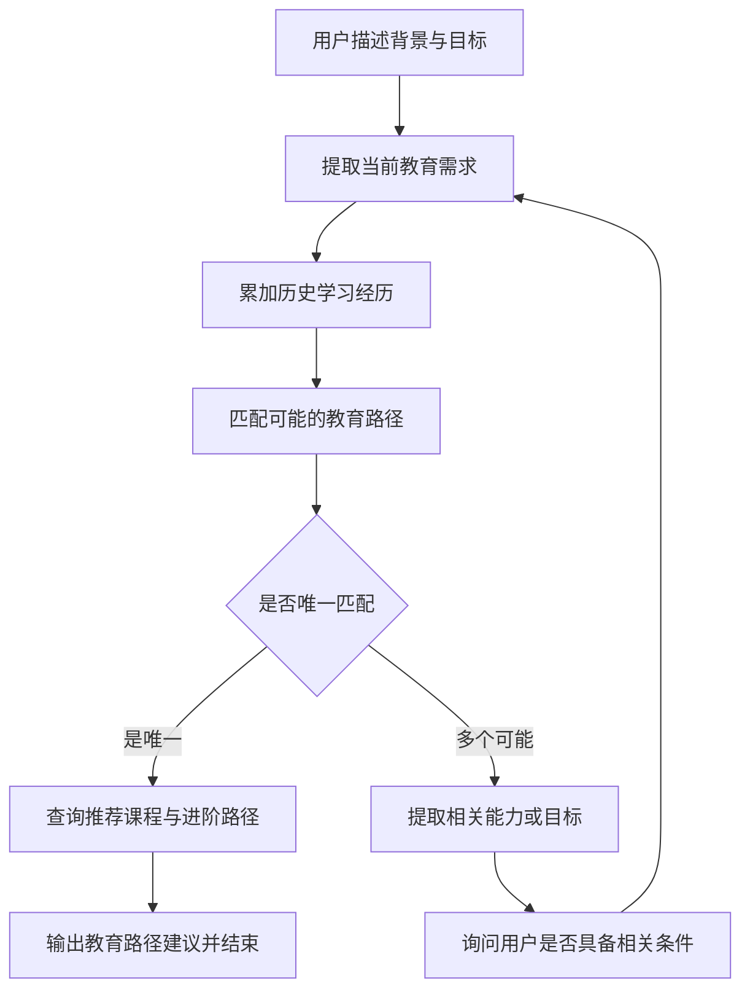
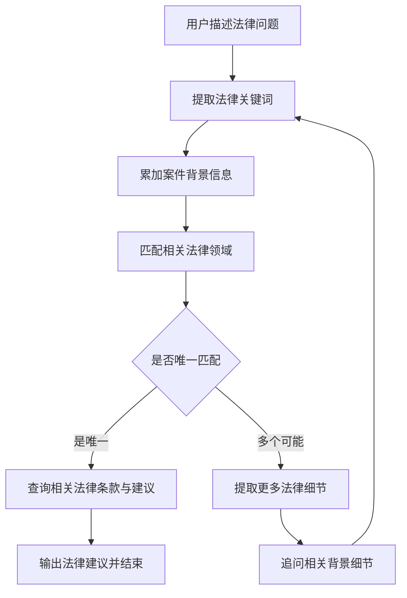
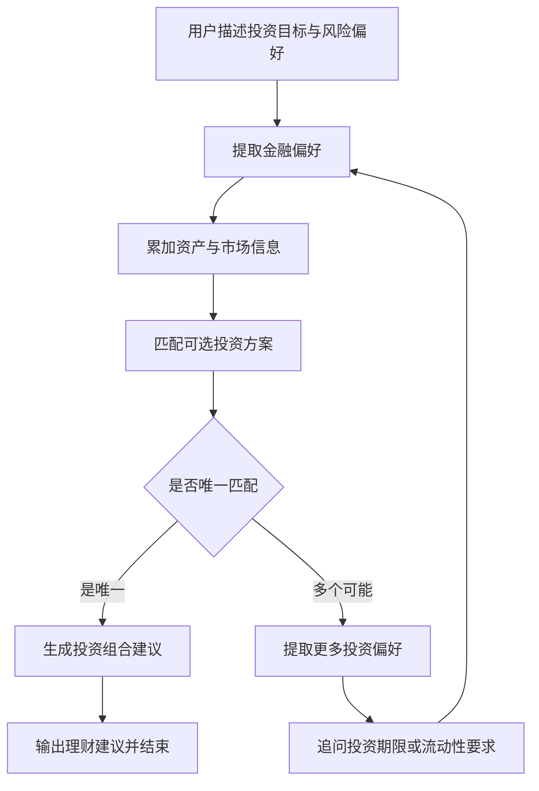
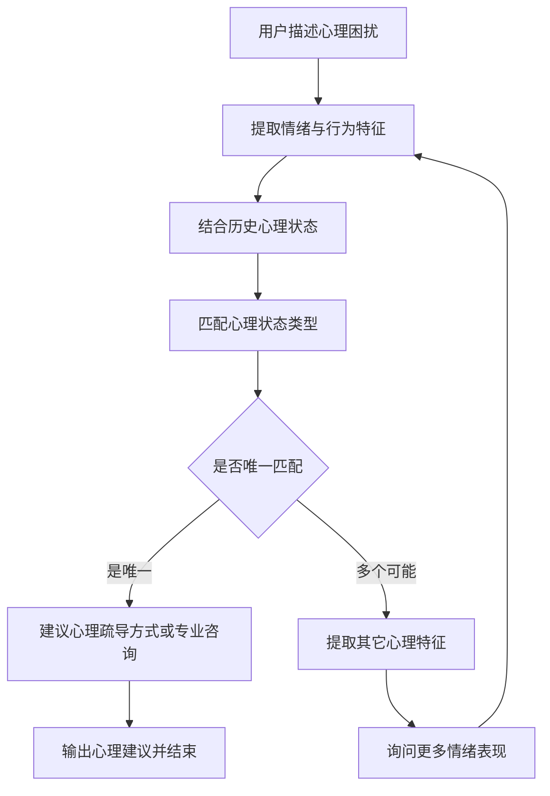
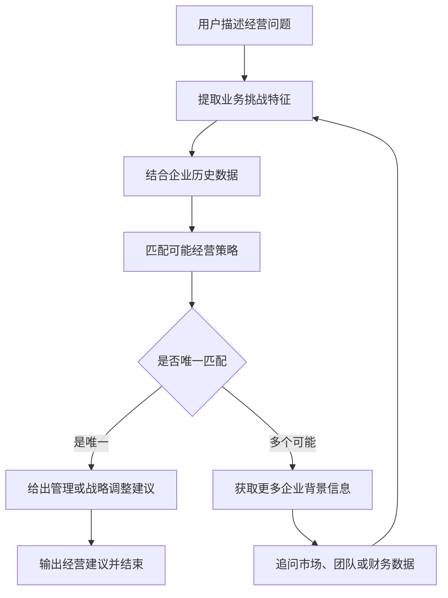
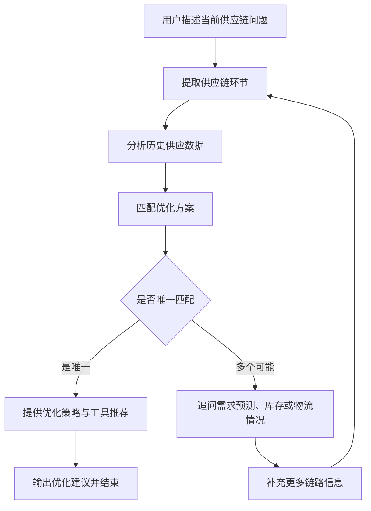
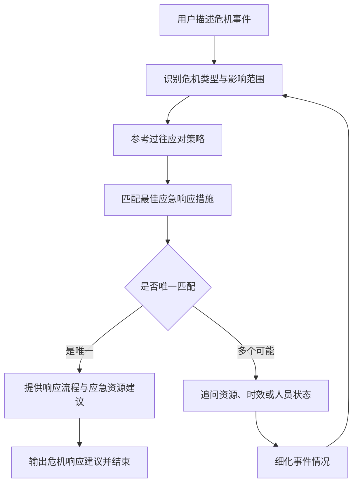
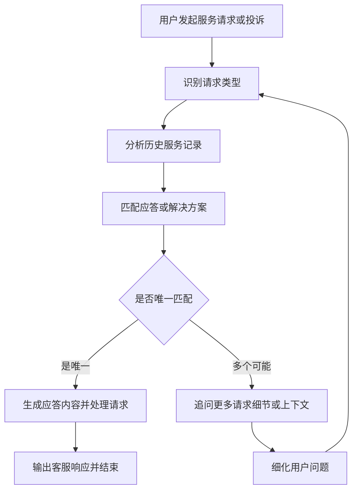

# 辅助决策型Agent

在企业管理、教育选择、法律咨询甚至心理健康等场景中，人们常常面临「信息复杂」「选项众多」「缺乏经验」的问题。传统的问答类AI无法提供真正“有逻辑”的建议，于是我构建了一个更实用的系统：辅助决策型 Agent（Decision Agent）。

它不是简单回答一个问题，而是：

分析用户的情况和目标；
累加上下文和历史；
调用工具或数据库查找方案；
主动追问缺失的信息；
最终给出结构化、有针对性的建议。

# 作者微信: johnsongzc

# 安装
前端
```
cd frontend
npm install
npm run dev
```

后端，任选1个Agent
```
cd backend
pip install -e .
cd doctor
cp env_template .env
python main_data_prepare.py
python main_api.py
```
## .env讲解
```
GOOGLE_API_KEY=xxx
DEEPSEEK_API_KEY=sk-xxx
#工具中使用的嵌入模型的key是ALI_API_KEY的，可以自行更改
ALI_API_KEY=sk-xxx
OPENAI_API_KEY=sk-xxx
CLAUDE_API_KEY=skxxx
# 流式的输出结果
STREAMING=true
# 默认使用的模型
MODEL_PROVIDER=openai
LLM_MODEL=gpt-4.1
# 工具中使用的模型，向量模型粗筛，LLM模型细筛
TOOL_MODEL_API_BASE=https://api.deepseek.com/v1
TOOL_MODEL_API_KEY=sk-xxx
TOOL_MODEL_NAME=deepseek-chat
TOOL_MODEL_PROVIDER=deepseek
```

## 数据

**决策型 Agent 场景的模拟数据（结构与疾病场景一致）**，每条数据包括 `name`（名称）、`matches`（匹配条件/特征描述）、`treatment_plan`（应对策略或处理方案）：


## ✅ 数据格式汇总

目前你已拥有以下结构化决策数据样例：

| 场景       | 数据变量名              |
| ---------- | ----------------------- |
| 教育路径   | `education_data`        |
| 法律咨询   | `law_data`              |
| 金融投资   | `finance_data`          |
| 心理健康   | `mental_health_data`    |
| 企业经营   | `business_data`         |
| 供应链优化 | `supply_chain_data`     |
| 危机应对   | `crisis_data`           |
| 智能客服   | `customer_service_data` |
| 疾病诊断   | `example_data`          |


下面是每个**辅助决策型 Agent 场景**的流程图。

---

### 🎓 教育路径（`education_data`）



---

### ⚖️ 法律咨询（`law_data`）



---

### 💰 金融投资（`finance_data`）



---

### 🧠 心理健康（`mental_health_data`）



---

### 🏢 企业经营（`business_data`）



---

### 📦 供应链优化（`supply_chain_data`）



---

### 🚨 危机应对（`crisis_data`）



---

### 🤖 智能客服（`customer_service_data`）


