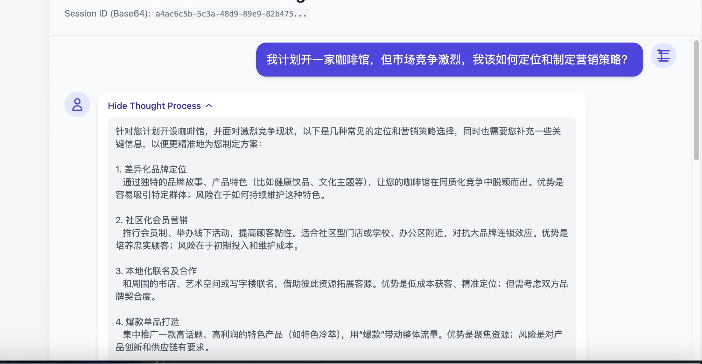
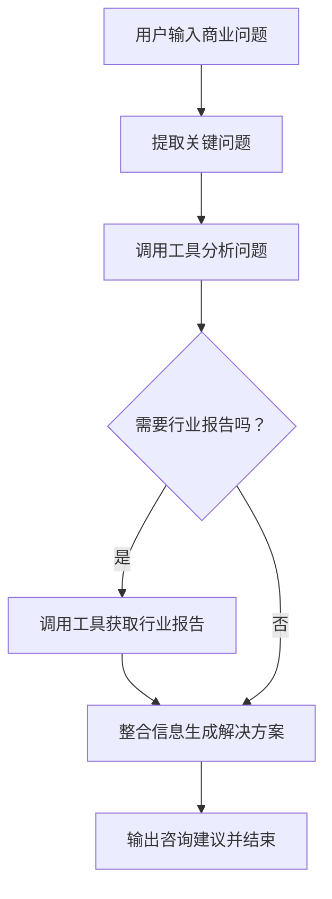

# 运行和测试
## 准备数据（数据进行向量化）
python main_data_prepare.py

## 运行服务端
python main_api.py

## 前端进行测试

# 商业咨询Agent
1. 用户描述他们遇到的商业问题，例如市场进入策略、竞争分析、营销计划、运营效率等。
2. Agent 提取关键问题点，并利用工具进行分析。
3. Agent 调用 `analyzeBusinessProblem` 工具来识别问题的核心，并提出初步的解决方案框架。
4. 如果需要更详细的行业背景信息，Agent 会调用 `getIndustryReport` 工具来获取特定行业的分析报告。
5. Agent 整合所有信息，为用户提供结构化、可行的商业建议。

# 示例问题：
我计划开一家咖啡馆，但市场竞争激烈，我该如何定位和制定营销策略？