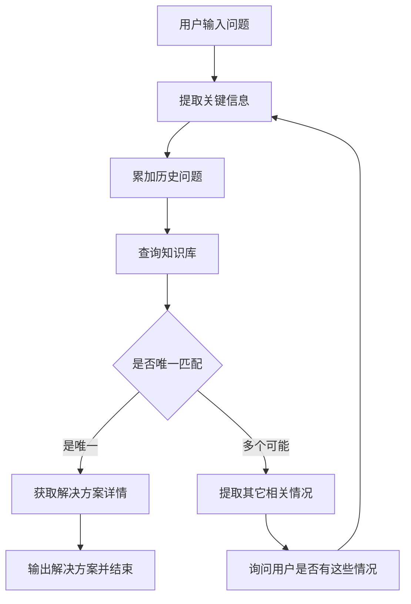

# 运行和测试
## 准备数据（数据进行向量化）
python main_data_prepare.py

## 运行服务端
python main_api.py

## 前端进行测试

# 客户服务Agent
1. 用户提出问题或遇到的困难。
2. Agent提取用户问题的关键信息。
3. Agent调用知识库查询工具，匹配可能的解决方案。
4. 如果是唯一解决方案，则直接提供详细步骤。
5. 如果有多个可能的解决方案，则通过提问进一步澄清用户意图。

# 示例问题：
我无法登录我的账户，该怎么办？