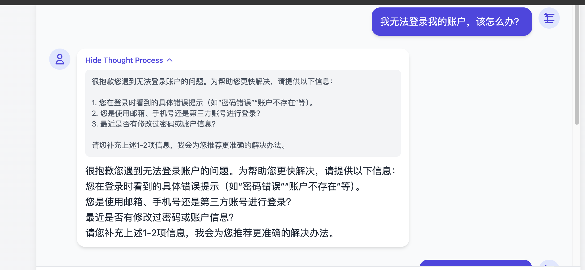
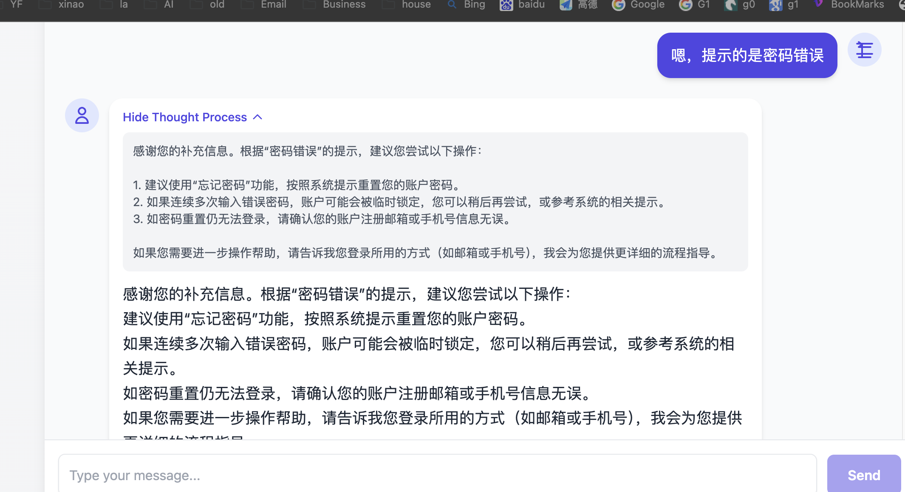
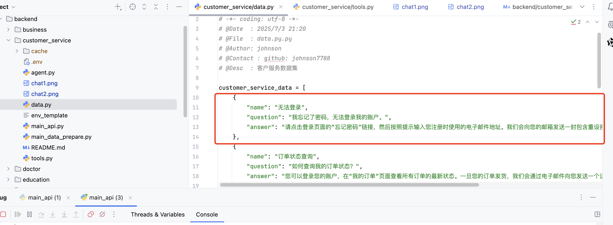
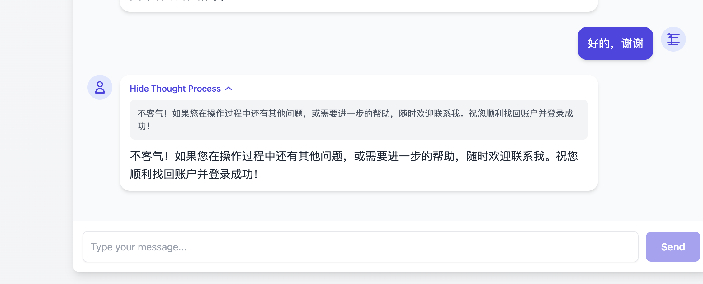
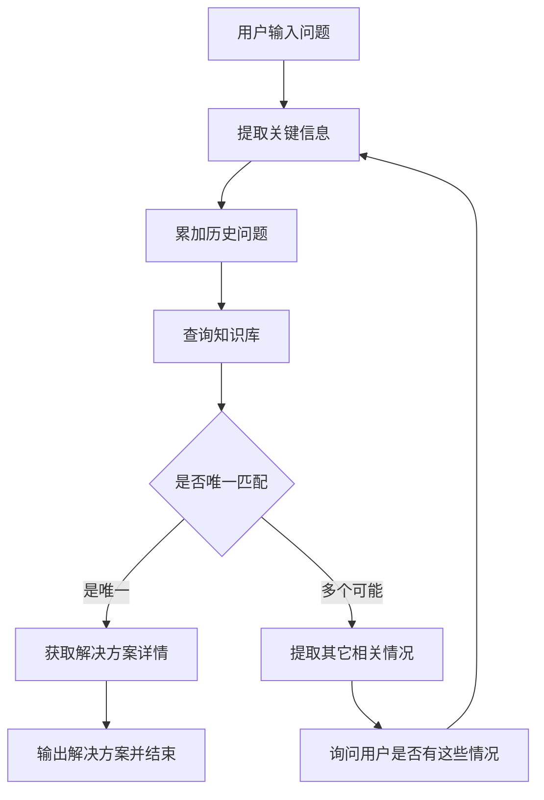

# 运行和测试
## 准备数据（数据进行向量化）
python main_data_prepare.py

## 运行服务端
python main_api.py

## 前端进行测试


自动找到需要的解决方案，然后进行解决



# 客户服务Agent
1. 用户提出问题或遇到的困难。
2. Agent提取用户问题的关键信息。
3. Agent调用知识库查询工具，匹配可能的解决方案。
4. 如果是唯一解决方案，则直接提供详细步骤。
5. 如果有多个可能的解决方案，则通过提问进一步澄清用户意图。



# 示例问题：
我无法登录我的账户，该怎么办？

# 后台请求数据流
```
python main_api.py
Connected to pydev debugger (build 251.26094.141)
使用的向量表是: customer_service_data
2025-07-04 08:47:22,445 [INFO] 启动 Agent 服务
2025-07-04 08:47:22,445 [INFO] 流式模式: True
2025-07-04 08:47:22,446 [INFO] 使用 SSE 流式输出模式
2025-07-04 08:47:22,446 [INFO] 服务启动中，监听地址: http://localhost:10012
INFO:     Started server process [7777]
INFO:     Waiting for application startup.
INFO:     Application startup complete.
INFO:     Uvicorn running on http://localhost:10012 (Press CTRL+C to quit)
INFO:     ::1:59831 - "GET /.well-known/agent.json HTTP/1.1" 200 OK
INFO:     ::1:59831 - "POST / HTTP/1.1" 200 OK
调用了customer_service模型前的callback, 现在Agent共有1条历史记录,metadata数据为：None
2025-07-04 08:47:43,534 [DEBUG] 收到请求信息: parts=[Part(
  text='我无法登录我的账户，该怎么办？'
)] role='user'
2025-07-04 08:47:43,561 [INFO] Task not found or task_id not set. Creating new task for event (task_id: 79f09333-d8d9-425b-9c3c-d18d9d025555, context_id: a2fd4c65-35cd-489f-8b64-34171c272807).
08:47:43 - LiteLLM:INFO: utils.py:3120 - 
LiteLLM completion() model= gpt-4.1; provider = openai
2025-07-04 08:47:43,584 [INFO] 
LiteLLM completion() model= gpt-4.1; provider = openai
2025-07-04 08:47:45,058 [INFO] HTTP Request: POST https://api.openai.com/v1/chat/completions "HTTP/1.1 200 OK"
08:47:45 - LiteLLM:INFO: cost_calculator.py:660 - selected model name for cost calculation: openai/gpt-4.1
2025-07-04 08:47:45,059 [INFO] selected model name for cost calculation: openai/gpt-4.1
08:47:45 - LiteLLM:INFO: cost_calculator.py:660 - selected model name for cost calculation: openai/gpt-4.1
2025-07-04 08:47:45,288 [INFO] Skipping event, content=Content(
  parts=[
    Part(
      function_call=FunctionCall(
        args={
          'query': '无法登录账户'
        },
        id='call_7SvLCvE4FpGwtmYG2BEAn5JA',
        name='query_knowledge_base'
      )
    ),
  ],
  role='model'
) grounding_metadata=None partial=False turn_complete=None error_code=None error_message=None interrupted=None custom_metadata=None usage_metadata=GenerateContentResponseUsageMetadata(
  candidates_token_count=18,
  prompt_token_count=656,
  total_token_count=674
) invocation_id='e-e626f770-5149-4aad-a632-9b94157ba5ea' author='customer_service' actions=EventActions(skip_summarization=None, state_delta={}, artifact_delta={}, transfer_to_agent=None, escalate=None, requested_auth_configs={}) long_running_tool_ids=set() branch=None id='NfLX2xhM' timestamp=1751590063.541891
2025-07-04 08:47:45,287 [INFO] selected model name for cost calculation: openai/gpt-4.1
调用了customer_service模型后的callback, 这次模型回复1条信息,metadata数据为：None
Agent customer_service 正在调用工具：query_knowledge_base，传入的用户问题是：无法登录账户，历史问题有: []
查询文本: '无法登录账户'
2025-07-04 08:47:45,454 [INFO] HTTP Request: POST https://dashscope.aliyuncs.com/compatible-mode/v1/embeddings "HTTP/1.1 200 OK"
text ['无法登录账户'] embedding result => {'data': [{'embedding': [-0.028907397761940956, 0.019994081929326057, 0.014770292676985264, 0.005263362545520067, 0.012073162011802197, -0.009954421781003475, 0.015500891953706741, 0.052457064390182495, -0.030831310898065567, 0.05104457214474678, 0.014185812324285507, -0.010155336931347847, 0.01721780188381672, 0.027032192796468735, -0.015196476131677628, -0.05362602323293686, -0.025741465389728546, -0.07797934859991074, -0.02710525318980217, 0.05016785115003586, -0.008718490600585938, -0.0034216423518955708, 0.0716961920261383, 0.0014391293516382575, 0.006587574724107981, 0.05951952934265137, 0.029370112344622612, 0.034557368606328964, -0.027129605412483215, 0.04975384473800659, -0.03070954419672489, -0.01259067002683878, 0.022916480898857117, 0.007348616141825914, 0.008791550993919373, 0.0030624307692050934, -0.029004812240600586, 0.025984998792409897, 0.020274143666028976, 0.010398870334029198, 0.007531266193836927, 0.003908708691596985, 0.015306065790355206, 0.03443560376763344, -0.0008546495228074491, 0.03889226168394089, -0.029613645747303963, -0.03070954419672489, -0.018593763932585716, -0.044396113604307175, 0.04834135249257088, -0.005324245896190405, 0.02326960302889347, 0.03584809601306915, -0.0007001581252552569, 0.04144936054944992, 0.04668532684445381, -0.03231686353683472, -0.005878284107893705, -0.00458146957680583, 0.010563255287706852, 0.013613509014248848, -0.025497931987047195, -0.0233670175075531, 0.029199637472629547, -0.017875341698527336, 0.04205819591879845, 0.055184636265039444, 0.01288290973752737, -0.014624172821640968, 0.034557368606328964, 0.013576979748904705, 0.03777201101183891, -0.004277052823454142, -0.014185812324285507, 0.055476877838373184, -0.025205692276358604, -0.05995788797736168, 0.014758115634322166, -0.041181474924087524, 0.0013561758678406477, -0.015074709430336952, -0.007640856318175793, -0.018313702195882797, 0.04308103397488594, -0.013869219459593296, 0.006411013193428516, 0.04130324348807335, 0.009491709060966969, 0.09356547892093658, 0.013467389158904552, -0.009461266919970512, 0.02557099238038063, -0.0064353663474321365, -0.029662352055311203, 0.029491879045963287, -0.052457064390182495, 0.039403680711984634, -0.012444550171494484, 0.011068587191402912, -0.02417067624628544, 0.011908777058124542, 0.002671255497261882, -0.048000406473875046, 0.02561969868838787, 0.0437629260122776, -0.05162905156612396, -0.003933062311261892, -0.006855461280792952, 0.004234434571117163, -0.02302606962621212, -0.01345521304756403, -0.024243736639618874, 0.01783881150186062, -0.03553150221705437, 0.009376030415296555, -0.0047976053319871426, -0.002027414506301284, -0.0007028217660263181, 0.038453903049230576, -0.0321463905274868, 0.027519259601831436, 0.02561969868838787, -0.038259074091911316, 0.008267953991889954, -0.017339568585157394, -0.017729220911860466, -0.02883433923125267, 0.016000134870409966, 0.04006122052669525, 0.03594550862908363, -0.035287968814373016, -0.02661818638443947, -0.024195030331611633, 0.015366949141025543, -0.04198513552546501, 0.01674291118979454, -0.025838879868388176, -0.08036597818136215, -7.591388566652313e-05, 0.05396697297692299, 0.0040822261944413185, 0.019726194441318512, -0.009509974159300327, 0.023440076038241386, -0.0007267945911735296, -0.07340092957019806, -0.033364057540893555, 0.008243600837886333, -0.002683432074263692, -0.020213261246681213, 0.005345555022358894, -0.03738235682249069, 0.026228532195091248, 0.02566840685904026, 0.0037838981952518225, 0.006946786306798458, 0.016048843041062355, 0.008949847891926765, -0.013917925767600536, 0.02431679703295231, 0.0013873785501345992, -0.013869219459593296, -0.012846379540860653, 0.013552626594901085, -0.0363595150411129, 0.016815971583127975, -0.008341014385223389, -0.014161459170281887, 0.033412765711545944, -0.013710922561585903, 0.019166067242622375, -0.007506913039833307, 0.002996981143951416, 0.06443890184164047, -0.031074844300746918, 0.0016621145186945796, -0.019214775413274765, 0.030782604590058327, 0.0042526996694505215, 0.029223991557955742, 0.003665175521746278, 0.05031397193670273, 0.03772330284118652, -0.0008455170318484306, -0.013881396502256393, 0.054892398416996, 0.009528239257633686, 0.023878436535596848, 0.06039625033736229, -0.006429278291761875, 0.06093202158808708, -0.018642472103238106, -0.01726650819182396, 0.05649971589446068, 0.004523630253970623, 0.0042526996694505215, 0.05104457214474678, 0.06989404559135437, 0.007640856318175793, 0.011695684865117073, -0.0648285523056984, -0.03285263851284981, 0.04028040170669556, -0.01866682432591915, 0.01847199723124504, 0.04941289871931076, -0.05401567742228508, -0.00012633287406060845, 0.02341572381556034, 0.006137038115411997, 0.0007169010350480676, -0.0050928895361721516, -0.019166067242622375, -0.010697199031710625, -0.016182785853743553, -0.03195156529545784, 0.03224380314350128, -0.0023561844136565924, -0.010173602029681206, 0.0025677538942545652, -0.01266372948884964, -0.029394464567303658, 0.00022602931130677462, 0.016085371375083923, 0.0519212931394577, 0.026447713375091553, 0.013589155860245228, 0.005662148352712393, 0.04356810078024864, 0.0020578561816364527, -0.019068654626607895, -0.0304173044860363, -0.055769115686416626, -0.0178022813051939, -0.014015339314937592, 0.03333970531821251, -0.022965187206864357, 0.014404992572963238, 0.007640856318175793, -0.03224380314350128, 0.019458306953310966, 0.009436913765966892, 0.038307782262563705, -0.0007161400280892849, 0.022088466212153435, -0.022624239325523376, 0.027032192796468735, -0.02666689269244671, 0.00035007906262762845, -0.09424737095832825, 0.025497931987047195, 0.03755282983183861, 0.017595278099179268, 0.010301456786692142, 0.04683144763112068, 0.021138686686754227, 0.002248116536065936, 0.08192458748817444, -0.005375996697694063, -0.016085371375083923, 0.06453631818294525, -0.018155405297875404, -0.03022247739136219, -0.03402159735560417, 0.007951361127197742, 0.06999146193265915, 0.03738235682249069, -0.04515106603503227, -0.012712436728179455, -0.008426250889897346, -0.022672947496175766, 0.02072468027472496, -0.023086953908205032, -0.028858691453933716, 0.02446291595697403, -0.030003298074007034, 0.003223771695047617, 0.007933096028864384, -0.015720073133707047, -0.032219450920820236, -0.03080695867538452, -0.013102089986205101, -0.038356490433216095, 0.03842955082654953, 0.055525586009025574, 0.01889818161725998, 0.012724612839519978, 0.007105083204805851, 0.021187394857406616, -0.040036868304014206, 0.03755282983183861, -0.00664236955344677, 0.001908691949211061, -0.008688049390912056, 0.025546640157699585, 0.03195156529545784, 0.050021734088659286, -0.0021233055740594864, 0.047415927052497864, 0.005400350317358971, -0.005625618621706963, -0.010228397324681282, 0.00014412222662940621, 0.016815971583127975, -0.042813148349523544, -0.05065491795539856, -0.046173907816410065, 0.1162140741944313, -0.06536433100700378, -0.022039759904146194, 0.019994081929326057, 0.07987891137599945, 0.024828216060996056, 0.048901479691267014, -0.016523731872439384, 0.058301862329244614, -0.010989438742399216, 0.004758031107485294, 0.03246298432350159, 0.008821992203593254, -0.03377806395292282, -0.05026526749134064, 0.03967157006263733, 0.005025917664170265, 0.009022907353937626, -7.481988723156974e-05, -0.02167445980012417, -0.013138619251549244, -0.011817451566457748, -0.03467913717031479, 0.006721518002450466, -0.00019378018623683602, 0.010429312475025654, -0.03295005112886429, -0.013187326490879059, 0.026496419683098793, 0.018459821119904518, 0.01268808264285326, 0.02480386383831501, 0.020225437358021736, 0.006563221570104361, 0.06341606378555298, 0.0044901445508003235, 0.012724612839519978, 0.03942803665995598, 0.03650563582777977, -0.03285263851284981, -0.004940681159496307, 0.0063075115904212, 0.013613509014248848, 0.009266440756618977, -0.013467389158904552, 0.07491083443164825, 0.000957390118855983, -0.020225437358021736, 0.023233072832226753, 0.03273086994886398, -0.03492267057299614, -0.005738252308219671, -0.03248733654618263, -0.01674291118979454, -0.05664583668112755, -0.04074311628937721, 0.0658026859164238, -0.001138517982326448, -0.005537337623536587, 0.008414073847234249, -0.011287766508758068, 0.030490364879369736, 0.04860923811793327, 0.0009269485017284751, -0.052213530987501144, 0.023440076038241386, -0.01783881150186062, 0.036919642239809036, 0.0071355244144797325, -0.019507015123963356, -0.019312188029289246, 0.021382220089435577, -0.018240641802549362, -0.008493222296237946, 0.018825121223926544, 0.003860002150759101, 0.021857110783457756, -0.025400519371032715, -0.04159548133611679, -0.01799710839986801, -0.008420162834227085, -0.02451162226498127, 0.01453893631696701, 0.023147836327552795, 0.006891991477459669, -0.013552626594901085, 0.05201870575547218, 0.0037656330969184637, -0.006225319113582373, -0.0028082430362701416, 0.04697756841778755, -0.019019948318600655, -0.006544956471771002, -0.003284654812887311, -0.023610549047589302, -0.003473393153399229, 0.004532762803137302, 0.009156851097941399, 0.04519977420568466, 0.01923912763595581, -0.007537354715168476, -0.00916293915361166, -0.01827717199921608, 0.021126510575413704, -0.0022070202976465225, 0.029808470979332924, -0.011105116456747055, 0.006928521208465099, -0.05377214401960373, -0.007342528086155653, 0.030855664983391762, 0.007592149544507265, -0.018143227323889732, 0.0014787035761401057, -0.022721653804183006, -0.031001783907413483, 0.01971401832997799, 0.20456793904304504, 0.005336422473192215, 0.0008067039307206869, 0.06799449026584625, 0.04264267534017563, -0.06546173989772797, -0.018837297335267067, -0.04373857378959656, 0.0009809824405238032, 0.04254526272416115, -0.016085371375083923, -0.005278583616018295, -0.0385756678879261, -0.0027869336772710085, -0.018910357728600502, -0.06955309957265854, 0.0235009603202343, 0.004748898558318615, -0.004459702875465155, -0.03972027450799942, 0.01870335452258587, 0.022124996408820152, -0.003948282916098833, 0.04371422156691551, -0.03200026974081993, 0.019969727843999863, 0.018301524221897125, 0.030441658571362495, -0.010551078245043755, 0.0022070202976465225, 0.03604292497038841, 0.03319358453154564, 0.031147904694080353, -0.03492267057299614, 0.02576581947505474, 0.0032389922998845577, -0.03497137501835823, -0.004414040595293045, 0.02576581947505474, -0.019409600645303726, 0.018106698989868164, 0.027275726199150085, 0.012773320078849792, -0.012919439934194088, -0.06385441869497299, -0.020371558144688606, -0.02893175184726715, 0.05007043853402138, -0.04101100191473961, 0.020834270864725113, -0.04407951980829239, -0.05104457214474678, 0.0568893700838089, -0.01712038926780224, -0.00016638268425595015, 0.003573850728571415, 0.009954421781003475, 0.012578492984175682, 0.013041206635534763, -0.010831141844391823, -0.01491641253232956, 0.008688049390912056, 0.02854209765791893, 0.003990901168435812, 0.010197955183684826, 0.014112752862274647, 0.0028371624648571014, -0.0003554063441697508, 0.05528205260634422, -0.03740670904517174, 0.024523800238966942, -0.029613645747303963, 0.021710989996790886, 0.03991510346531868, 0.02421938255429268, -0.01871553063392639, 0.005290760193020105, 0.011470416560769081, -0.010423223488032818, 0.008779373951256275, -0.0077139162458479404, -0.035239264369010925, 0.01352827250957489, 0.007610414642840624, 0.006063978187739849, -0.05718161165714264, -0.00938211940228939, 0.010946820490062237, 0.0023881481029093266, -0.020274143666028976, 0.007397322915494442, -0.02725137211382389, 0.012194927781820297, 0.006867637857794762, -0.0633186474442482, -0.013199502602219582, -0.030782604590058327, 0.020395910367369652, -0.020651621744036674, -0.018642472103238106, 0.02859080582857132, 0.004462746903300285, -0.012060984969139099, 0.10111501067876816, 0.006678899750113487, 0.014039692468941212, -0.03070954419672489, 0.039306268095970154, 0.007330351043492556, 0.001701688626781106, 0.0014071656623855233, -0.033461470156908035, -0.005595176946371794, 0.016621144488453865, -0.028809985145926476, 0.024450739845633507, -0.042423494160175323, 0.0016362391179427505, -0.01631672866642475, -0.041814662516117096, -0.05781479552388191, -0.0022374619729816914, -0.021260453388094902, 0.0060304924845695496, 6.459339056164026e-05, -0.002200931776314974, 0.024596858769655228, -0.02211282029747963, -0.04388469457626343, 0.02596064656972885, -0.00399394566193223, -0.0038204281590878963, 0.011232972145080566, 0.022819066420197487, -0.026204179972410202, -0.010465841740369797, 0.02018890716135502, 0.022319823503494263, -0.0004901107167825103, -0.017643984407186508, -0.033705003559589386, -0.006231407169252634, 0.005942211486399174, 0.0423017293214798, -0.0026864763349294662, -0.02264859341084957, -0.012541962787508965, -0.00021004743757657707, 0.006557133048772812, 0.036870937794446945, 0.020700328052043915, 0.003549497341737151, 0.0717448964715004, 0.04115712270140648, -0.02978411875665188, -0.023196542635560036, 0.04393339902162552, 0.008018332533538342, -0.019774900749325752, 0.0022435502614825964, -0.02656947821378708, 0.0007861558115109801, 0.05065491795539856, 0.03769895061850548, -0.012992499396204948, 0.018727708607912064, 0.027738438919186592, -0.03640822321176529, -0.01708385907113552, -0.04551636800169945, 0.04544330760836601, 0.049778200685977936, -0.03467913717031479, 0.0029376200400292873, -0.03492267057299614, -0.042667027562856674, 0.0011194919934496284, 0.013589155860245228, 0.008164452388882637, -0.0031537557952106, -0.02676430530846119, -0.02235635370016098, 0.06960180401802063, 0.0235009603202343, -0.015537422150373459, 0.00949779711663723, 0.05011914670467377, 0.02898045815527439, -0.011458240449428558, -0.041181474924087524, -0.0031537557952106, 0.0038386930245906115, -0.021029097959399223, -0.023111306130886078, -0.023914966732263565, 0.036383870989084244, -0.02576581947505474, 0.016255846247076988, -0.03409465774893761, 0.018873827531933784, 0.04456658661365509, -0.024718625470995903, -0.01412492897361517, 0.016828147694468498, -0.026423359289765358, -0.02503521926701069, 0.011640889570116997, -0.03126966953277588, -0.038356490433216095, 0.05723031610250473, 0.00029281069873832166, 0.020992567762732506, 0.016036665067076683, -0.010812876746058464, -0.05406438559293747, 0.03066083788871765, 0.030636483803391457, 0.0149651188403368, 0.011086852289736271, -0.0009497797582298517, -0.06867638230323792, 0.024633388966321945, -0.024889100342988968, 0.04120582714676857, -0.03616468980908394, 0.007598238065838814, 0.04235043376684189, 0.05990918353199959, 0.021029097959399223, 0.03794248402118683, 0.01852070540189743, 0.009394295513629913, 0.020408088341355324, -0.012170574627816677, 0.0190443005412817, -0.022478120401501656, -0.09755942225456238, -0.03453301638364792, 0.006289246492087841, -0.002488605445250869, 0.001614929991774261, -0.028128091245889664, -0.02087080106139183, -0.013881396502256393, 0.011653066612780094, -0.015525246039032936, -0.047221098095178604, -0.02437767945230007, 0.029394464567303658, 0.043154094368219376, -0.018447645008563995, 0.07685910165309906, 0.009540415368974209, 0.027129605412483215, -0.005582999903708696, 0.000490871723741293, 0.01770486868917942, 0.016876855865120888, 0.013832689262926579, -0.0682380199432373, -0.003692573169246316, 0.003080695867538452, 0.06107814237475395, 0.005165949463844299, -0.015768779441714287, 0.006234451662749052, -0.0642927810549736, 0.006496249698102474, -0.015914898365736008, -0.038551315665245056, 0.017254332080483437, -0.038551315665245056, -0.020943861454725266, 0.03421642258763313, -0.009290793910622597, -0.022989539429545403, 0.028956105932593346, -0.04298362135887146, 0.020517677068710327, 0.0025236133951693773, -0.02849339134991169, -0.021126510575413704, 0.007567796390503645, 0.005993962287902832, -0.007646944373846054, 0.031196611002087593, 0.004255743697285652, -0.027178311720490456, 0.004383598919957876, 0.0011758090695366263, -0.004158330615609884, 0.02345225401222706, 0.014636348932981491, -0.005987874232232571, -0.008505399338901043, 0.03833213448524475, -0.018155405297875404, 0.02105345018208027, 0.030587777495384216, 0.022222410887479782, 0.009223822504281998, 0.05099586397409439, 0.016487201675772667, -0.0005102782743051648, -0.0013881395570933819, -0.035434089601039886, -0.052651893347501755, 0.02527875266969204, 0.07383928447961807, -0.007720004301518202, 0.003933062311261892, 0.01688903197646141, -0.028274212032556534, -0.01204271987080574, 0.01328473910689354, -0.10725204646587372, -0.029905885457992554, 0.04812217131257057, 0.04081617668271065, 0.16433624923229218, 0.030782604590058327, -0.0746672973036766, 0.10705722123384476, 0.0056103975512087345, -0.03402159735560417, 0.005866107530891895, 0.00021689682034775615, 0.08119399100542068, -0.01053281407803297, -0.034459955990314484, 0.01966531202197075, 0.061516501009464264, -0.026691244915127754, -0.001220710459165275, 0.012359312735497952, -0.0060304924845695496, -0.02005496434867382, 0.003284654812887311, -0.04600343480706215, -0.024572506546974182, 0.06049366295337677, -0.05401567742228508, 0.022721653804183006, 0.02824985794723034, 0.052651893347501755, 0.009479532018303871, 0.011817451566457748, 0.004599734675139189, 0.0376015342772007, 0.030295537784695625, -0.008523664437234402, -0.04293491318821907, -0.015902722254395485, -0.03898967429995537, -0.02183275669813156, -0.05026526749134064, 0.009022907353937626, 0.0022313734516501427, -0.021991053596138954, 0.020663797855377197, 0.0076712979935109615, 0.03275522589683533, -0.05386955663561821, 0.0030746073462069035, -0.023476606234908104, 0.01059978548437357, 0.03404594957828522, -0.01707168109714985, -0.03248733654618263, 0.0030746073462069035, -0.011080763302743435, 0.012048807926476002, 0.03402159735560417, 0.04843876510858536, -0.027446199208498, 0.03611598163843155, 0.01208533812314272, 0.023293957114219666, 0.017643984407186508, 0.04556507244706154, -0.02186928689479828, -0.029467524960637093, 0.04071876034140587, 0.0012914873659610748, -0.007945273071527481, -0.004809781908988953, -0.047951698303222656, 0.0329013429582119, -0.008310572244226933, 0.0026332035195082426, -0.011287766508758068, 0.021333513781428337, 0.005391217768192291, 0.03287699073553085, -0.019872315227985382, 0.03928191587328911, 0.04955901950597763, 0.008164452388882637, 0.03660304844379425, 0.017303038388490677, -0.011963571421802044, -0.007853947579860687, 0.00980830192565918, 0.016535907983779907, 0.015306065790355206, 0.01173221506178379, 0.027957618236541748, -0.020602913573384285, 0.015050355345010757, 0.022916480898857117, 0.05498981103301048, 0.007257291115820408, -0.027738438919186592, -0.02149181067943573, -0.058837637305259705, -0.00823142472654581, 0.017108211293816566, -0.032828282564878464, 0.01703515276312828, 0.015293888747692108, -0.032122038304805756, -0.01347956620156765, -0.033705003559589386, -0.015391302295029163, -0.010204044170677662, -0.062393222004175186, -0.01866682432591915, 0.00715987803414464, 0.03256039693951607, 0.014599818736314774, -0.01659679226577282, 0.004164418671280146, 0.04792734608054161, 0.017960578203201294, 0.020895153284072876, 0.013637863099575043, 0.021077804267406464, -0.027324432507157326, 0.0032998756505548954, 0.007634767796844244, -0.0015471972292289138, 0.039793334901332855, 0.03343711793422699, 0.03411900997161865, 0.007245114538818598, -0.00978394877165556, 0.03833213448524475, -0.023440076038241386, -0.00801224447786808, -0.009321236051619053, 0.013662216253578663, -0.01168350875377655, 0.008341014385223389, 0.006691076327115297, -0.03952544927597046, 0.013942278921604156, 0.014806822873651981, 0.01664549857378006, -0.010191867128014565, -0.041230183094739914, 0.0539182648062706, 0.0005513745127245784, -0.007579972967505455, 0.03716317564249039, 0.014137106016278267, -0.0035342765040695667, 0.011720038019120693, 0.0019756637047976255, 0.06025012955069542, 0.027933266013860703, -0.04193642735481262, -0.01981143094599247, 0.025059573352336884, 0.007756534498184919, -0.004715412855148315, 0.008420162834227085, -0.0036012481432408094, -0.05674324929714203, 0.004791516810655594, -0.07875865697860718, -0.02586323209106922, -0.020639443770051003, 0.004481012001633644, -0.009686535224318504, -0.02730007842183113, -0.009583033621311188, -0.016255846247076988, -0.0022374619729816914, -0.005239009391516447, 0.0420338399708271, -0.029711058363318443, 0.05713290348649025, -0.051434226334095, -0.010685021989047527, 0.02907787263393402, 0.03433819115161896, -0.018191935494542122, 0.014429345726966858, -0.000670858018565923, -0.00046689892769791186, 0.029613645747303963, -0.034557368606328964, -0.06458502262830734, 0.022392883896827698, 0.06063978374004364, -0.029637997969985008, -0.015464362688362598, 0.03502008318901062, 0.04081617668271065, 0.049193717539310455, -0.010818964801728725, -0.07150136679410934, -0.058788929134607315, 0.005634750705212355, -0.009704800322651863, -0.006715429946780205, 0.016414141282439232, 0.036968350410461426, -0.005342510994523764, -0.0005684979842044413, 0.041327595710754395, 0.01055716723203659, 0.011373003013432026, -0.033071815967559814, -0.01713256537914276, -0.010977261699736118, -0.08007373660802841, -0.009321236051619053, -0.024876922369003296, 0.007866124622523785, -0.04110841453075409, 0.013089912943542004, -0.012797673232853413, 0.05328507721424103, -0.009747418574988842, 0.009936157613992691, -0.0008767197723500431, -0.041522420942783356, -0.02883433923125267, 0.016048843041062355, 0.0009657616028562188, -0.0008896574727259576, -0.008980289101600647, -0.01095899660140276, -0.0070259347558021545, -0.050021734088659286, 0.00455711642280221, -0.008755020797252655, -0.00687372637912631, -0.010325810872018337, 0.015391302295029163, 0.0026940866373479366, 0.0012534352717921138, -0.04590601846575737, -0.006417101714760065, -0.030246831476688385, 0.021954523399472237, -0.002852383302524686, 0.062198396772146225, -0.01407622266560793, -0.04992431774735451, 0.005820444785058498, -0.003710838034749031, -0.006532779894769192, 0.027957618236541748, -0.048243939876556396, 0.02197887748479843, 0.03229251131415367, 0.052408359944820404, 0.03443560376763344, 0.03022247739136219, -0.01702297478914261, 0.04159548133611679, 0.016048843041062355, 0.020761210471391678, 0.000866826216224581, 0.010965085588395596, -0.06604622304439545, -0.01520865224301815, 0.05347990617156029, 0.022672947496175766, -0.04670967906713486, 0.04081617668271065, -0.05479498580098152, 0.0021537472493946552, -0.022234586998820305, -0.03453301638364792, -0.02576581947505474, -0.009595210663974285, 0.005272495094686747, -0.06989404559135437, 0.020030610263347626, -0.009686535224318504, -0.03358323872089386, -0.017680514603853226, -0.02547357976436615, -0.003780853934586048, -0.02883433923125267, 0.03592115640640259], 'index': 0, 'object': 'embedding'}], 'model': 'text-embedding-v4', 'object': 'list', 'usage': {'prompt_tokens': 4, 'total_tokens': 4}, 'id': '288f2a2e-76ba-943a-8f9a-f34f2998226f'}
函数do_embedding被调用，缓存未命中，结果被缓存，对于参数(){'texts': ['无法登录账户']}, 写入文件:cache/c5f1999d25287161cb6bc2e201984dcc_cache.pkl
查询结果:
08:47:45 - LiteLLM:INFO: utils.py:3120 - 
LiteLLM completion() model= deepseek-chat; provider = deepseek
2025-07-04 08:47:45,486 [INFO] 
LiteLLM completion() model= deepseek-chat; provider = deepseek
2025-07-04 08:47:45,746 [INFO] HTTP Request: POST https://api.deepseek.com/v1/chat/completions "HTTP/1.1 200 OK"
08:47:54 - LiteLLM:INFO: utils.py:1216 - Wrapper: Completed Call, calling success_handler
2025-07-04 08:47:54,997 [INFO] Wrapper: Completed Call, calling success_handler
08:47:54 - LiteLLM:INFO: cost_calculator.py:660 - selected model name for cost calculation: deepseek/deepseek-chat
2025-07-04 08:47:54,999 [INFO] selected model name for cost calculation: deepseek/deepseek-chat
08:47:55 - LiteLLM:INFO: cost_calculator.py:660 - selected model name for cost calculation: deepseek/deepseek-chat
2025-07-04 08:47:55,002 [INFO] selected model name for cost calculation: deepseek/deepseek-chat
2025-07-04 08:47:55,007 [DEBUG] Yielding update response, content=Content(
  parts=[
    Part(
      function_response=FunctionResponse(
        id='call_7SvLCvE4FpGwtmYG2BEAn5JA',
        name='query_knowledge_base',
        response={
          'result': """由于知识库中未提供任何已知问题及其解决方案的描述，目前无法直接匹配具体的解决方案名称。  
可能的解决方案：  
1. **密码重置流程**：建议进一步了解您的【账户类型、注册邮箱/手机号】，以确认是否需要发送重置链接。  
2. **账户锁定检查**：根据“无法登录”的描述，可能是多次输错密码导致锁定，需确认【是否收到锁定提示】。  
3. **网络或设备兼容性问题**：建议明确您的【设备型号、网络状态（如VPN使用情况）】，以排除技术环境问题。  
**需进一步确认的关键信息**：  
- 具体的错误提示（如“密码错误”“账户不存在”等）。  
- 登录方式（邮箱、手机号、第三方账号等）。  
- 最近是否修改过密码或账户信息。  
（当前信息不足，需用户补充以上至少1-2项以精准推荐解决方案。）"""
        }
      )
    ),
  ],
  role='user'
) grounding_metadata=None partial=None turn_complete=None error_code=None error_message=None interrupted=None custom_metadata=None usage_metadata=None invocation_id='e-e626f770-5149-4aad-a632-9b94157ba5ea' author='customer_service' actions=EventActions(skip_summarization=None, state_delta={'queries': ['无法登录账户']}, artifact_delta={}, transfer_to_agent=None, escalate=None, requested_auth_configs={}) long_running_tool_ids=None branch=None id='kF69yeSZ' timestamp=1751590075.003289
调用了query_knowledge_base工具后的callback, tool_response数据为：由于知识库中未提供任何已知问题及其解决方案的描述，目前无法直接匹配具体的解决方案名称。  
可能的解决方案：  
1. **密码重置流程**：建议进一步了解您的【账户类型、注册邮箱/手机号】，以确认是否需要发送重置链接。  
2. **账户锁定检查**：根据“无法登录”的描述，可能是多次输错密码导致锁定，需确认【是否收到锁定提示】。  
3. **网络或设备兼容性问题**：建议明确您的【设备型号、网络状态（如VPN使用情况）】，以排除技术环境问题。  
**需进一步确认的关键信息**：  
- 具体的错误提示（如“密码错误”“账户不存在”等）。  
- 登录方式（邮箱、手机号、第三方账号等）。  
- 最近是否修改过密码或账户信息。  
（当前信息不足，需用户补充以上至少1-2项以精准推荐解决方案。）
调用了customer_service模型前的callback, 现在Agent共有3条历史记录,metadata数据为：None
08:47:55 - LiteLLM:INFO: utils.py:3120 - 
LiteLLM completion() model= gpt-4.1; provider = openai
2025-07-04 08:47:55,014 [INFO] 
LiteLLM completion() model= gpt-4.1; provider = openai
08:47:55 - LiteLLM:INFO: cost_calculator.py:660 - selected model name for cost calculation: openai/gpt-4.1
2025-07-04 08:47:55,015 [INFO] selected model name for cost calculation: openai/gpt-4.1
2025-07-04 08:47:56,115 [INFO] HTTP Request: POST https://api.openai.com/v1/chat/completions "HTTP/1.1 200 OK"
08:47:56 - LiteLLM:INFO: cost_calculator.py:660 - selected model name for cost calculation: openai/gpt-4.1
2025-07-04 08:47:56,118 [INFO] selected model name for cost calculation: openai/gpt-4.1
调用了customer_service模型后的callback, 这次模型回复1条信息,metadata数据为：None
调用了customer_service模型后的callback, 这次模型回复1条信息,metadata数据为：None
调用了customer_service模型后的callback, 这次模型回复1条信息,metadata数据为：None
2025-07-04 08:47:56,148 [DEBUG] Yielding update response, content=Content(
  parts=[
    Part(
      text='很'
    ),
  ],
  role='model'
) grounding_metadata=None partial=True turn_complete=None error_code=None error_message=None interrupted=None custom_metadata=None usage_metadata=None invocation_id='e-e626f770-5149-4aad-a632-9b94157ba5ea' author='customer_service' actions=EventActions(skip_summarization=None, state_delta={}, artifact_delta={}, transfer_to_agent=None, escalate=None, requested_auth_configs={}) long_running_tool_ids=None branch=None id='KXQoxhUr' timestamp=1751590075.011724
2025-07-04 08:47:56,153 [DEBUG] Yielding update response, content=Content(
  parts=[
    Part(
      text='抱'
    ),
  ],
  role='model'
) grounding_metadata=None partial=True turn_complete=None error_code=None error_message=None interrupted=None custom_metadata=None usage_metadata=None invocation_id='e-e626f770-5149-4aad-a632-9b94157ba5ea' author='customer_service' actions=EventActions(skip_summarization=None, state_delta={}, artifact_delta={}, transfer_to_agent=None, escalate=None, requested_auth_configs={}) long_running_tool_ids=None branch=None id='YTjPZt2t' timestamp=1751590075.011724
2025-07-04 08:47:56,157 [DEBUG] Yielding update response, content=Content(
  parts=[
    Part(
      text='歉'
    ),
  ],
  role='model'
) grounding_metadata=None partial=True turn_complete=None error_code=None error_message=None interrupted=None custom_metadata=None usage_metadata=None invocation_id='e-e626f770-5149-4aad-a632-9b94157ba5ea' author='customer_service' actions=EventActions(skip_summarization=None, state_delta={}, artifact_delta={}, transfer_to_agent=None, escalate=None, requested_auth_configs={}) long_running_tool_ids=None branch=None id='kcmYocVu' timestamp=1751590075.011724
2025-07-04 08:47:56,161 [DEBUG] Yielding update response, content=Content(
  parts=[
    Part(
      text='您'
    ),
  ],
  role='model'
) grounding_metadata=None partial=True turn_complete=None error_code=None error_message=None interrupted=None custom_metadata=None usage_metadata=None invocation_id='e-e626f770-5149-4aad-a632-9b94157ba5ea' author='customer_service' actions=EventActions(skip_summarization=None, state_delta={}, artifact_delta={}, transfer_to_agent=None, escalate=None, requested_auth_configs={}) long_running_tool_ids=None branch=None id='0PQtYaCh' timestamp=1751590075.011724
2025-07-04 08:47:56,164 [DEBUG] Yielding update response, content=Content(
  parts=[
    Part(
      text='遇'
    ),
  ],
  role='model'
) grounding_metadata=None partial=True turn_complete=None error_code=None error_message=None interrupted=None custom_metadata=None usage_metadata=None invocation_id='e-e626f770-5149-4aad-a632-9b94157ba5ea' author='customer_service' actions=EventActions(skip_summarization=None, state_delta={}, artifact_delta={}, transfer_to_agent=None, escalate=None, requested_auth_configs={}) long_running_tool_ids=None branch=None id='LNsMhsUZ' timestamp=1751590075.011724
2025-07-04 08:47:56,167 [DEBUG] Yielding update response, content=Content(
  parts=[
    Part(
      text='到'
    ),
  ],
  role='model'
) grounding_metadata=None partial=True turn_complete=None error_code=None error_message=None interrupted=None custom_metadata=None usage_metadata=None invocation_id='e-e626f770-5149-4aad-a632-9b94157ba5ea' author='customer_service' actions=EventActions(skip_summarization=None, state_delta={}, artifact_delta={}, transfer_to_agent=None, escalate=None, requested_auth_configs={}) long_running_tool_ids=None branch=None id='EpuTZ2aY' timestamp=1751590075.011724
调用了customer_service模型后的callback, 这次模型回复1条信息,metadata数据为：None
调用了customer_service模型后的callback, 这次模型回复1条信息,metadata数据为：None
调用了customer_service模型后的callback, 这次模型回复1条信息,metadata数据为：None
调用了customer_service模型后的callback, 这次模型回复1条信息,metadata数据为：None
调用了customer_service模型后的callback, 这次模型回复1条信息,metadata数据为：None
调用了customer_service模型后的callback, 这次模型回复1条信息,metadata数据为：None
调用了customer_service模型后的callback, 这次模型回复1条信息,metadata数据为：None
2025-07-04 08:47:56,174 [DEBUG] Yielding update response, content=Content(
  parts=[
    Part(
      text='无法'
    ),
  ],
  role='model'
) grounding_metadata=None partial=True turn_complete=None error_code=None error_message=None interrupted=None custom_metadata=None usage_metadata=None invocation_id='e-e626f770-5149-4aad-a632-9b94157ba5ea' author='customer_service' actions=EventActions(skip_summarization=None, state_delta={}, artifact_delta={}, transfer_to_agent=None, escalate=None, requested_auth_configs={}) long_running_tool_ids=None branch=None id='h47IRhug' timestamp=1751590075.011724
2025-07-04 08:47:56,177 [DEBUG] Yielding update response, content=Content(
  parts=[
    Part(
      text='登录'
    ),
  ],
  role='model'
) grounding_metadata=None partial=True turn_complete=None error_code=None error_message=None interrupted=None custom_metadata=None usage_metadata=None invocation_id='e-e626f770-5149-4aad-a632-9b94157ba5ea' author='customer_service' actions=EventActions(skip_summarization=None, state_delta={}, artifact_delta={}, transfer_to_agent=None, escalate=None, requested_auth_configs={}) long_running_tool_ids=None branch=None id='0xFv8iuR' timestamp=1751590075.011724
2025-07-04 08:47:56,180 [DEBUG] Yielding update response, content=Content(
  parts=[
    Part(
      text='账户'
    ),
  ],
  role='model'
) grounding_metadata=None partial=True turn_complete=None error_code=None error_message=None interrupted=None custom_metadata=None usage_metadata=None invocation_id='e-e626f770-5149-4aad-a632-9b94157ba5ea' author='customer_service' actions=EventActions(skip_summarization=None, state_delta={}, artifact_delta={}, transfer_to_agent=None, escalate=None, requested_auth_configs={}) long_running_tool_ids=None branch=None id='36cPqJTt' timestamp=1751590075.011724
2025-07-04 08:47:56,183 [DEBUG] Yielding update response, content=Content(
  parts=[
    Part(
      text='的问题'
    ),
  ],
  role='model'
) grounding_metadata=None partial=True turn_complete=None error_code=None error_message=None interrupted=None custom_metadata=None usage_metadata=None invocation_id='e-e626f770-5149-4aad-a632-9b94157ba5ea' author='customer_service' actions=EventActions(skip_summarization=None, state_delta={}, artifact_delta={}, transfer_to_agent=None, escalate=None, requested_auth_configs={}) long_running_tool_ids=None branch=None id='E6CNfdrz' timestamp=1751590075.011724
2025-07-04 08:47:56,187 [DEBUG] Yielding update response, content=Content(
  parts=[
    Part(
      text='。'
    ),
  ],
  role='model'
) grounding_metadata=None partial=True turn_complete=None error_code=None error_message=None interrupted=None custom_metadata=None usage_metadata=None invocation_id='e-e626f770-5149-4aad-a632-9b94157ba5ea' author='customer_service' actions=EventActions(skip_summarization=None, state_delta={}, artifact_delta={}, transfer_to_agent=None, escalate=None, requested_auth_configs={}) long_running_tool_ids=None branch=None id='7fedvhpq' timestamp=1751590075.011724
2025-07-04 08:47:56,190 [DEBUG] Yielding update response, content=Content(
  parts=[
    Part(
      text='为'
    ),
  ],
  role='model'
) grounding_metadata=None partial=True turn_complete=None error_code=None error_message=None interrupted=None custom_metadata=None usage_metadata=None invocation_id='e-e626f770-5149-4aad-a632-9b94157ba5ea' author='customer_service' actions=EventActions(skip_summarization=None, state_delta={}, artifact_delta={}, transfer_to_agent=None, escalate=None, requested_auth_configs={}) long_running_tool_ids=None branch=None id='UgsvaI2u' timestamp=1751590075.011724
调用了customer_service模型后的callback, 这次模型回复1条信息,metadata数据为：None
调用了customer_service模型后的callback, 这次模型回复1条信息,metadata数据为：None
调用了customer_service模型后的callback, 这次模型回复1条信息,metadata数据为：None
调用了customer_service模型后的callback, 这次模型回复1条信息,metadata数据为：None
2025-07-04 08:47:56,203 [DEBUG] Yielding update response, content=Content(
  parts=[
    Part(
      text='帮助'
    ),
  ],
  role='model'
) grounding_metadata=None partial=True turn_complete=None error_code=None error_message=None interrupted=None custom_metadata=None usage_metadata=None invocation_id='e-e626f770-5149-4aad-a632-9b94157ba5ea' author='customer_service' actions=EventActions(skip_summarization=None, state_delta={}, artifact_delta={}, transfer_to_agent=None, escalate=None, requested_auth_configs={}) long_running_tool_ids=None branch=None id='yVbbTRtK' timestamp=1751590075.011724
2025-07-04 08:47:56,206 [DEBUG] Yielding update response, content=Content(
  parts=[
    Part(
      text='您'
    ),
  ],
  role='model'
) grounding_metadata=None partial=True turn_complete=None error_code=None error_message=None interrupted=None custom_metadata=None usage_metadata=None invocation_id='e-e626f770-5149-4aad-a632-9b94157ba5ea' author='customer_service' actions=EventActions(skip_summarization=None, state_delta={}, artifact_delta={}, transfer_to_agent=None, escalate=None, requested_auth_configs={}) long_running_tool_ids=None branch=None id='47wgoNAg' timestamp=1751590075.011724
调用了customer_service模型后的callback, 这次模型回复1条信息,metadata数据为：None
调用了customer_service模型后的callback, 这次模型回复1条信息,metadata数据为：None
2025-07-04 08:47:56,233 [DEBUG] Yielding update response, content=Content(
  parts=[
    Part(
      text='更'
    ),
  ],
  role='model'
) grounding_metadata=None partial=True turn_complete=None error_code=None error_message=None interrupted=None custom_metadata=None usage_metadata=None invocation_id='e-e626f770-5149-4aad-a632-9b94157ba5ea' author='customer_service' actions=EventActions(skip_summarization=None, state_delta={}, artifact_delta={}, transfer_to_agent=None, escalate=None, requested_auth_configs={}) long_running_tool_ids=None branch=None id='21S3TCnt' timestamp=1751590075.011724
2025-07-04 08:47:56,236 [DEBUG] Yielding update response, content=Content(
  parts=[
    Part(
      text='快'
    ),
  ],
  role='model'
) grounding_metadata=None partial=True turn_complete=None error_code=None error_message=None interrupted=None custom_metadata=None usage_metadata=None invocation_id='e-e626f770-5149-4aad-a632-9b94157ba5ea' author='customer_service' actions=EventActions(skip_summarization=None, state_delta={}, artifact_delta={}, transfer_to_agent=None, escalate=None, requested_auth_configs={}) long_running_tool_ids=None branch=None id='vDJfg8m3' timestamp=1751590075.011724
调用了customer_service模型后的callback, 这次模型回复1条信息,metadata数据为：None
调用了customer_service模型后的callback, 这次模型回复1条信息,metadata数据为：None
2025-07-04 08:47:56,264 [DEBUG] Yielding update response, content=Content(
  parts=[
    Part(
      text='解决'
    ),
  ],
  role='model'
) grounding_metadata=None partial=True turn_complete=None error_code=None error_message=None interrupted=None custom_metadata=None usage_metadata=None invocation_id='e-e626f770-5149-4aad-a632-9b94157ba5ea' author='customer_service' actions=EventActions(skip_summarization=None, state_delta={}, artifact_delta={}, transfer_to_agent=None, escalate=None, requested_auth_configs={}) long_running_tool_ids=None branch=None id='YpfH17kN' timestamp=1751590075.011724
2025-07-04 08:47:56,267 [DEBUG] Yielding update response, content=Content(
  parts=[
    Part(
      text='，请'
    ),
  ],
  role='model'
) grounding_metadata=None partial=True turn_complete=None error_code=None error_message=None interrupted=None custom_metadata=None usage_metadata=None invocation_id='e-e626f770-5149-4aad-a632-9b94157ba5ea' author='customer_service' actions=EventActions(skip_summarization=None, state_delta={}, artifact_delta={}, transfer_to_agent=None, escalate=None, requested_auth_configs={}) long_running_tool_ids=None branch=None id='sFhkoepa' timestamp=1751590075.011724
调用了customer_service模型后的callback, 这次模型回复1条信息,metadata数据为：None
调用了customer_service模型后的callback, 这次模型回复1条信息,metadata数据为：None
2025-07-04 08:47:56,294 [DEBUG] Yielding update response, content=Content(
  parts=[
    Part(
      text='提供'
    ),
  ],
  role='model'
) grounding_metadata=None partial=True turn_complete=None error_code=None error_message=None interrupted=None custom_metadata=None usage_metadata=None invocation_id='e-e626f770-5149-4aad-a632-9b94157ba5ea' author='customer_service' actions=EventActions(skip_summarization=None, state_delta={}, artifact_delta={}, transfer_to_agent=None, escalate=None, requested_auth_configs={}) long_running_tool_ids=None branch=None id='ebJxGkyR' timestamp=1751590075.011724
2025-07-04 08:47:56,297 [DEBUG] Yielding update response, content=Content(
  parts=[
    Part(
      text='以下'
    ),
  ],
  role='model'
) grounding_metadata=None partial=True turn_complete=None error_code=None error_message=None interrupted=None custom_metadata=None usage_metadata=None invocation_id='e-e626f770-5149-4aad-a632-9b94157ba5ea' author='customer_service' actions=EventActions(skip_summarization=None, state_delta={}, artifact_delta={}, transfer_to_agent=None, escalate=None, requested_auth_configs={}) long_running_tool_ids=None branch=None id='brkxw6rP' timestamp=1751590075.011724
调用了customer_service模型后的callback, 这次模型回复1条信息,metadata数据为：None
调用了customer_service模型后的callback, 这次模型回复1条信息,metadata数据为：None
调用了customer_service模型后的callback, 这次模型回复1条信息,metadata数据为：None
2025-07-04 08:47:56,338 [DEBUG] Yielding update response, content=Content(
  parts=[
    Part(
      text='信息'
    ),
  ],
  role='model'
) grounding_metadata=None partial=True turn_complete=None error_code=None error_message=None interrupted=None custom_metadata=None usage_metadata=None invocation_id='e-e626f770-5149-4aad-a632-9b94157ba5ea' author='customer_service' actions=EventActions(skip_summarization=None, state_delta={}, artifact_delta={}, transfer_to_agent=None, escalate=None, requested_auth_configs={}) long_running_tool_ids=None branch=None id='t3eWmpzX' timestamp=1751590075.011724
2025-07-04 08:47:56,342 [DEBUG] Yielding update response, content=Content(
  parts=[
    Part(
      text="""：
"""
    ),
  ],
  role='model'
) grounding_metadata=None partial=True turn_complete=None error_code=None error_message=None interrupted=None custom_metadata=None usage_metadata=None invocation_id='e-e626f770-5149-4aad-a632-9b94157ba5ea' author='customer_service' actions=EventActions(skip_summarization=None, state_delta={}, artifact_delta={}, transfer_to_agent=None, escalate=None, requested_auth_configs={}) long_running_tool_ids=None branch=None id='15f8ZL9x' timestamp=1751590075.011724
2025-07-04 08:47:56,346 [DEBUG] Yielding update response, content=Content(
  parts=[
    Part(
      text='1'
    ),
  ],
  role='model'
) grounding_metadata=None partial=True turn_complete=None error_code=None error_message=None interrupted=None custom_metadata=None usage_metadata=None invocation_id='e-e626f770-5149-4aad-a632-9b94157ba5ea' author='customer_service' actions=EventActions(skip_summarization=None, state_delta={}, artifact_delta={}, transfer_to_agent=None, escalate=None, requested_auth_configs={}) long_running_tool_ids=None branch=None id='ugRCWUSE' timestamp=1751590075.011724
2025-07-04 08:47:56,349 [DEBUG] Yielding update response, content=Content(
  parts=[
    Part(
      text='.'
    ),
  ],
  role='model'
) grounding_metadata=None partial=True turn_complete=None error_code=None error_message=None interrupted=None custom_metadata=None usage_metadata=None invocation_id='e-e626f770-5149-4aad-a632-9b94157ba5ea' author='customer_service' actions=EventActions(skip_summarization=None, state_delta={}, artifact_delta={}, transfer_to_agent=None, escalate=None, requested_auth_configs={}) long_running_tool_ids=None branch=None id='wDp59iYQ' timestamp=1751590075.011724
调用了customer_service模型后的callback, 这次模型回复1条信息,metadata数据为：None
调用了customer_service模型后的callback, 这次模型回复1条信息,metadata数据为：None
调用了customer_service模型后的callback, 这次模型回复1条信息,metadata数据为：None
2025-07-04 08:47:56,371 [DEBUG] Yielding update response, content=Content(
  parts=[
    Part(
      text=' 您'
    ),
  ],
  role='model'
) grounding_metadata=None partial=True turn_complete=None error_code=None error_message=None interrupted=None custom_metadata=None usage_metadata=None invocation_id='e-e626f770-5149-4aad-a632-9b94157ba5ea' author='customer_service' actions=EventActions(skip_summarization=None, state_delta={}, artifact_delta={}, transfer_to_agent=None, escalate=None, requested_auth_configs={}) long_running_tool_ids=None branch=None id='eQ39dhiC' timestamp=1751590075.011724
2025-07-04 08:47:56,374 [DEBUG] Yielding update response, content=Content(
  parts=[
    Part(
      text='在'
    ),
  ],
  role='model'
) grounding_metadata=None partial=True turn_complete=None error_code=None error_message=None interrupted=None custom_metadata=None usage_metadata=None invocation_id='e-e626f770-5149-4aad-a632-9b94157ba5ea' author='customer_service' actions=EventActions(skip_summarization=None, state_delta={}, artifact_delta={}, transfer_to_agent=None, escalate=None, requested_auth_configs={}) long_running_tool_ids=None branch=None id='P3bQp7WA' timestamp=1751590075.011724
调用了customer_service模型后的callback, 这次模型回复1条信息,metadata数据为：None
调用了customer_service模型后的callback, 这次模型回复1条信息,metadata数据为：None
2025-07-04 08:47:56,398 [DEBUG] Yielding update response, content=Content(
  parts=[
    Part(
      text='登录'
    ),
  ],
  role='model'
) grounding_metadata=None partial=True turn_complete=None error_code=None error_message=None interrupted=None custom_metadata=None usage_metadata=None invocation_id='e-e626f770-5149-4aad-a632-9b94157ba5ea' author='customer_service' actions=EventActions(skip_summarization=None, state_delta={}, artifact_delta={}, transfer_to_agent=None, escalate=None, requested_auth_configs={}) long_running_tool_ids=None branch=None id='KjCf4arS' timestamp=1751590075.011724
2025-07-04 08:47:56,401 [DEBUG] Yielding update response, content=Content(
  parts=[
    Part(
      text='时'
    ),
  ],
  role='model'
) grounding_metadata=None partial=True turn_complete=None error_code=None error_message=None interrupted=None custom_metadata=None usage_metadata=None invocation_id='e-e626f770-5149-4aad-a632-9b94157ba5ea' author='customer_service' actions=EventActions(skip_summarization=None, state_delta={}, artifact_delta={}, transfer_to_agent=None, escalate=None, requested_auth_configs={}) long_running_tool_ids=None branch=None id='yvPoMb3S' timestamp=1751590075.011724
调用了customer_service模型后的callback, 这次模型回复1条信息,metadata数据为：None
调用了customer_service模型后的callback, 这次模型回复1条信息,metadata数据为：None
调用了customer_service模型后的callback, 这次模型回复1条信息,metadata数据为：None
调用了customer_service模型后的callback, 这次模型回复1条信息,metadata数据为：None
2025-07-04 08:47:56,420 [DEBUG] Yielding update response, content=Content(
  parts=[
    Part(
      text='看到'
    ),
  ],
  role='model'
) grounding_metadata=None partial=True turn_complete=None error_code=None error_message=None interrupted=None custom_metadata=None usage_metadata=None invocation_id='e-e626f770-5149-4aad-a632-9b94157ba5ea' author='customer_service' actions=EventActions(skip_summarization=None, state_delta={}, artifact_delta={}, transfer_to_agent=None, escalate=None, requested_auth_configs={}) long_running_tool_ids=None branch=None id='KUcvys9s' timestamp=1751590075.011724
2025-07-04 08:47:56,424 [DEBUG] Yielding update response, content=Content(
  parts=[
    Part(
      text='的'
    ),
  ],
  role='model'
) grounding_metadata=None partial=True turn_complete=None error_code=None error_message=None interrupted=None custom_metadata=None usage_metadata=None invocation_id='e-e626f770-5149-4aad-a632-9b94157ba5ea' author='customer_service' actions=EventActions(skip_summarization=None, state_delta={}, artifact_delta={}, transfer_to_agent=None, escalate=None, requested_auth_configs={}) long_running_tool_ids=None branch=None id='x5WfqE3G' timestamp=1751590075.011724
2025-07-04 08:47:56,427 [DEBUG] Yielding update response, content=Content(
  parts=[
    Part(
      text='具体'
    ),
  ],
  role='model'
) grounding_metadata=None partial=True turn_complete=None error_code=None error_message=None interrupted=None custom_metadata=None usage_metadata=None invocation_id='e-e626f770-5149-4aad-a632-9b94157ba5ea' author='customer_service' actions=EventActions(skip_summarization=None, state_delta={}, artifact_delta={}, transfer_to_agent=None, escalate=None, requested_auth_configs={}) long_running_tool_ids=None branch=None id='9abZW7OJ' timestamp=1751590075.011724
2025-07-04 08:47:56,430 [DEBUG] Yielding update response, content=Content(
  parts=[
    Part(
      text='错误'
    ),
  ],
  role='model'
) grounding_metadata=None partial=True turn_complete=None error_code=None error_message=None interrupted=None custom_metadata=None usage_metadata=None invocation_id='e-e626f770-5149-4aad-a632-9b94157ba5ea' author='customer_service' actions=EventActions(skip_summarization=None, state_delta={}, artifact_delta={}, transfer_to_agent=None, escalate=None, requested_auth_configs={}) long_running_tool_ids=None branch=None id='q6695ZTP' timestamp=1751590075.011724
2025-07-04 08:47:56,435 [DEBUG] Yielding update response, content=Content(
  parts=[
    Part(
      text='提示'
    ),
  ],
  role='model'
) grounding_metadata=None partial=True turn_complete=None error_code=None error_message=None interrupted=None custom_metadata=None usage_metadata=None invocation_id='e-e626f770-5149-4aad-a632-9b94157ba5ea' author='customer_service' actions=EventActions(skip_summarization=None, state_delta={}, artifact_delta={}, transfer_to_agent=None, escalate=None, requested_auth_configs={}) long_running_tool_ids=None branch=None id='0W9m7e2A' timestamp=1751590075.011724
2025-07-04 08:47:56,438 [DEBUG] Yielding update response, content=Content(
  parts=[
    Part(
      text='（'
    ),
  ],
  role='model'
) grounding_metadata=None partial=True turn_complete=None error_code=None error_message=None interrupted=None custom_metadata=None usage_metadata=None invocation_id='e-e626f770-5149-4aad-a632-9b94157ba5ea' author='customer_service' actions=EventActions(skip_summarization=None, state_delta={}, artifact_delta={}, transfer_to_agent=None, escalate=None, requested_auth_configs={}) long_running_tool_ids=None branch=None id='o6aJxZ1T' timestamp=1751590075.011724
调用了customer_service模型后的callback, 这次模型回复1条信息,metadata数据为：None
调用了customer_service模型后的callback, 这次模型回复1条信息,metadata数据为：None
调用了customer_service模型后的callback, 这次模型回复1条信息,metadata数据为：None
调用了customer_service模型后的callback, 这次模型回复1条信息,metadata数据为：None
2025-07-04 08:47:56,453 [DEBUG] Yielding update response, content=Content(
  parts=[
    Part(
      text='如'
    ),
  ],
  role='model'
) grounding_metadata=None partial=True turn_complete=None error_code=None error_message=None interrupted=None custom_metadata=None usage_metadata=None invocation_id='e-e626f770-5149-4aad-a632-9b94157ba5ea' author='customer_service' actions=EventActions(skip_summarization=None, state_delta={}, artifact_delta={}, transfer_to_agent=None, escalate=None, requested_auth_configs={}) long_running_tool_ids=None branch=None id='Kz5cWhDy' timestamp=1751590075.011724
2025-07-04 08:47:56,456 [DEBUG] Yielding update response, content=Content(
  parts=[
    Part(
      text='“'
    ),
  ],
  role='model'
) grounding_metadata=None partial=True turn_complete=None error_code=None error_message=None interrupted=None custom_metadata=None usage_metadata=None invocation_id='e-e626f770-5149-4aad-a632-9b94157ba5ea' author='customer_service' actions=EventActions(skip_summarization=None, state_delta={}, artifact_delta={}, transfer_to_agent=None, escalate=None, requested_auth_configs={}) long_running_tool_ids=None branch=None id='SOfsWgwr' timestamp=1751590075.011724
调用了customer_service模型后的callback, 这次模型回复1条信息,metadata数据为：None
调用了customer_service模型后的callback, 这次模型回复1条信息,metadata数据为：None
2025-07-04 08:47:56,477 [DEBUG] Yielding update response, content=Content(
  parts=[
    Part(
      text='密码'
    ),
  ],
  role='model'
) grounding_metadata=None partial=True turn_complete=None error_code=None error_message=None interrupted=None custom_metadata=None usage_metadata=None invocation_id='e-e626f770-5149-4aad-a632-9b94157ba5ea' author='customer_service' actions=EventActions(skip_summarization=None, state_delta={}, artifact_delta={}, transfer_to_agent=None, escalate=None, requested_auth_configs={}) long_running_tool_ids=None branch=None id='OHyXX8TY' timestamp=1751590075.011724
2025-07-04 08:47:56,479 [DEBUG] Yielding update response, content=Content(
  parts=[
    Part(
      text='错误'
    ),
  ],
  role='model'
) grounding_metadata=None partial=True turn_complete=None error_code=None error_message=None interrupted=None custom_metadata=None usage_metadata=None invocation_id='e-e626f770-5149-4aad-a632-9b94157ba5ea' author='customer_service' actions=EventActions(skip_summarization=None, state_delta={}, artifact_delta={}, transfer_to_agent=None, escalate=None, requested_auth_configs={}) long_running_tool_ids=None branch=None id='9U4tugrd' timestamp=1751590075.011724
调用了customer_service模型后的callback, 这次模型回复1条信息,metadata数据为：None
调用了customer_service模型后的callback, 这次模型回复1条信息,metadata数据为：None
2025-07-04 08:47:56,492 [DEBUG] Yielding update response, content=Content(
  parts=[
    Part(
      text='”“'
    ),
  ],
  role='model'
) grounding_metadata=None partial=True turn_complete=None error_code=None error_message=None interrupted=None custom_metadata=None usage_metadata=None invocation_id='e-e626f770-5149-4aad-a632-9b94157ba5ea' author='customer_service' actions=EventActions(skip_summarization=None, state_delta={}, artifact_delta={}, transfer_to_agent=None, escalate=None, requested_auth_configs={}) long_running_tool_ids=None branch=None id='lmPZfpMv' timestamp=1751590075.011724
2025-07-04 08:47:56,495 [DEBUG] Yielding update response, content=Content(
  parts=[
    Part(
      text='账户'
    ),
  ],
  role='model'
) grounding_metadata=None partial=True turn_complete=None error_code=None error_message=None interrupted=None custom_metadata=None usage_metadata=None invocation_id='e-e626f770-5149-4aad-a632-9b94157ba5ea' author='customer_service' actions=EventActions(skip_summarization=None, state_delta={}, artifact_delta={}, transfer_to_agent=None, escalate=None, requested_auth_configs={}) long_running_tool_ids=None branch=None id='xjEnMH9j' timestamp=1751590075.011724
调用了customer_service模型后的callback, 这次模型回复1条信息,metadata数据为：None
调用了customer_service模型后的callback, 这次模型回复1条信息,metadata数据为：None
2025-07-04 08:47:56,517 [DEBUG] Yielding update response, content=Content(
  parts=[
    Part(
      text='不存在'
    ),
  ],
  role='model'
) grounding_metadata=None partial=True turn_complete=None error_code=None error_message=None interrupted=None custom_metadata=None usage_metadata=None invocation_id='e-e626f770-5149-4aad-a632-9b94157ba5ea' author='customer_service' actions=EventActions(skip_summarization=None, state_delta={}, artifact_delta={}, transfer_to_agent=None, escalate=None, requested_auth_configs={}) long_running_tool_ids=None branch=None id='qpIXt4qE' timestamp=1751590075.011724
2025-07-04 08:47:56,520 [DEBUG] Yielding update response, content=Content(
  parts=[
    Part(
      text='”等'
    ),
  ],
  role='model'
) grounding_metadata=None partial=True turn_complete=None error_code=None error_message=None interrupted=None custom_metadata=None usage_metadata=None invocation_id='e-e626f770-5149-4aad-a632-9b94157ba5ea' author='customer_service' actions=EventActions(skip_summarization=None, state_delta={}, artifact_delta={}, transfer_to_agent=None, escalate=None, requested_auth_configs={}) long_running_tool_ids=None branch=None id='rEVhQb5b' timestamp=1751590075.011724
调用了customer_service模型后的callback, 这次模型回复1条信息,metadata数据为：None
调用了customer_service模型后的callback, 这次模型回复1条信息,metadata数据为：None
2025-07-04 08:47:56,544 [DEBUG] Yielding update response, content=Content(
  parts=[
    Part(
      text="""）。
"""
    ),
  ],
  role='model'
) grounding_metadata=None partial=True turn_complete=None error_code=None error_message=None interrupted=None custom_metadata=None usage_metadata=None invocation_id='e-e626f770-5149-4aad-a632-9b94157ba5ea' author='customer_service' actions=EventActions(skip_summarization=None, state_delta={}, artifact_delta={}, transfer_to_agent=None, escalate=None, requested_auth_configs={}) long_running_tool_ids=None branch=None id='rZNREtFk' timestamp=1751590075.011724
2025-07-04 08:47:56,547 [DEBUG] Yielding update response, content=Content(
  parts=[
    Part(
      text='2'
    ),
  ],
  role='model'
) grounding_metadata=None partial=True turn_complete=None error_code=None error_message=None interrupted=None custom_metadata=None usage_metadata=None invocation_id='e-e626f770-5149-4aad-a632-9b94157ba5ea' author='customer_service' actions=EventActions(skip_summarization=None, state_delta={}, artifact_delta={}, transfer_to_agent=None, escalate=None, requested_auth_configs={}) long_running_tool_ids=None branch=None id='h54pEBKP' timestamp=1751590075.011724
2025-07-04 08:47:56,557 [DEBUG] Yielding update response, content=Content(
  parts=[
    Part(
      text='.'
    ),
  ],
  role='model'
) grounding_metadata=None partial=True turn_complete=None error_code=None error_message=None interrupted=None custom_metadata=None usage_metadata=None invocation_id='e-e626f770-5149-4aad-a632-9b94157ba5ea' author='customer_service' actions=EventActions(skip_summarization=None, state_delta={}, artifact_delta={}, transfer_to_agent=None, escalate=None, requested_auth_configs={}) long_running_tool_ids=None branch=None id='EN3nMhTe' timestamp=1751590075.011724
2025-07-04 08:47:56,560 [DEBUG] Yielding update response, content=Content(
  parts=[
    Part(
      text=' 您'
    ),
  ],
  role='model'
) grounding_metadata=None partial=True turn_complete=None error_code=None error_message=None interrupted=None custom_metadata=None usage_metadata=None invocation_id='e-e626f770-5149-4aad-a632-9b94157ba5ea' author='customer_service' actions=EventActions(skip_summarization=None, state_delta={}, artifact_delta={}, transfer_to_agent=None, escalate=None, requested_auth_configs={}) long_running_tool_ids=None branch=None id='ajjklISt' timestamp=1751590075.011724
调用了customer_service模型后的callback, 这次模型回复1条信息,metadata数据为：None
调用了customer_service模型后的callback, 这次模型回复1条信息,metadata数据为：None
调用了customer_service模型后的callback, 这次模型回复1条信息,metadata数据为：None
调用了customer_service模型后的callback, 这次模型回复1条信息,metadata数据为：None
2025-07-04 08:47:56,614 [DEBUG] Yielding update response, content=Content(
  parts=[
    Part(
      text='是'
    ),
  ],
  role='model'
) grounding_metadata=None partial=True turn_complete=None error_code=None error_message=None interrupted=None custom_metadata=None usage_metadata=None invocation_id='e-e626f770-5149-4aad-a632-9b94157ba5ea' author='customer_service' actions=EventActions(skip_summarization=None, state_delta={}, artifact_delta={}, transfer_to_agent=None, escalate=None, requested_auth_configs={}) long_running_tool_ids=None branch=None id='8xbSk4Y2' timestamp=1751590075.011724
2025-07-04 08:47:56,617 [DEBUG] Yielding update response, content=Content(
  parts=[
    Part(
      text='使用'
    ),
  ],
  role='model'
) grounding_metadata=None partial=True turn_complete=None error_code=None error_message=None interrupted=None custom_metadata=None usage_metadata=None invocation_id='e-e626f770-5149-4aad-a632-9b94157ba5ea' author='customer_service' actions=EventActions(skip_summarization=None, state_delta={}, artifact_delta={}, transfer_to_agent=None, escalate=None, requested_auth_configs={}) long_running_tool_ids=None branch=None id='eDtSx3hq' timestamp=1751590075.011724
调用了customer_service模型后的callback, 这次模型回复1条信息,metadata数据为：None
调用了customer_service模型后的callback, 这次模型回复1条信息,metadata数据为：None
2025-07-04 08:47:56,629 [DEBUG] Yielding update response, content=Content(
  parts=[
    Part(
      text='邮箱'
    ),
  ],
  role='model'
) grounding_metadata=None partial=True turn_complete=None error_code=None error_message=None interrupted=None custom_metadata=None usage_metadata=None invocation_id='e-e626f770-5149-4aad-a632-9b94157ba5ea' author='customer_service' actions=EventActions(skip_summarization=None, state_delta={}, artifact_delta={}, transfer_to_agent=None, escalate=None, requested_auth_configs={}) long_running_tool_ids=None branch=None id='WEfPDSK9' timestamp=1751590075.011724
2025-07-04 08:47:56,633 [DEBUG] Yielding update response, content=Content(
  parts=[
    Part(
      text='、'
    ),
  ],
  role='model'
) grounding_metadata=None partial=True turn_complete=None error_code=None error_message=None interrupted=None custom_metadata=None usage_metadata=None invocation_id='e-e626f770-5149-4aad-a632-9b94157ba5ea' author='customer_service' actions=EventActions(skip_summarization=None, state_delta={}, artifact_delta={}, transfer_to_agent=None, escalate=None, requested_auth_configs={}) long_running_tool_ids=None branch=None id='t3RLb2ul' timestamp=1751590075.011724
调用了customer_service模型后的callback, 这次模型回复1条信息,metadata数据为：None
调用了customer_service模型后的callback, 这次模型回复1条信息,metadata数据为：None
2025-07-04 08:47:56,645 [DEBUG] Yielding update response, content=Content(
  parts=[
    Part(
      text='手机号'
    ),
  ],
  role='model'
) grounding_metadata=None partial=True turn_complete=None error_code=None error_message=None interrupted=None custom_metadata=None usage_metadata=None invocation_id='e-e626f770-5149-4aad-a632-9b94157ba5ea' author='customer_service' actions=EventActions(skip_summarization=None, state_delta={}, artifact_delta={}, transfer_to_agent=None, escalate=None, requested_auth_configs={}) long_running_tool_ids=None branch=None id='HEazaQPV' timestamp=1751590075.011724
2025-07-04 08:47:56,648 [DEBUG] Yielding update response, content=Content(
  parts=[
    Part(
      text='还是'
    ),
  ],
  role='model'
) grounding_metadata=None partial=True turn_complete=None error_code=None error_message=None interrupted=None custom_metadata=None usage_metadata=None invocation_id='e-e626f770-5149-4aad-a632-9b94157ba5ea' author='customer_service' actions=EventActions(skip_summarization=None, state_delta={}, artifact_delta={}, transfer_to_agent=None, escalate=None, requested_auth_configs={}) long_running_tool_ids=None branch=None id='B32L1pQF' timestamp=1751590075.011724
调用了customer_service模型后的callback, 这次模型回复1条信息,metadata数据为：None
调用了customer_service模型后的callback, 这次模型回复1条信息,metadata数据为：None
2025-07-04 08:47:56,672 [DEBUG] Yielding update response, content=Content(
  parts=[
    Part(
      text='第三'
    ),
  ],
  role='model'
) grounding_metadata=None partial=True turn_complete=None error_code=None error_message=None interrupted=None custom_metadata=None usage_metadata=None invocation_id='e-e626f770-5149-4aad-a632-9b94157ba5ea' author='customer_service' actions=EventActions(skip_summarization=None, state_delta={}, artifact_delta={}, transfer_to_agent=None, escalate=None, requested_auth_configs={}) long_running_tool_ids=None branch=None id='5j3Wsss4' timestamp=1751590075.011724
2025-07-04 08:47:56,675 [DEBUG] Yielding update response, content=Content(
  parts=[
    Part(
      text='方'
    ),
  ],
  role='model'
) grounding_metadata=None partial=True turn_complete=None error_code=None error_message=None interrupted=None custom_metadata=None usage_metadata=None invocation_id='e-e626f770-5149-4aad-a632-9b94157ba5ea' author='customer_service' actions=EventActions(skip_summarization=None, state_delta={}, artifact_delta={}, transfer_to_agent=None, escalate=None, requested_auth_configs={}) long_running_tool_ids=None branch=None id='8BDTJqhr' timestamp=1751590075.011724
调用了customer_service模型后的callback, 这次模型回复1条信息,metadata数据为：None
调用了customer_service模型后的callback, 这次模型回复1条信息,metadata数据为：None
2025-07-04 08:47:56,698 [DEBUG] Yielding update response, content=Content(
  parts=[
    Part(
      text='账号'
    ),
  ],
  role='model'
) grounding_metadata=None partial=True turn_complete=None error_code=None error_message=None interrupted=None custom_metadata=None usage_metadata=None invocation_id='e-e626f770-5149-4aad-a632-9b94157ba5ea' author='customer_service' actions=EventActions(skip_summarization=None, state_delta={}, artifact_delta={}, transfer_to_agent=None, escalate=None, requested_auth_configs={}) long_running_tool_ids=None branch=None id='NeLDdrZc' timestamp=1751590075.011724
2025-07-04 08:47:56,702 [DEBUG] Yielding update response, content=Content(
  parts=[
    Part(
      text='进行'
    ),
  ],
  role='model'
) grounding_metadata=None partial=True turn_complete=None error_code=None error_message=None interrupted=None custom_metadata=None usage_metadata=None invocation_id='e-e626f770-5149-4aad-a632-9b94157ba5ea' author='customer_service' actions=EventActions(skip_summarization=None, state_delta={}, artifact_delta={}, transfer_to_agent=None, escalate=None, requested_auth_configs={}) long_running_tool_ids=None branch=None id='j51OebAd' timestamp=1751590075.011724
调用了customer_service模型后的callback, 这次模型回复1条信息,metadata数据为：None
调用了customer_service模型后的callback, 这次模型回复1条信息,metadata数据为：None
调用了customer_service模型后的callback, 这次模型回复1条信息,metadata数据为：None
2025-07-04 08:47:56,755 [DEBUG] Yielding update response, content=Content(
  parts=[
    Part(
      text='登录'
    ),
  ],
  role='model'
) grounding_metadata=None partial=True turn_complete=None error_code=None error_message=None interrupted=None custom_metadata=None usage_metadata=None invocation_id='e-e626f770-5149-4aad-a632-9b94157ba5ea' author='customer_service' actions=EventActions(skip_summarization=None, state_delta={}, artifact_delta={}, transfer_to_agent=None, escalate=None, requested_auth_configs={}) long_running_tool_ids=None branch=None id='1mVFCUkk' timestamp=1751590075.011724
2025-07-04 08:47:56,759 [DEBUG] Yielding update response, content=Content(
  parts=[
    Part(
      text="""？
"""
    ),
  ],
  role='model'
) grounding_metadata=None partial=True turn_complete=None error_code=None error_message=None interrupted=None custom_metadata=None usage_metadata=None invocation_id='e-e626f770-5149-4aad-a632-9b94157ba5ea' author='customer_service' actions=EventActions(skip_summarization=None, state_delta={}, artifact_delta={}, transfer_to_agent=None, escalate=None, requested_auth_configs={}) long_running_tool_ids=None branch=None id='I7JHQKDo' timestamp=1751590075.011724
2025-07-04 08:47:56,763 [DEBUG] Yielding update response, content=Content(
  parts=[
    Part(
      text='3'
    ),
  ],
  role='model'
) grounding_metadata=None partial=True turn_complete=None error_code=None error_message=None interrupted=None custom_metadata=None usage_metadata=None invocation_id='e-e626f770-5149-4aad-a632-9b94157ba5ea' author='customer_service' actions=EventActions(skip_summarization=None, state_delta={}, artifact_delta={}, transfer_to_agent=None, escalate=None, requested_auth_configs={}) long_running_tool_ids=None branch=None id='Aw6VlZEw' timestamp=1751590075.011724
2025-07-04 08:47:56,767 [DEBUG] Yielding update response, content=Content(
  parts=[
    Part(
      text='.'
    ),
  ],
  role='model'
) grounding_metadata=None partial=True turn_complete=None error_code=None error_message=None interrupted=None custom_metadata=None usage_metadata=None invocation_id='e-e626f770-5149-4aad-a632-9b94157ba5ea' author='customer_service' actions=EventActions(skip_summarization=None, state_delta={}, artifact_delta={}, transfer_to_agent=None, escalate=None, requested_auth_configs={}) long_running_tool_ids=None branch=None id='EKSBcG0Y' timestamp=1751590075.011724
2025-07-04 08:47:56,772 [DEBUG] Yielding update response, content=Content(
  parts=[
    Part(
      text=' 最近'
    ),
  ],
  role='model'
) grounding_metadata=None partial=True turn_complete=None error_code=None error_message=None interrupted=None custom_metadata=None usage_metadata=None invocation_id='e-e626f770-5149-4aad-a632-9b94157ba5ea' author='customer_service' actions=EventActions(skip_summarization=None, state_delta={}, artifact_delta={}, transfer_to_agent=None, escalate=None, requested_auth_configs={}) long_running_tool_ids=None branch=None id='csR546x9' timestamp=1751590075.011724
调用了customer_service模型后的callback, 这次模型回复1条信息,metadata数据为：None
调用了customer_service模型后的callback, 这次模型回复1条信息,metadata数据为：None
调用了customer_service模型后的callback, 这次模型回复1条信息,metadata数据为：None
调用了customer_service模型后的callback, 这次模型回复1条信息,metadata数据为：None
调用了customer_service模型后的callback, 这次模型回复1条信息,metadata数据为：None
2025-07-04 08:47:56,776 [DEBUG] Yielding update response, content=Content(
  parts=[
    Part(
      text='是否'
    ),
  ],
  role='model'
) grounding_metadata=None partial=True turn_complete=None error_code=None error_message=None interrupted=None custom_metadata=None usage_metadata=None invocation_id='e-e626f770-5149-4aad-a632-9b94157ba5ea' author='customer_service' actions=EventActions(skip_summarization=None, state_delta={}, artifact_delta={}, transfer_to_agent=None, escalate=None, requested_auth_configs={}) long_running_tool_ids=None branch=None id='xnxSM93l' timestamp=1751590075.011724
2025-07-04 08:47:56,782 [DEBUG] Yielding update response, content=Content(
  parts=[
    Part(
      text='有'
    ),
  ],
  role='model'
) grounding_metadata=None partial=True turn_complete=None error_code=None error_message=None interrupted=None custom_metadata=None usage_metadata=None invocation_id='e-e626f770-5149-4aad-a632-9b94157ba5ea' author='customer_service' actions=EventActions(skip_summarization=None, state_delta={}, artifact_delta={}, transfer_to_agent=None, escalate=None, requested_auth_configs={}) long_running_tool_ids=None branch=None id='UjaSChX2' timestamp=1751590075.011724
2025-07-04 08:47:56,785 [DEBUG] Yielding update response, content=Content(
  parts=[
    Part(
      text='修改'
    ),
  ],
  role='model'
) grounding_metadata=None partial=True turn_complete=None error_code=None error_message=None interrupted=None custom_metadata=None usage_metadata=None invocation_id='e-e626f770-5149-4aad-a632-9b94157ba5ea' author='customer_service' actions=EventActions(skip_summarization=None, state_delta={}, artifact_delta={}, transfer_to_agent=None, escalate=None, requested_auth_configs={}) long_running_tool_ids=None branch=None id='QlNuKgru' timestamp=1751590075.011724
2025-07-04 08:47:56,788 [DEBUG] Yielding update response, content=Content(
  parts=[
    Part(
      text='过'
    ),
  ],
  role='model'
) grounding_metadata=None partial=True turn_complete=None error_code=None error_message=None interrupted=None custom_metadata=None usage_metadata=None invocation_id='e-e626f770-5149-4aad-a632-9b94157ba5ea' author='customer_service' actions=EventActions(skip_summarization=None, state_delta={}, artifact_delta={}, transfer_to_agent=None, escalate=None, requested_auth_configs={}) long_running_tool_ids=None branch=None id='eAlOFdlY' timestamp=1751590075.011724
2025-07-04 08:47:56,790 [DEBUG] Yielding update response, content=Content(
  parts=[
    Part(
      text='密码'
    ),
  ],
  role='model'
) grounding_metadata=None partial=True turn_complete=None error_code=None error_message=None interrupted=None custom_metadata=None usage_metadata=None invocation_id='e-e626f770-5149-4aad-a632-9b94157ba5ea' author='customer_service' actions=EventActions(skip_summarization=None, state_delta={}, artifact_delta={}, transfer_to_agent=None, escalate=None, requested_auth_configs={}) long_running_tool_ids=None branch=None id='r66AetDr' timestamp=1751590075.011724
2025-07-04 08:47:56,793 [DEBUG] Yielding update response, content=Content(
  parts=[
    Part(
      text='或'
    ),
  ],
  role='model'
) grounding_metadata=None partial=True turn_complete=None error_code=None error_message=None interrupted=None custom_metadata=None usage_metadata=None invocation_id='e-e626f770-5149-4aad-a632-9b94157ba5ea' author='customer_service' actions=EventActions(skip_summarization=None, state_delta={}, artifact_delta={}, transfer_to_agent=None, escalate=None, requested_auth_configs={}) long_running_tool_ids=None branch=None id='5l8Pt4oP' timestamp=1751590075.011724
2025-07-04 08:47:56,796 [DEBUG] Yielding update response, content=Content(
  parts=[
    Part(
      text='账户'
    ),
  ],
  role='model'
) grounding_metadata=None partial=True turn_complete=None error_code=None error_message=None interrupted=None custom_metadata=None usage_metadata=None invocation_id='e-e626f770-5149-4aad-a632-9b94157ba5ea' author='customer_service' actions=EventActions(skip_summarization=None, state_delta={}, artifact_delta={}, transfer_to_agent=None, escalate=None, requested_auth_configs={}) long_running_tool_ids=None branch=None id='qy9eKJuU' timestamp=1751590075.011724
调用了customer_service模型后的callback, 这次模型回复1条信息,metadata数据为：None
调用了customer_service模型后的callback, 这次模型回复1条信息,metadata数据为：None
调用了customer_service模型后的callback, 这次模型回复1条信息,metadata数据为：None
调用了customer_service模型后的callback, 这次模型回复1条信息,metadata数据为：None
调用了customer_service模型后的callback, 这次模型回复1条信息,metadata数据为：None
调用了customer_service模型后的callback, 这次模型回复1条信息,metadata数据为：None
2025-07-04 08:47:56,825 [DEBUG] Yielding update response, content=Content(
  parts=[
    Part(
      text='信息'
    ),
  ],
  role='model'
) grounding_metadata=None partial=True turn_complete=None error_code=None error_message=None interrupted=None custom_metadata=None usage_metadata=None invocation_id='e-e626f770-5149-4aad-a632-9b94157ba5ea' author='customer_service' actions=EventActions(skip_summarization=None, state_delta={}, artifact_delta={}, transfer_to_agent=None, escalate=None, requested_auth_configs={}) long_running_tool_ids=None branch=None id='Srbmqv4t' timestamp=1751590075.011724
2025-07-04 08:47:56,828 [DEBUG] Yielding update response, content=Content(
  parts=[
    Part(
      text="""？
"""
    ),
  ],
  role='model'
) grounding_metadata=None partial=True turn_complete=None error_code=None error_message=None interrupted=None custom_metadata=None usage_metadata=None invocation_id='e-e626f770-5149-4aad-a632-9b94157ba5ea' author='customer_service' actions=EventActions(skip_summarization=None, state_delta={}, artifact_delta={}, transfer_to_agent=None, escalate=None, requested_auth_configs={}) long_running_tool_ids=None branch=None id='0e16Qs6j' timestamp=1751590075.011724
调用了customer_service模型后的callback, 这次模型回复1条信息,metadata数据为：None
调用了customer_service模型后的callback, 这次模型回复1条信息,metadata数据为：None
2025-07-04 08:47:56,852 [DEBUG] Yielding update response, content=Content(
  parts=[
    Part(
      text='请'
    ),
  ],
  role='model'
) grounding_metadata=None partial=True turn_complete=None error_code=None error_message=None interrupted=None custom_metadata=None usage_metadata=None invocation_id='e-e626f770-5149-4aad-a632-9b94157ba5ea' author='customer_service' actions=EventActions(skip_summarization=None, state_delta={}, artifact_delta={}, transfer_to_agent=None, escalate=None, requested_auth_configs={}) long_running_tool_ids=None branch=None id='SVVMbtPq' timestamp=1751590075.011724
2025-07-04 08:47:56,855 [DEBUG] Yielding update response, content=Content(
  parts=[
    Part(
      text='您'
    ),
  ],
  role='model'
) grounding_metadata=None partial=True turn_complete=None error_code=None error_message=None interrupted=None custom_metadata=None usage_metadata=None invocation_id='e-e626f770-5149-4aad-a632-9b94157ba5ea' author='customer_service' actions=EventActions(skip_summarization=None, state_delta={}, artifact_delta={}, transfer_to_agent=None, escalate=None, requested_auth_configs={}) long_running_tool_ids=None branch=None id='hUsnbG6G' timestamp=1751590075.011724
调用了customer_service模型后的callback, 这次模型回复1条信息,metadata数据为：None
调用了customer_service模型后的callback, 这次模型回复1条信息,metadata数据为：None
2025-07-04 08:47:56,880 [DEBUG] Yielding update response, content=Content(
  parts=[
    Part(
      text='补'
    ),
  ],
  role='model'
) grounding_metadata=None partial=True turn_complete=None error_code=None error_message=None interrupted=None custom_metadata=None usage_metadata=None invocation_id='e-e626f770-5149-4aad-a632-9b94157ba5ea' author='customer_service' actions=EventActions(skip_summarization=None, state_delta={}, artifact_delta={}, transfer_to_agent=None, escalate=None, requested_auth_configs={}) long_running_tool_ids=None branch=None id='nxEa319o' timestamp=1751590075.011724
2025-07-04 08:47:56,883 [DEBUG] Yielding update response, content=Content(
  parts=[
    Part(
      text='充'
    ),
  ],
  role='model'
) grounding_metadata=None partial=True turn_complete=None error_code=None error_message=None interrupted=None custom_metadata=None usage_metadata=None invocation_id='e-e626f770-5149-4aad-a632-9b94157ba5ea' author='customer_service' actions=EventActions(skip_summarization=None, state_delta={}, artifact_delta={}, transfer_to_agent=None, escalate=None, requested_auth_configs={}) long_running_tool_ids=None branch=None id='HuVAIrci' timestamp=1751590075.011724
调用了customer_service模型后的callback, 这次模型回复1条信息,metadata数据为：None
调用了customer_service模型后的callback, 这次模型回复1条信息,metadata数据为：None
2025-07-04 08:47:56,907 [DEBUG] Yielding update response, content=Content(
  parts=[
    Part(
      text='上述'
    ),
  ],
  role='model'
) grounding_metadata=None partial=True turn_complete=None error_code=None error_message=None interrupted=None custom_metadata=None usage_metadata=None invocation_id='e-e626f770-5149-4aad-a632-9b94157ba5ea' author='customer_service' actions=EventActions(skip_summarization=None, state_delta={}, artifact_delta={}, transfer_to_agent=None, escalate=None, requested_auth_configs={}) long_running_tool_ids=None branch=None id='2cvWYEQk' timestamp=1751590075.011724
2025-07-04 08:47:56,910 [DEBUG] Yielding update response, content=Content(
  parts=[
    Part(
      text='1'
    ),
  ],
  role='model'
) grounding_metadata=None partial=True turn_complete=None error_code=None error_message=None interrupted=None custom_metadata=None usage_metadata=None invocation_id='e-e626f770-5149-4aad-a632-9b94157ba5ea' author='customer_service' actions=EventActions(skip_summarization=None, state_delta={}, artifact_delta={}, transfer_to_agent=None, escalate=None, requested_auth_configs={}) long_running_tool_ids=None branch=None id='6mmpfCXB' timestamp=1751590075.011724
调用了customer_service模型后的callback, 这次模型回复1条信息,metadata数据为：None
调用了customer_service模型后的callback, 这次模型回复1条信息,metadata数据为：None
2025-07-04 08:47:56,933 [DEBUG] Yielding update response, content=Content(
  parts=[
    Part(
      text='-'
    ),
  ],
  role='model'
) grounding_metadata=None partial=True turn_complete=None error_code=None error_message=None interrupted=None custom_metadata=None usage_metadata=None invocation_id='e-e626f770-5149-4aad-a632-9b94157ba5ea' author='customer_service' actions=EventActions(skip_summarization=None, state_delta={}, artifact_delta={}, transfer_to_agent=None, escalate=None, requested_auth_configs={}) long_running_tool_ids=None branch=None id='K4pxWd0h' timestamp=1751590075.011724
2025-07-04 08:47:56,936 [DEBUG] Yielding update response, content=Content(
  parts=[
    Part(
      text='2'
    ),
  ],
  role='model'
) grounding_metadata=None partial=True turn_complete=None error_code=None error_message=None interrupted=None custom_metadata=None usage_metadata=None invocation_id='e-e626f770-5149-4aad-a632-9b94157ba5ea' author='customer_service' actions=EventActions(skip_summarization=None, state_delta={}, artifact_delta={}, transfer_to_agent=None, escalate=None, requested_auth_configs={}) long_running_tool_ids=None branch=None id='Xfrk7z5W' timestamp=1751590075.011724
调用了customer_service模型后的callback, 这次模型回复1条信息,metadata数据为：None
调用了customer_service模型后的callback, 这次模型回复1条信息,metadata数据为：None
2025-07-04 08:47:56,954 [DEBUG] Yielding update response, content=Content(
  parts=[
    Part(
      text='项'
    ),
  ],
  role='model'
) grounding_metadata=None partial=True turn_complete=None error_code=None error_message=None interrupted=None custom_metadata=None usage_metadata=None invocation_id='e-e626f770-5149-4aad-a632-9b94157ba5ea' author='customer_service' actions=EventActions(skip_summarization=None, state_delta={}, artifact_delta={}, transfer_to_agent=None, escalate=None, requested_auth_configs={}) long_running_tool_ids=None branch=None id='GH3QcZlF' timestamp=1751590075.011724
2025-07-04 08:47:56,957 [DEBUG] Yielding update response, content=Content(
  parts=[
    Part(
      text='信息'
    ),
  ],
  role='model'
) grounding_metadata=None partial=True turn_complete=None error_code=None error_message=None interrupted=None custom_metadata=None usage_metadata=None invocation_id='e-e626f770-5149-4aad-a632-9b94157ba5ea' author='customer_service' actions=EventActions(skip_summarization=None, state_delta={}, artifact_delta={}, transfer_to_agent=None, escalate=None, requested_auth_configs={}) long_running_tool_ids=None branch=None id='JRe08xLA' timestamp=1751590075.011724
调用了customer_service模型后的callback, 这次模型回复1条信息,metadata数据为：None
调用了customer_service模型后的callback, 这次模型回复1条信息,metadata数据为：None
2025-07-04 08:47:56,986 [DEBUG] Yielding update response, content=Content(
  parts=[
    Part(
      text='，我'
    ),
  ],
  role='model'
) grounding_metadata=None partial=True turn_complete=None error_code=None error_message=None interrupted=None custom_metadata=None usage_metadata=None invocation_id='e-e626f770-5149-4aad-a632-9b94157ba5ea' author='customer_service' actions=EventActions(skip_summarization=None, state_delta={}, artifact_delta={}, transfer_to_agent=None, escalate=None, requested_auth_configs={}) long_running_tool_ids=None branch=None id='IFrXHMZ7' timestamp=1751590075.011724
2025-07-04 08:47:56,989 [DEBUG] Yielding update response, content=Content(
  parts=[
    Part(
      text='会'
    ),
  ],
  role='model'
) grounding_metadata=None partial=True turn_complete=None error_code=None error_message=None interrupted=None custom_metadata=None usage_metadata=None invocation_id='e-e626f770-5149-4aad-a632-9b94157ba5ea' author='customer_service' actions=EventActions(skip_summarization=None, state_delta={}, artifact_delta={}, transfer_to_agent=None, escalate=None, requested_auth_configs={}) long_running_tool_ids=None branch=None id='pWbvmhFQ' timestamp=1751590075.011724
调用了customer_service模型后的callback, 这次模型回复1条信息,metadata数据为：None
调用了customer_service模型后的callback, 这次模型回复1条信息,metadata数据为：None
2025-07-04 08:47:57,004 [DEBUG] Yielding update response, content=Content(
  parts=[
    Part(
      text='为'
    ),
  ],
  role='model'
) grounding_metadata=None partial=True turn_complete=None error_code=None error_message=None interrupted=None custom_metadata=None usage_metadata=None invocation_id='e-e626f770-5149-4aad-a632-9b94157ba5ea' author='customer_service' actions=EventActions(skip_summarization=None, state_delta={}, artifact_delta={}, transfer_to_agent=None, escalate=None, requested_auth_configs={}) long_running_tool_ids=None branch=None id='tWbOLIPY' timestamp=1751590075.011724
2025-07-04 08:47:57,007 [DEBUG] Yielding update response, content=Content(
  parts=[
    Part(
      text='您'
    ),
  ],
  role='model'
) grounding_metadata=None partial=True turn_complete=None error_code=None error_message=None interrupted=None custom_metadata=None usage_metadata=None invocation_id='e-e626f770-5149-4aad-a632-9b94157ba5ea' author='customer_service' actions=EventActions(skip_summarization=None, state_delta={}, artifact_delta={}, transfer_to_agent=None, escalate=None, requested_auth_configs={}) long_running_tool_ids=None branch=None id='aAWY68R8' timestamp=1751590075.011724
2025-07-04 08:47:57,017 [DEBUG] Yielding update response, content=Content(
  parts=[
    Part(
      text='推荐'
    ),
  ],
  role='model'
) grounding_metadata=None partial=True turn_complete=None error_code=None error_message=None interrupted=None custom_metadata=None usage_metadata=None invocation_id='e-e626f770-5149-4aad-a632-9b94157ba5ea' author='customer_service' actions=EventActions(skip_summarization=None, state_delta={}, artifact_delta={}, transfer_to_agent=None, escalate=None, requested_auth_configs={}) long_running_tool_ids=None branch=None id='cg7AiAZu' timestamp=1751590075.011724
2025-07-04 08:47:57,021 [DEBUG] Yielding update response, content=Content(
  parts=[
    Part(
      text='更'
    ),
  ],
  role='model'
) grounding_metadata=None partial=True turn_complete=None error_code=None error_message=None interrupted=None custom_metadata=None usage_metadata=None invocation_id='e-e626f770-5149-4aad-a632-9b94157ba5ea' author='customer_service' actions=EventActions(skip_summarization=None, state_delta={}, artifact_delta={}, transfer_to_agent=None, escalate=None, requested_auth_configs={}) long_running_tool_ids=None branch=None id='bBnRr1ox' timestamp=1751590075.011724
调用了customer_service模型后的callback, 这次模型回复1条信息,metadata数据为：None
调用了customer_service模型后的callback, 这次模型回复1条信息,metadata数据为：None
调用了customer_service模型后的callback, 这次模型回复1条信息,metadata数据为：None
调用了customer_service模型后的callback, 这次模型回复1条信息,metadata数据为：None
2025-07-04 08:47:57,030 [DEBUG] Yielding update response, content=Content(
  parts=[
    Part(
      text='准确'
    ),
  ],
  role='model'
) grounding_metadata=None partial=True turn_complete=None error_code=None error_message=None interrupted=None custom_metadata=None usage_metadata=None invocation_id='e-e626f770-5149-4aad-a632-9b94157ba5ea' author='customer_service' actions=EventActions(skip_summarization=None, state_delta={}, artifact_delta={}, transfer_to_agent=None, escalate=None, requested_auth_configs={}) long_running_tool_ids=None branch=None id='eT1K9BaT' timestamp=1751590075.011724
2025-07-04 08:47:57,033 [DEBUG] Yielding update response, content=Content(
  parts=[
    Part(
      text='的'
    ),
  ],
  role='model'
) grounding_metadata=None partial=True turn_complete=None error_code=None error_message=None interrupted=None custom_metadata=None usage_metadata=None invocation_id='e-e626f770-5149-4aad-a632-9b94157ba5ea' author='customer_service' actions=EventActions(skip_summarization=None, state_delta={}, artifact_delta={}, transfer_to_agent=None, escalate=None, requested_auth_configs={}) long_running_tool_ids=None branch=None id='zqr5T1Be' timestamp=1751590075.011724
调用了customer_service模型后的callback, 这次模型回复1条信息,metadata数据为：None
调用了customer_service模型后的callback, 这次模型回复1条信息,metadata数据为：None
调用了customer_service模型后的callback, 这次模型回复1条信息,metadata数据为：None
2025-07-04 08:47:57,076 [DEBUG] Yielding update response, content=Content(
  parts=[
    Part(
      text='解决'
    ),
  ],
  role='model'
) grounding_metadata=None partial=True turn_complete=None error_code=None error_message=None interrupted=None custom_metadata=None usage_metadata=None invocation_id='e-e626f770-5149-4aad-a632-9b94157ba5ea' author='customer_service' actions=EventActions(skip_summarization=None, state_delta={}, artifact_delta={}, transfer_to_agent=None, escalate=None, requested_auth_configs={}) long_running_tool_ids=None branch=None id='NulyrWlq' timestamp=1751590075.011724
2025-07-04 08:47:57,079 [DEBUG] Yielding update response, content=Content(
  parts=[
    Part(
      text='办法'
    ),
  ],
  role='model'
) grounding_metadata=None partial=True turn_complete=None error_code=None error_message=None interrupted=None custom_metadata=None usage_metadata=None invocation_id='e-e626f770-5149-4aad-a632-9b94157ba5ea' author='customer_service' actions=EventActions(skip_summarization=None, state_delta={}, artifact_delta={}, transfer_to_agent=None, escalate=None, requested_auth_configs={}) long_running_tool_ids=None branch=None id='jnuGvOWT' timestamp=1751590075.011724
2025-07-04 08:47:57,085 [DEBUG] Yielding update response, content=Content(
  parts=[
    Part(
      text='。'
    ),
  ],
  role='model'
) grounding_metadata=None partial=True turn_complete=None error_code=None error_message=None interrupted=None custom_metadata=None usage_metadata=None invocation_id='e-e626f770-5149-4aad-a632-9b94157ba5ea' author='customer_service' actions=EventActions(skip_summarization=None, state_delta={}, artifact_delta={}, transfer_to_agent=None, escalate=None, requested_auth_configs={}) long_running_tool_ids=None branch=None id='9MsrZisN' timestamp=1751590075.011724
调用了customer_service模型后的callback, 这次模型回复1条信息,metadata数据为：None
最终的session中的结果final_session中的state:  {'metadata': None, 'queries': ['无法登录账户']}
2025-07-04 08:47:57,118 [DEBUG] Yielding final response: [TextPart(kind='text', metadata=None, text='很抱歉您遇到无法登录账户的问题。为帮助您更快解决，请提供以下信息：\n\n1. 您在登录时看到的具体错误提示（如“密码错误”“账户不存在”等）。\n2. 您是使用邮箱、手机号还是第三方账号进行登录？\n3. 最近是否有修改过密码或账户信息？\n\n请您补充上述1-2项信息，我会为您推荐更准确的解决办法。')]
2025-07-04 08:47:57,118 [DEBUG] [adk agent ] 执行完成，退出
08:47:57 - LiteLLM:INFO: cost_calculator.py:660 - selected model name for cost calculation: openai/gpt-4.1
2025-07-04 08:47:57,118 [INFO] selected model name for cost calculation: openai/gpt-4.1
08:47:57 - LiteLLM:INFO: cost_calculator.py:660 - selected model name for cost calculation: openai/gpt-4.1
2025-07-04 08:47:57,120 [INFO] selected model name for cost calculation: openai/gpt-4.1
INFO:     ::1:59947 - "POST / HTTP/1.1" 200 OK
调用了customer_service模型前的callback, 现在Agent共有5条历史记录,metadata数据为：None
2025-07-04 08:48:22,948 [DEBUG] 收到请求信息: parts=[Part(
  text='嗯，提示的是密码错误'
)] role='user'
08:48:22 - LiteLLM:INFO: utils.py:3120 - 
LiteLLM completion() model= gpt-4.1; provider = openai
2025-07-04 08:48:22,958 [INFO] 
LiteLLM completion() model= gpt-4.1; provider = openai
2025-07-04 08:48:22,959 [INFO] Task not found or task_id not set. Creating new task for event (task_id: 269d018b-4e46-45a0-9c29-c809d65e9574, context_id: a2fd4c65-35cd-489f-8b64-34171c272807).
2025-07-04 08:48:24,888 [INFO] HTTP Request: POST https://api.openai.com/v1/chat/completions "HTTP/1.1 200 OK"
08:48:24 - LiteLLM:INFO: cost_calculator.py:660 - selected model name for cost calculation: openai/gpt-4.1
2025-07-04 08:48:24,891 [INFO] selected model name for cost calculation: openai/gpt-4.1
调用了customer_service模型后的callback, 这次模型回复1条信息,metadata数据为：None
Agent customer_service 正在调用工具：query_knowledge_base，传入的用户问题是：账户无法登录，提示密码错误，历史问题有: ['无法登录账户']
查询文本: '无法登录账户,账户无法登录，提示密码错误'
2025-07-04 08:48:25,009 [INFO] Skipping event, content=Content(
  parts=[
    Part(
      function_call=FunctionCall(
        args={
          'query': '账户无法登录，提示密码错误'
        },
        id='call_0g6NlwhXAjC05T7EIMg48of8',
        name='query_knowledge_base'
      )
    ),
  ],
  role='model'
) grounding_metadata=None partial=False turn_complete=None error_code=None error_message=None interrupted=None custom_metadata=None usage_metadata=GenerateContentResponseUsageMetadata(
  candidates_token_count=22,
  prompt_token_count=1032,
  total_token_count=1054
) invocation_id='e-219f464c-2ece-49bd-8a8e-1a903b303214' author='customer_service' actions=EventActions(skip_summarization=None, state_delta={}, artifact_delta={}, transfer_to_agent=None, escalate=None, requested_auth_configs={}) long_running_tool_ids=set() branch=None id='BnWPQFEY' timestamp=1751590102.954524
08:48:25 - LiteLLM:INFO: cost_calculator.py:660 - selected model name for cost calculation: openai/gpt-4.1
2025-07-04 08:48:25,010 [INFO] selected model name for cost calculation: openai/gpt-4.1
2025-07-04 08:48:25,184 [INFO] HTTP Request: POST https://dashscope.aliyuncs.com/compatible-mode/v1/embeddings "HTTP/1.1 200 OK"
text ['无法登录账户,账户无法登录，提示密码错误'] embedding result => {'data': [{'embedding': [-0.0108336815610528, 0.02668343484401703, 0.0003961226320825517, 0.028002092614769936, -0.012365652248263359, -0.016703004017472267, 0.03260447084903717, 0.05171208456158638, -0.04586862027645111, 0.05538364127278328, 0.011648147366940975, 0.02055555395781994, 0.011195666156709194, 0.04359328746795654, -0.0034711735788732767, -0.015513624995946884, -0.02479594387114048, -0.0829978957772255, -0.036741435527801514, 0.037801533937454224, -0.009799440391361713, 0.02579140104353428, 0.07948147505521774, 0.0021654434967786074, -0.02255939692258835, 0.051350098103284836, -5.8264467952540144e-06, 0.0037879101000726223, -0.0412403866648674, 0.04881620779633522, -0.008900942280888557, 0.009230607189238071, 0.02932075224816799, -0.0031447410583496094, -0.005058088339865208, 0.013341717422008514, -0.021925924345850945, 0.023541925475001335, 0.010995281860232353, 0.007989517413079739, 0.004841543734073639, 0.00245955609716475, 0.005006376188248396, 0.06588119268417358, -0.0015812586061656475, 0.0450153686106205, -0.036586299538612366, -0.04904891178011894, -0.000553480873350054, -0.04617889225482941, 0.035784762352705, -0.004938504192978144, 0.024718375876545906, 0.07368972152471542, -0.00035309657687321305, 0.008377357386052608, 0.041990213096141815, 0.013419285416603088, -0.014996504411101341, -0.011150417849421501, 0.01180974766612053, 0.0005146968178451061, -0.02196470834314823, -0.0466960109770298, 0.031673651188611984, -0.01155765075236559, 0.033742133527994156, 0.051401812583208084, 0.007562892511487007, -0.012294547632336617, 0.04007686674594879, 0.03526763990521431, 0.02385219931602478, 0.003946278244256973, -0.04584276303648949, 0.0757582038640976, 0.005471785087138414, -0.055642202496528625, 0.016728859394788742, -0.05083297938108444, 0.018991263583302498, 0.016858140006661415, -0.024175399914383888, -0.021033890545368195, 0.05065198615193367, -0.03728441148996353, 0.014350103214383125, 0.06965617835521698, 0.008060621097683907, 0.09851151704788208, 0.010937105864286423, -0.011738643050193787, 0.029165616258978844, 0.005529961083084345, -0.03806009516119957, 0.002021619351580739, -0.054918233305215836, 0.015629976987838745, -0.013626134023070335, 0.026230955496430397, -0.04765268415212631, 0.02149929851293564, 0.006438154261559248, -0.04548077657818794, 0.022197412326931953, 0.0572969876229763, -0.041990213096141815, 0.022106915712356567, -0.002115347422659397, 0.036586299538612366, -0.003613381879404187, 0.007336651906371117, -0.0059371935203671455, 0.012501396238803864, -0.04346400499343872, 0.02725226804614067, 0.017763100564479828, -0.014673303812742233, 0.0008669854141771793, 0.04069741070270538, -0.007291404064744711, 0.01833193376660347, 0.03332844004034996, -0.03666386753320694, -0.008816909976303577, -0.017181340605020523, -0.04537735506892204, 0.004964360035955906, 0.012320403940975666, 0.04121452942490578, 0.016315162181854248, -0.03723270073533058, -0.043774280697107315, -0.05512508004903793, 0.022042276337742805, -0.022934310138225555, 0.026179242879152298, -0.02957931160926819, -0.050910547375679016, -0.0014842983800917864, 0.05326344817876816, -0.008519565686583519, -0.008409678004682064, -0.005455624777823687, 0.03030328080058098, -0.006153738126158714, -0.068001389503479, -0.039197761565446854, 0.008984974585473537, -0.004799527581781149, -0.013522709719836712, -0.010659153573215008, -0.04545492306351662, 0.03141508996486664, 0.011318482458591461, -0.008816909976303577, 0.013328789733350277, 0.05543535575270653, 0.010781969875097275, -0.021163171157240868, 0.03912018984556198, 0.006709642708301544, -0.011389586143195629, -0.017543325200676918, 0.020103072747588158, -0.04372256621718407, -0.0011182738235220313, 0.0042985668405890465, -0.031234098598361015, 0.012514323927462101, 0.0009267774876207113, 0.01949545554816723, 0.009715408086776733, 0.018900766968727112, 0.07560306787490845, -0.010937105864286423, -0.011951955035328865, -0.033302582800388336, 0.03526763990521431, 0.04193849861621857, 0.04434311389923096, 0.006192522123456001, 0.010148496367037296, 0.040154434740543365, 0.03689657151699066, -0.013742486014962196, 0.07094898074865341, -0.0030413169879466295, 0.010859537869691849, 0.04747169464826584, 0.010956497862935066, 0.03844793513417244, -0.012132947333157063, 0.011247377842664719, 0.02100803330540657, 0.009424527175724506, -0.012333331629633904, 0.06112368404865265, 0.0576072633266449, 0.019068831577897072, 0.025700906291604042, -0.04193849861621857, -0.03927532956004143, 0.050057295709848404, -0.020465057343244553, 0.039430465549230576, 0.048402510583400726, -0.04579105228185654, 0.015642905607819557, 0.01387176662683487, 0.0069035631604492664, -0.0046670157462358475, -0.016948634758591652, -0.019689375534653664, -0.040257856249809265, 0.002320579718798399, -0.035914041101932526, 0.04167994111776352, -0.006412298418581486, -0.020995106548070908, -0.00632503442466259, -0.030716978013515472, -0.004563591443002224, 0.0007223531720228493, -0.0010237377136945724, 0.04586862027645111, 0.041705794632434845, 0.027329836040735245, 0.0269161406904459, 0.032294195145368576, 0.002464404096826911, -0.016573723405599594, 0.0031398930586874485, -0.03878406435251236, -0.019689375534653664, -0.03500908240675926, 0.018008733168244362, -0.03358699753880501, 0.011538258753716946, 0.0306394100189209, -0.0063024102710187435, 0.014375959523022175, 0.015035288408398628, 0.018823198974132538, -0.007976588793098927, 0.03710342198610306, -0.060761697590351105, 0.004844775889068842, -0.004127270542085171, 0.0007373011903837323, -0.08025715500116348, 0.022986020892858505, 0.03454367071390152, 0.005048392340540886, 0.032397620379924774, 0.03180292993783951, 0.014621592126786709, -0.008933262899518013, 0.08098112046718597, -0.016741788014769554, -0.01860342174768448, 0.05060027539730072, -0.003367749508470297, -0.031234098598361015, -0.021098529919981956, 0.023141156882047653, 0.06189936399459839, 0.043231301009655, -0.023399718105793, 0.011131025850772858, -0.0023448197171092033, -0.048945486545562744, 0.007640460506081581, -0.018254365772008896, -0.023890983313322067, 0.007562892511487007, -0.04069741070270538, 0.0047025675885379314, 0.02290845289826393, -0.014944792725145817, -0.041654083877801895, -0.026476586237549782, 0.004886792041361332, -0.028338221833109856, 0.01877148635685444, 0.04969531297683716, 0.00894619058817625, 0.017750171944499016, 0.01541020069271326, 0.029010478407144547, -0.01822851039469242, 0.024537384510040283, -0.028519215062260628, 0.005995369516313076, -0.005387752782553434, 0.018978334963321686, 0.039430465549230576, 0.07539621740579605, -0.011434834450483322, 0.036301884800195694, 0.006289482116699219, -0.020477985963225365, 0.023386789485812187, 0.008707022294402122, 0.026812715455889702, -0.022817956283688545, -0.03950803354382515, -0.03968902304768562, 0.1074577122926712, -0.06825995445251465, -0.020258208736777306, 0.01934031955897808, 0.08847937732934952, 8.799639545031823e-06, 0.036638010293245316, 0.002218771493062377, 0.04429139941930771, 0.005439464934170246, 0.005953353829681873, 0.029062191024422646, -0.010743185877799988, -0.032242484390735626, -0.06660516560077667, 0.040206145495176315, 0.008345037698745728, -0.00944391917437315, -0.0018971870886161923, -0.02329629473388195, -0.010122640058398247, -0.0043050311505794525, -0.03405240923166275, 0.01345807034522295, -0.005287560634315014, 0.018306078389286995, -0.018810270354151726, -0.01413032691925764, 0.010070928372442722, 0.019857440143823624, 0.04219705983996391, 0.001272602123208344, 0.01861635036766529, 0.03319915756583214, 0.05817609280347824, -0.0010552497114986181, 0.008377357386052608, 0.03294059634208679, 0.02970859222114086, -0.01871977373957634, -0.009295247495174408, 0.008170509710907936, 0.026941996067762375, -0.0007057891343720257, -0.028105517849326134, 0.04576519504189491, -0.004434311296790838, -0.027459116652607918, 0.007485324051231146, 0.021408801898360252, -0.029656879603862762, -0.009411599487066269, -0.03270789235830307, -0.014944792725145817, -0.05388399213552475, -0.034621238708496094, 0.06665688008069992, -0.011215058155357838, -0.030406706035137177, 0.029501743614673615, -0.0189395509660244, 0.022262051701545715, 0.06660516560077667, -0.011564115062355995, -0.025532841682434082, 0.023606566712260246, 0.01485429611057043, 0.05132424458861351, 0.013354646041989326, -0.01019374467432499, -0.015138712711632252, 0.0010011136764660478, -0.008267469704151154, -0.019960865378379822, 0.01844828575849533, 0.02218448370695114, 0.019249822944402695, -0.0358881875872612, -0.04359328746795654, 0.01031009666621685, -0.007252619601786137, -0.017297692596912384, 0.000885569432284683, 0.007756812497973442, 0.033742133527994156, -0.02255939692258835, 0.01710377261042595, 0.011053457856178284, 0.007039307616651058, 0.0004286447074264288, 0.04180921986699104, 0.007763276807963848, -0.002023235196247697, 0.0022672517225146294, -0.021486371755599976, -0.0018341629765927792, -0.001690338714979589, 0.013923478312790394, 0.03322501480579376, 0.02758839726448059, -0.013380501419305801, -0.005688329227268696, -0.019353248178958893, 0.0009098094888031483, -0.029682736843824387, 0.011512402445077896, -0.0066643948666751385, 0.00332896551117301, -0.06365757435560226, -0.004398758988827467, 0.02636023424565792, -0.016922779381275177, -0.034569527953863144, 0.0094180628657341, -0.04576519504189491, -0.0448085218667984, 0.021912995725870132, 0.17726902663707733, -0.014492311514914036, -0.015694618225097656, 0.06903563439846039, 0.030510129407048225, -0.05008315294981003, -0.018965406343340874, -0.029294895008206367, 0.02179664373397827, 0.006897099316120148, -0.01760796457529068, -0.007814988493919373, -0.03482808917760849, -0.023141156882047653, -0.034853946417570114, -0.05548706650733948, 0.009689551778137684, -0.014983576722443104, -0.0038460863288491964, -0.04674772545695305, 0.02457616850733757, -0.002870020689442754, -0.0179440937936306, 0.03387141600251198, -0.018577566370368004, 0.016793498769402504, -0.010529872961342335, 0.04090425744652748, -0.006696715019643307, -0.028002092614769936, 0.039870016276836395, 0.0340006947517395, 0.006476938724517822, -0.02701956406235695, 0.009456847794353962, -0.002042627427726984, -0.003021924989297986, 0.008752270601689816, -0.004676711745560169, -0.011137490160763264, 0.05895177647471428, 0.03637945279479027, -0.004243622999638319, -0.02802794985473156, -0.05114325135946274, -0.0019295071251690388, -0.021744931116700172, 0.06246819719672203, -0.038861632347106934, 0.03961145505309105, -0.047497548162937164, -0.04747169464826584, 0.05287560448050499, -0.016509082168340683, 0.012928021140396595, -0.012055379338562489, 0.01262421254068613, 0.02255939692258835, 0.01917225494980812, -0.036689724773168564, -0.03738783672451973, 0.006211914122104645, 0.04041299223899841, 0.014582808129489422, 0.02740740403532982, -0.0006738731171935797, 0.005484712775796652, 0.0026502443943172693, 0.027278123423457146, -0.00593396183103323, 0.004763975739479065, -0.028234798461198807, 0.0066191465593874454, 0.025287209078669548, 0.020852897316217422, -0.03912018984556198, -0.014634519815444946, 0.004812455736100674, 0.00659005856141448, 0.006328266113996506, -0.012023059651255608, -0.04899720102548599, 0.0026243883185088634, -0.0020523234270513058, -0.016845211386680603, -0.05957232043147087, 0.020762402564287186, 0.03570719435811043, 0.021189026534557343, -0.014104470610618591, 0.019818656146526337, -0.03125995397567749, 0.033638712018728256, 0.008325645700097084, -0.05952060967683792, 0.0009615215822122991, -0.02083997055888176, -0.012727636843919754, -0.02630852349102497, -0.018965406343340874, 0.02077532932162285, -0.0033936055842787027, -0.026114601641893387, 0.0831013172864914, 0.007446540053933859, 0.008726414293050766, -0.06784625351428986, -0.005284328479319811, 0.025649193674325943, 0.025325993075966835, 0.04390355944633484, 0.009928720071911812, -0.00981236808001995, 0.015358489006757736, -0.05476309731602669, 0.009851152077317238, -0.029734447598457336, -0.005837001372128725, -0.036922428756952286, -0.019547168165445328, -0.06241648644208908, -0.01485429611057043, -0.02033577673137188, 0.011324946768581867, -0.012126483954489231, -0.008551886305212975, 0.02021942473948002, -0.017090843990445137, -0.028519215062260628, 0.014479383826255798, 0.024330535903573036, -0.027510829269886017, 0.010064464062452316, 0.027950381860136986, -0.009127182886004448, -0.007653388660401106, 0.015953177586197853, 0.028338221833109856, 0.012921556830406189, -0.028234798461198807, -0.02289552614092827, -0.013884694315493107, 0.01755625195801258, 0.06557092070579529, -0.00938574317842722, -0.02034870535135269, -0.015138712711632252, -0.007478860206902027, -0.0041401986964046955, 0.061382245272397995, 0.026941996067762375, -0.014789655804634094, 0.08315303176641464, 0.033457718789577484, -0.03275960683822632, -0.007866701111197472, 0.04423968866467476, -0.0030590929090976715, -0.023438502103090286, -0.011389586143195629, -0.0015061144949868321, -0.0007453812286257744, 0.03319915756583214, 0.04392941668629646, -0.014531095512211323, 0.025778474286198616, 0.0358881875872612, -0.038422077894210815, -0.015242137014865875, -0.024589095264673233, 0.020361633971333504, 0.042429763823747635, -0.014246678911149502, 0.02590775489807129, -0.029837872833013535, -0.046282313764095306, 0.026179242879152298, 0.019482526928186417, -0.007420684210956097, -0.005529961083084345, -0.016974491998553276, -0.016353946179151535, 0.04214534908533096, 0.02250768430531025, -0.008868622593581676, 0.023141156882047653, 0.02932075224816799, 0.003581061726436019, -0.015371416695415974, -0.028622638434171677, -0.004482791293412447, 0.02701956406235695, -0.01811215654015541, 0.015849754214286804, -0.04793710261583328, 0.030742833390831947, -0.009398670867085457, 0.023335078731179237, -0.06707057356834412, 0.03795666992664337, 0.0608651228249073, -0.019146399572491646, -0.015125785022974014, -0.008429070003330708, -0.04090425744652748, -0.04152480512857437, 0.01849999837577343, -0.03718098998069763, -0.013677846640348434, 0.049333326518535614, -0.013445141725242138, 0.000638321042060852, 0.0067484271712601185, 0.018319005146622658, -0.027665965259075165, 0.04364499822258949, 0.04289517551660538, 0.0030574770644307137, -0.001489954418502748, -0.014647447504103184, -0.07244862616062164, 0.016638362780213356, -0.0306394100189209, 0.04067155346274376, -0.021421730518341064, 0.008034764789044857, 0.05615932494401932, 0.05075541138648987, 0.0411369614303112, 0.02361949533224106, 0.03733612596988678, -0.01459573581814766, 0.031466804444789886, -0.016004890203475952, 0.02124073915183544, -0.02341264672577381, -0.10983646661043167, -0.026761002838611603, 0.007142731454223394, 0.009069006890058517, -0.008997902274131775, -0.025442345067858696, -0.01175803504884243, -0.01095003355294466, 0.010853073559701443, -0.056469596922397614, -0.016392730176448822, -0.014194967225193977, 0.03299231082201004, 0.025093289092183113, -0.019585952162742615, 0.05807267129421234, -0.025222569704055786, 0.03937875106930733, -0.018732702359557152, -0.004285639151930809, -0.028829487040638924, -0.0010407057125121355, 0.0046605514362454414, -0.05724527686834335, -0.00692295515909791, -0.01844828575849533, 0.04674772545695305, 0.00839028600603342, -0.014169110916554928, 0.008855693973600864, -0.049566034227609634, 0.013406357727944851, -0.004996680188924074, -0.05248776450753212, -0.028907055035233498, -0.024446887895464897, -0.0306394100189209, 0.0484800785779953, -0.012391508556902409, -0.0048286160454154015, 0.04897134378552437, -0.09344373643398285, 0.016677146777510643, 0.016871066763997078, -0.02646365948021412, -0.023748774081468582, -0.00015675225586164743, 0.0003199685306753963, -0.01100174617022276, 0.030225712805986404, 0.02696785144507885, -0.01910761557519436, 0.009773584082722664, -0.008900942280888557, 0.02908804640173912, 0.030742833390831947, 0.0036844860296696424, -0.00020351533021312207, -0.007892556488513947, 0.03503493592143059, 0.002388451946899295, -0.01743989996612072, -0.0002817904460243881, 0.03506079316139221, 0.03144094720482826, 0.0650537982583046, 0.016457371413707733, 0.012837524525821209, -0.010827217251062393, -0.04969531297683716, -0.04046470671892166, 0.026334378868341446, 0.051117394119501114, -0.022468900308012962, 0.02701956406235695, -0.009094863198697567, -0.01860342174768448, -0.017814813181757927, 0.015203353017568588, -0.08703143894672394, -0.032682038843631744, 0.0030380848329514265, 0.02100803330540657, 0.14531095325946808, 0.007957196794450283, -0.04891963303089142, 0.11149125546216965, 0.003325733356177807, -0.04061984270811081, -0.004799527581781149, 0.01396226231008768, 0.09008245170116425, -0.01262421254068613, -0.011848531663417816, 0.005972745828330517, 0.07699929177761078, -0.009120718576014042, 0.016858140006661415, 0.015914393588900566, -0.0015545944916084409, -0.05181550979614258, -0.01459573581814766, -0.04902305454015732, -0.01716841198503971, 0.04439482465386391, -0.053522005677223206, 0.029682736843824387, 0.03141508996486664, 0.05008315294981003, 0.01008385606110096, 0.027562540024518967, -0.01750454120337963, 0.019922079518437386, 0.0010237377136945724, 0.023916838690638542, -0.01849999837577343, -0.0006367050227709115, -0.03868063911795616, 0.009282318875193596, -0.04307616502046585, -0.014725015498697758, 0.00871994998306036, -0.029631024226546288, 0.015810970216989517, 0.017077915370464325, 0.0040981825441122055, -0.05010901018977165, 0.007621068507432938, -0.02100803330540657, 0.0022850276436656713, 0.02257232554256916, -0.004870631732046604, -0.041654083877801895, 0.027122987434267998, 0.00921767856925726, 0.00041612068889662623, 0.012501396238803864, 0.03366456553339958, -0.029941296204924583, 0.04548077657818794, 0.024731304496526718, 0.019314464181661606, 0.019042974337935448, 0.04385184869170189, -0.010103248059749603, -0.010672081261873245, 0.04206778109073639, -0.0006827611359767616, -0.005785289220511913, -0.01039412897080183, -0.03348357602953911, 0.0032675573602318764, -0.018512926995754242, 0.0018066909397020936, -0.02011600136756897, 0.007511180359870195, -0.0009849535999819636, 0.0450153686106205, -0.011971347033977509, 0.047057997435331345, 0.06815652549266815, 0.02524842508137226, 0.0341041199862957, -0.0008734494331292808, -0.013277078047394753, 0.004036774393171072, -0.0030300049111247063, 0.004175751004368067, 0.016690075397491455, 0.018306078389286995, 0.06164080277085304, -0.009411599487066269, 0.013509782031178474, 0.004964360035955906, 0.05745212361216545, -0.0044181509874761105, -0.018512926995754242, -0.021719075739383698, -0.059262048453092575, -0.02813137322664261, 0.0067031788639724255, -0.013199509121477604, -0.006483402568846941, 0.03304402157664299, -0.005610761232674122, -0.0021864515729248524, -0.013858838938176632, -0.06908734142780304, 0.012695316225290298, -0.07617189735174179, -0.025868970900774002, 0.0022026116494089365, 0.01934031955897808, 0.015979034826159477, -0.026993708685040474, 0.010103248059749603, 0.07141438871622086, 0.0012265460100024939, 0.022249124944210052, 0.009631375782191753, 0.026735147461295128, -0.0342075452208519, 0.016405658796429634, 0.007879628799855709, 0.006037385668605566, 0.02440810389816761, 0.012249300256371498, 0.018849054351449013, -0.01605660282075405, -0.0089720468968153, 0.04074912145733833, -0.013083157129585743, -0.005843465682119131, 0.006877707317471504, -0.03604332357645035, -0.03188050165772438, -0.010387664660811424, 0.025170857086777687, -0.04620474576950073, -0.020426273345947266, 0.02268867753446102, 0.028907055035233498, -0.020490912720561028, -0.035965755581855774, 0.038189373910427094, -0.012191124260425568, 0.020827041938900948, 0.02407197467982769, 0.0223525483161211, 0.00871994998306036, 0.03048427402973175, 0.0021816035732626915, 0.05147938057780266, 0.03216491639614105, 0.005811145529150963, -0.0007308371714316308, 0.009262926876544952, -0.004211302846670151, -0.021486371755599976, -0.002975060837343335, 0.015591192990541458, -0.048738639801740646, 0.0024337000213563442, -0.06577777117490768, -0.018797341734170914, -0.01989622414112091, 0.008441997691988945, -0.018409501761198044, -0.04568762704730034, -0.00911425519734621, -0.022093987092375755, -0.0057368092238903046, -0.005613992922008038, 0.046437449753284454, -0.013141333125531673, 0.06133053079247475, -0.07079384475946426, -0.01502236071974039, 0.024059047922492027, 0.03999929875135422, -0.02252061292529106, -0.0007631572661921382, 0.0035228857304900885, -0.012113555334508419, 0.037413693964481354, 0.0006104449857957661, -0.02846750244498253, 0.03188050165772438, 0.08092941343784332, -0.04351571947336197, -0.02836407721042633, -0.001447130343876779, 0.07374142855405807, 0.0234514307230711, -0.017245979979634285, -0.0757582038640976, -0.04478266462683678, 0.018512926995754242, 0.004902951885014772, 0.002158979419618845, -0.021551011130213737, 0.024976937100291252, -0.002622772241011262, 0.00042137267882935703, 0.02268867753446102, 0.001792146940715611, -0.002268867800012231, -0.05238434299826622, -0.03728441148996353, -0.020982177928090096, -0.05672815442085266, 0.005284328479319811, -0.014983576722443104, 0.013115477748215199, -0.021266594529151917, 0.020646048709750175, -0.0064187622629106045, 0.04294688627123833, -0.003962438553571701, 0.011273234151303768, 0.002055555349215865, -0.058486368507146835, -0.03319915756583214, 0.028234798461198807, 0.017090843990445137, 0.0015885306056588888, 0.013277078047394753, 0.0046249995939433575, -0.0014875304186716676, -0.03699999675154686, 0.02124073915183544, -0.009760655462741852, -0.02831236645579338, 0.010148496367037296, 0.003120501060038805, -0.010387664660811424, 0.007679244503378868, -0.025623338297009468, 0.007575820200145245, -0.04240391030907631, 0.021602723747491837, 0.026709292083978653, 0.05683157965540886, -0.03477637469768524, -0.05476309731602669, 0.007905485108494759, 0.01599196158349514, 0.001030201674439013, 0.0359916090965271, -0.033069878816604614, -0.005594600923359394, 0.035190071910619736, 0.009715408086776733, 0.03394898399710655, 0.028570925816893578, -0.011609362438321114, 0.049902159720659256, 0.02156393975019455, 0.030897969380021095, 0.006767819169908762, 0.027614252641797066, -0.03048427402973175, -0.026256810873746872, 0.042765893042087555, 0.010820753872394562, -0.041705794632434845, 0.025054505094885826, -0.05176379531621933, -0.013302933424711227, -0.009211215190589428, -0.015332632698118687, -0.00487709604203701, 0.007175051607191563, 0.01833193376660347, -0.052125781774520874, 0.002992836758494377, -0.012947413139045238, -0.015901464968919754, -0.026450730860233307, -0.011719251051545143, -0.006496330723166466, -0.02880363166332245, 0.02368413470685482], 'index': 0, 'object': 'embedding'}], 'model': 'text-embedding-v4', 'object': 'list', 'usage': {'prompt_tokens': 12, 'total_tokens': 12}, 'id': 'dbe69c3f-2890-9556-874e-cab4a3c8d71c'}
函数do_embedding被调用，缓存未命中，结果被缓存，对于参数(){'texts': ['无法登录账户,账户无法登录，提示密码错误']}, 写入文件:cache/88b6593ec7e59fd66adfbcd75a228f95_cache.pkl
查询结果:
08:48:25 - LiteLLM:INFO: utils.py:3120 - 
LiteLLM completion() model= deepseek-chat; provider = deepseek
2025-07-04 08:48:25,198 [INFO] 
LiteLLM completion() model= deepseek-chat; provider = deepseek
2025-07-04 08:48:25,277 [INFO] HTTP Request: POST https://api.deepseek.com/v1/chat/completions "HTTP/1.1 200 OK"
08:48:35 - LiteLLM:INFO: utils.py:1216 - Wrapper: Completed Call, calling success_handler
2025-07-04 08:48:35,962 [INFO] Wrapper: Completed Call, calling success_handler
08:48:35 - LiteLLM:INFO: cost_calculator.py:660 - selected model name for cost calculation: deepseek/deepseek-chat
2025-07-04 08:48:35,965 [INFO] selected model name for cost calculation: deepseek/deepseek-chat
2025-07-04 08:48:35,973 [DEBUG] Yielding update response, content=Content(
  parts=[
    Part(
      function_response=FunctionResponse(
        id='call_0g6NlwhXAjC05T7EIMg48of8',
        name='query_knowledge_base',
        response={
          'result': """由于知识库中未提供任何已知问题及其解决方案的描述，目前无法直接匹配具体的解决方案名称。但根据用户提出的问题“无法登录账户”和“账户无法登录，提示密码错误”，可以推断以下可能的通用解决方案方向：
```
可能的解决方案：
1. 密码重置流程：根据密码错误的提示，此方案匹配度很高（不再需要其他信息判断）。
2. 账户锁定检查：建议进一步了解您的【连续错误登录次数】，以确认账户是否被临时锁定。
3. 多设备兼容性问题：建议明确您的【设备型号、浏览器/APP版本】，以排除客户端兼容性问题。
4. 服务器状态验证：需确认当前服务是否中断（可通过官方状态页或第三方工具检查，无需用户提供额外信息）。
```
需要进一步说明的是：  
- 若密码重置后仍无法解决，可能需要验证【账户绑定邮箱/手机号是否可用】。  
- 若提示从“密码错误”变为其他错误（如“账户不存在”），则需重新评估问题根源。"""
        }
      )
    ),
  ],
  role='user'
) grounding_metadata=None partial=None turn_complete=None error_code=None error_message=None interrupted=None custom_metadata=None usage_metadata=None invocation_id='e-219f464c-2ece-49bd-8a8e-1a903b303214' author='customer_service' actions=EventActions(skip_summarization=None, state_delta={'queries': ['无法登录账户', '账户无法登录，提示密码错误']}, artifact_delta={}, transfer_to_agent=None, escalate=None, requested_auth_configs={}) long_running_tool_ids=None branch=None id='3JCaUoAp' timestamp=1751590115.968739
调用了query_knowledge_base工具后的callback, tool_response数据为：由于知识库中未提供任何已知问题及其解决方案的描述，目前无法直接匹配具体的解决方案名称。但根据用户提出的问题“无法登录账户”和“账户无法登录，提示密码错误”，可以推断以下可能的通用解决方案方向：
```
可能的解决方案：
1. 密码重置流程：根据密码错误的提示，此方案匹配度很高（不再需要其他信息判断）。
2. 账户锁定检查：建议进一步了解您的【连续错误登录次数】，以确认账户是否被临时锁定。
3. 多设备兼容性问题：建议明确您的【设备型号、浏览器/APP版本】，以排除客户端兼容性问题。
4. 服务器状态验证：需确认当前服务是否中断（可通过官方状态页或第三方工具检查，无需用户提供额外信息）。
```
需要进一步说明的是：  
- 若密码重置后仍无法解决，可能需要验证【账户绑定邮箱/手机号是否可用】。  
- 若提示从“密码错误”变为其他错误（如“账户不存在”），则需重新评估问题根源。
调用了customer_service模型前的callback, 现在Agent共有7条历史记录,metadata数据为：None
08:48:35 - LiteLLM:INFO: cost_calculator.py:660 - selected model name for cost calculation: deepseek/deepseek-chat
2025-07-04 08:48:35,983 [INFO] selected model name for cost calculation: deepseek/deepseek-chat
08:48:35 - LiteLLM:INFO: utils.py:3120 - 
LiteLLM completion() model= gpt-4.1; provider = openai
2025-07-04 08:48:35,986 [INFO] 
LiteLLM completion() model= gpt-4.1; provider = openai
08:48:35 - LiteLLM:INFO: cost_calculator.py:660 - selected model name for cost calculation: openai/gpt-4.1
2025-07-04 08:48:35,987 [INFO] selected model name for cost calculation: openai/gpt-4.1
2025-07-04 08:48:36,973 [INFO] HTTP Request: POST https://api.openai.com/v1/chat/completions "HTTP/1.1 200 OK"
08:48:36 - LiteLLM:INFO: cost_calculator.py:660 - selected model name for cost calculation: openai/gpt-4.1
2025-07-04 08:48:36,974 [INFO] selected model name for cost calculation: openai/gpt-4.1
调用了customer_service模型后的callback, 这次模型回复1条信息,metadata数据为：None
调用了customer_service模型后的callback, 这次模型回复1条信息,metadata数据为：None
2025-07-04 08:48:37,015 [DEBUG] Yielding update response, content=Content(
  parts=[
    Part(
      text='感谢'
    ),
  ],
  role='model'
) grounding_metadata=None partial=True turn_complete=None error_code=None error_message=None interrupted=None custom_metadata=None usage_metadata=None invocation_id='e-219f464c-2ece-49bd-8a8e-1a903b303214' author='customer_service' actions=EventActions(skip_summarization=None, state_delta={}, artifact_delta={}, transfer_to_agent=None, escalate=None, requested_auth_configs={}) long_running_tool_ids=None branch=None id='7D0IaFtl' timestamp=1751590115.979658
2025-07-04 08:48:37,017 [DEBUG] Yielding update response, content=Content(
  parts=[
    Part(
      text='您的'
    ),
  ],
  role='model'
) grounding_metadata=None partial=True turn_complete=None error_code=None error_message=None interrupted=None custom_metadata=None usage_metadata=None invocation_id='e-219f464c-2ece-49bd-8a8e-1a903b303214' author='customer_service' actions=EventActions(skip_summarization=None, state_delta={}, artifact_delta={}, transfer_to_agent=None, escalate=None, requested_auth_configs={}) long_running_tool_ids=None branch=None id='oOVXBzTb' timestamp=1751590115.979658
调用了customer_service模型后的callback, 这次模型回复1条信息,metadata数据为：None
调用了customer_service模型后的callback, 这次模型回复1条信息,metadata数据为：None
调用了customer_service模型后的callback, 这次模型回复1条信息,metadata数据为：None
调用了customer_service模型后的callback, 这次模型回复1条信息,metadata数据为：None
2025-07-04 08:48:37,032 [DEBUG] Yielding update response, content=Content(
  parts=[
    Part(
      text='补'
    ),
  ],
  role='model'
) grounding_metadata=None partial=True turn_complete=None error_code=None error_message=None interrupted=None custom_metadata=None usage_metadata=None invocation_id='e-219f464c-2ece-49bd-8a8e-1a903b303214' author='customer_service' actions=EventActions(skip_summarization=None, state_delta={}, artifact_delta={}, transfer_to_agent=None, escalate=None, requested_auth_configs={}) long_running_tool_ids=None branch=None id='y7mkDyNx' timestamp=1751590115.979658
2025-07-04 08:48:37,035 [DEBUG] Yielding update response, content=Content(
  parts=[
    Part(
      text='充'
    ),
  ],
  role='model'
) grounding_metadata=None partial=True turn_complete=None error_code=None error_message=None interrupted=None custom_metadata=None usage_metadata=None invocation_id='e-219f464c-2ece-49bd-8a8e-1a903b303214' author='customer_service' actions=EventActions(skip_summarization=None, state_delta={}, artifact_delta={}, transfer_to_agent=None, escalate=None, requested_auth_configs={}) long_running_tool_ids=None branch=None id='Zn3kG1HV' timestamp=1751590115.979658
2025-07-04 08:48:37,039 [DEBUG] Yielding update response, content=Content(
  parts=[
    Part(
      text='信息'
    ),
  ],
  role='model'
) grounding_metadata=None partial=True turn_complete=None error_code=None error_message=None interrupted=None custom_metadata=None usage_metadata=None invocation_id='e-219f464c-2ece-49bd-8a8e-1a903b303214' author='customer_service' actions=EventActions(skip_summarization=None, state_delta={}, artifact_delta={}, transfer_to_agent=None, escalate=None, requested_auth_configs={}) long_running_tool_ids=None branch=None id='wCm7dnGf' timestamp=1751590115.979658
2025-07-04 08:48:37,042 [DEBUG] Yielding update response, content=Content(
  parts=[
    Part(
      text='。'
    ),
  ],
  role='model'
) grounding_metadata=None partial=True turn_complete=None error_code=None error_message=None interrupted=None custom_metadata=None usage_metadata=None invocation_id='e-219f464c-2ece-49bd-8a8e-1a903b303214' author='customer_service' actions=EventActions(skip_summarization=None, state_delta={}, artifact_delta={}, transfer_to_agent=None, escalate=None, requested_auth_configs={}) long_running_tool_ids=None branch=None id='kOkeJamG' timestamp=1751590115.979658
调用了customer_service模型后的callback, 这次模型回复1条信息,metadata数据为：None
调用了customer_service模型后的callback, 这次模型回复1条信息,metadata数据为：None
调用了customer_service模型后的callback, 这次模型回复1条信息,metadata数据为：None
调用了customer_service模型后的callback, 这次模型回复1条信息,metadata数据为：None
2025-07-04 08:48:37,059 [DEBUG] Yielding update response, content=Content(
  parts=[
    Part(
      text='根据'
    ),
  ],
  role='model'
) grounding_metadata=None partial=True turn_complete=None error_code=None error_message=None interrupted=None custom_metadata=None usage_metadata=None invocation_id='e-219f464c-2ece-49bd-8a8e-1a903b303214' author='customer_service' actions=EventActions(skip_summarization=None, state_delta={}, artifact_delta={}, transfer_to_agent=None, escalate=None, requested_auth_configs={}) long_running_tool_ids=None branch=None id='ZPMuiAaD' timestamp=1751590115.979658
2025-07-04 08:48:37,063 [DEBUG] Yielding update response, content=Content(
  parts=[
    Part(
      text='“'
    ),
  ],
  role='model'
) grounding_metadata=None partial=True turn_complete=None error_code=None error_message=None interrupted=None custom_metadata=None usage_metadata=None invocation_id='e-219f464c-2ece-49bd-8a8e-1a903b303214' author='customer_service' actions=EventActions(skip_summarization=None, state_delta={}, artifact_delta={}, transfer_to_agent=None, escalate=None, requested_auth_configs={}) long_running_tool_ids=None branch=None id='my3qBCnE' timestamp=1751590115.979658
2025-07-04 08:48:37,074 [DEBUG] Yielding update response, content=Content(
  parts=[
    Part(
      text='密码'
    ),
  ],
  role='model'
) grounding_metadata=None partial=True turn_complete=None error_code=None error_message=None interrupted=None custom_metadata=None usage_metadata=None invocation_id='e-219f464c-2ece-49bd-8a8e-1a903b303214' author='customer_service' actions=EventActions(skip_summarization=None, state_delta={}, artifact_delta={}, transfer_to_agent=None, escalate=None, requested_auth_configs={}) long_running_tool_ids=None branch=None id='PnS6T6qN' timestamp=1751590115.979658
2025-07-04 08:48:37,077 [DEBUG] Yielding update response, content=Content(
  parts=[
    Part(
      text='错误'
    ),
  ],
  role='model'
) grounding_metadata=None partial=True turn_complete=None error_code=None error_message=None interrupted=None custom_metadata=None usage_metadata=None invocation_id='e-219f464c-2ece-49bd-8a8e-1a903b303214' author='customer_service' actions=EventActions(skip_summarization=None, state_delta={}, artifact_delta={}, transfer_to_agent=None, escalate=None, requested_auth_configs={}) long_running_tool_ids=None branch=None id='rVyHokDr' timestamp=1751590115.979658
调用了customer_service模型后的callback, 这次模型回复1条信息,metadata数据为：None
调用了customer_service模型后的callback, 这次模型回复1条信息,metadata数据为：None
2025-07-04 08:48:37,099 [DEBUG] Yielding update response, content=Content(
  parts=[
    Part(
      text='”的'
    ),
  ],
  role='model'
) grounding_metadata=None partial=True turn_complete=None error_code=None error_message=None interrupted=None custom_metadata=None usage_metadata=None invocation_id='e-219f464c-2ece-49bd-8a8e-1a903b303214' author='customer_service' actions=EventActions(skip_summarization=None, state_delta={}, artifact_delta={}, transfer_to_agent=None, escalate=None, requested_auth_configs={}) long_running_tool_ids=None branch=None id='gSXYDeOf' timestamp=1751590115.979658
2025-07-04 08:48:37,101 [DEBUG] Yielding update response, content=Content(
  parts=[
    Part(
      text='提示'
    ),
  ],
  role='model'
) grounding_metadata=None partial=True turn_complete=None error_code=None error_message=None interrupted=None custom_metadata=None usage_metadata=None invocation_id='e-219f464c-2ece-49bd-8a8e-1a903b303214' author='customer_service' actions=EventActions(skip_summarization=None, state_delta={}, artifact_delta={}, transfer_to_agent=None, escalate=None, requested_auth_configs={}) long_running_tool_ids=None branch=None id='Sd2RFQhb' timestamp=1751590115.979658
调用了customer_service模型后的callback, 这次模型回复1条信息,metadata数据为：None
调用了customer_service模型后的callback, 这次模型回复1条信息,metadata数据为：None
2025-07-04 08:48:37,126 [DEBUG] Yielding update response, content=Content(
  parts=[
    Part(
      text='，'
    ),
  ],
  role='model'
) grounding_metadata=None partial=True turn_complete=None error_code=None error_message=None interrupted=None custom_metadata=None usage_metadata=None invocation_id='e-219f464c-2ece-49bd-8a8e-1a903b303214' author='customer_service' actions=EventActions(skip_summarization=None, state_delta={}, artifact_delta={}, transfer_to_agent=None, escalate=None, requested_auth_configs={}) long_running_tool_ids=None branch=None id='y7XnX1ue' timestamp=1751590115.979658
2025-07-04 08:48:37,129 [DEBUG] Yielding update response, content=Content(
  parts=[
    Part(
      text='建议'
    ),
  ],
  role='model'
) grounding_metadata=None partial=True turn_complete=None error_code=None error_message=None interrupted=None custom_metadata=None usage_metadata=None invocation_id='e-219f464c-2ece-49bd-8a8e-1a903b303214' author='customer_service' actions=EventActions(skip_summarization=None, state_delta={}, artifact_delta={}, transfer_to_agent=None, escalate=None, requested_auth_configs={}) long_running_tool_ids=None branch=None id='Xwp2ZZ7X' timestamp=1751590115.979658
调用了customer_service模型后的callback, 这次模型回复1条信息,metadata数据为：None
调用了customer_service模型后的callback, 这次模型回复1条信息,metadata数据为：None
调用了customer_service模型后的callback, 这次模型回复1条信息,metadata数据为：None
2025-07-04 08:48:37,160 [DEBUG] Yielding update response, content=Content(
  parts=[
    Part(
      text='您'
    ),
  ],
  role='model'
) grounding_metadata=None partial=True turn_complete=None error_code=None error_message=None interrupted=None custom_metadata=None usage_metadata=None invocation_id='e-219f464c-2ece-49bd-8a8e-1a903b303214' author='customer_service' actions=EventActions(skip_summarization=None, state_delta={}, artifact_delta={}, transfer_to_agent=None, escalate=None, requested_auth_configs={}) long_running_tool_ids=None branch=None id='P7epf1TT' timestamp=1751590115.979658
2025-07-04 08:48:37,163 [DEBUG] Yielding update response, content=Content(
  parts=[
    Part(
      text='尝'
    ),
  ],
  role='model'
) grounding_metadata=None partial=True turn_complete=None error_code=None error_message=None interrupted=None custom_metadata=None usage_metadata=None invocation_id='e-219f464c-2ece-49bd-8a8e-1a903b303214' author='customer_service' actions=EventActions(skip_summarization=None, state_delta={}, artifact_delta={}, transfer_to_agent=None, escalate=None, requested_auth_configs={}) long_running_tool_ids=None branch=None id='2uN8kOAv' timestamp=1751590115.979658
2025-07-04 08:48:37,168 [DEBUG] Yielding update response, content=Content(
  parts=[
    Part(
      text='试'
    ),
  ],
  role='model'
) grounding_metadata=None partial=True turn_complete=None error_code=None error_message=None interrupted=None custom_metadata=None usage_metadata=None invocation_id='e-219f464c-2ece-49bd-8a8e-1a903b303214' author='customer_service' actions=EventActions(skip_summarization=None, state_delta={}, artifact_delta={}, transfer_to_agent=None, escalate=None, requested_auth_configs={}) long_running_tool_ids=None branch=None id='lAwDyvCt' timestamp=1751590115.979658
2025-07-04 08:48:37,171 [DEBUG] Yielding update response, content=Content(
  parts=[
    Part(
      text='以下'
    ),
  ],
  role='model'
) grounding_metadata=None partial=True turn_complete=None error_code=None error_message=None interrupted=None custom_metadata=None usage_metadata=None invocation_id='e-219f464c-2ece-49bd-8a8e-1a903b303214' author='customer_service' actions=EventActions(skip_summarization=None, state_delta={}, artifact_delta={}, transfer_to_agent=None, escalate=None, requested_auth_configs={}) long_running_tool_ids=None branch=None id='saieQlmd' timestamp=1751590115.979658
调用了customer_service模型后的callback, 这次模型回复1条信息,metadata数据为：None
调用了customer_service模型后的callback, 这次模型回复1条信息,metadata数据为：None
调用了customer_service模型后的callback, 这次模型回复1条信息,metadata数据为：None
调用了customer_service模型后的callback, 这次模型回复1条信息,metadata数据为：None
2025-07-04 08:48:37,184 [DEBUG] Yielding update response, content=Content(
  parts=[
    Part(
      text='操作'
    ),
  ],
  role='model'
) grounding_metadata=None partial=True turn_complete=None error_code=None error_message=None interrupted=None custom_metadata=None usage_metadata=None invocation_id='e-219f464c-2ece-49bd-8a8e-1a903b303214' author='customer_service' actions=EventActions(skip_summarization=None, state_delta={}, artifact_delta={}, transfer_to_agent=None, escalate=None, requested_auth_configs={}) long_running_tool_ids=None branch=None id='u1WsL0oF' timestamp=1751590115.979658
2025-07-04 08:48:37,188 [DEBUG] Yielding update response, content=Content(
  parts=[
    Part(
      text="""：
"""
    ),
  ],
  role='model'
) grounding_metadata=None partial=True turn_complete=None error_code=None error_message=None interrupted=None custom_metadata=None usage_metadata=None invocation_id='e-219f464c-2ece-49bd-8a8e-1a903b303214' author='customer_service' actions=EventActions(skip_summarization=None, state_delta={}, artifact_delta={}, transfer_to_agent=None, escalate=None, requested_auth_configs={}) long_running_tool_ids=None branch=None id='szKtPuQs' timestamp=1751590115.979658
2025-07-04 08:48:37,195 [DEBUG] Yielding update response, content=Content(
  parts=[
    Part(
      text='1'
    ),
  ],
  role='model'
) grounding_metadata=None partial=True turn_complete=None error_code=None error_message=None interrupted=None custom_metadata=None usage_metadata=None invocation_id='e-219f464c-2ece-49bd-8a8e-1a903b303214' author='customer_service' actions=EventActions(skip_summarization=None, state_delta={}, artifact_delta={}, transfer_to_agent=None, escalate=None, requested_auth_configs={}) long_running_tool_ids=None branch=None id='5T1cSgpg' timestamp=1751590115.979658
2025-07-04 08:48:37,199 [DEBUG] Yielding update response, content=Content(
  parts=[
    Part(
      text='.'
    ),
  ],
  role='model'
) grounding_metadata=None partial=True turn_complete=None error_code=None error_message=None interrupted=None custom_metadata=None usage_metadata=None invocation_id='e-219f464c-2ece-49bd-8a8e-1a903b303214' author='customer_service' actions=EventActions(skip_summarization=None, state_delta={}, artifact_delta={}, transfer_to_agent=None, escalate=None, requested_auth_configs={}) long_running_tool_ids=None branch=None id='EZNvNBFq' timestamp=1751590115.979658
调用了customer_service模型后的callback, 这次模型回复1条信息,metadata数据为：None
调用了customer_service模型后的callback, 这次模型回复1条信息,metadata数据为：None
调用了customer_service模型后的callback, 这次模型回复1条信息,metadata数据为：None
2025-07-04 08:48:37,222 [DEBUG] Yielding update response, content=Content(
  parts=[
    Part(
      text=' 建'
    ),
  ],
  role='model'
) grounding_metadata=None partial=True turn_complete=None error_code=None error_message=None interrupted=None custom_metadata=None usage_metadata=None invocation_id='e-219f464c-2ece-49bd-8a8e-1a903b303214' author='customer_service' actions=EventActions(skip_summarization=None, state_delta={}, artifact_delta={}, transfer_to_agent=None, escalate=None, requested_auth_configs={}) long_running_tool_ids=None branch=None id='V5MxFDIO' timestamp=1751590115.979658
2025-07-04 08:48:37,225 [DEBUG] Yielding update response, content=Content(
  parts=[
    Part(
      text='议'
    ),
  ],
  role='model'
) grounding_metadata=None partial=True turn_complete=None error_code=None error_message=None interrupted=None custom_metadata=None usage_metadata=None invocation_id='e-219f464c-2ece-49bd-8a8e-1a903b303214' author='customer_service' actions=EventActions(skip_summarization=None, state_delta={}, artifact_delta={}, transfer_to_agent=None, escalate=None, requested_auth_configs={}) long_running_tool_ids=None branch=None id='4xon3XI0' timestamp=1751590115.979658
调用了customer_service模型后的callback, 这次模型回复1条信息,metadata数据为：None
调用了customer_service模型后的callback, 这次模型回复1条信息,metadata数据为：None
2025-07-04 08:48:37,240 [DEBUG] Yielding update response, content=Content(
  parts=[
    Part(
      text='使用'
    ),
  ],
  role='model'
) grounding_metadata=None partial=True turn_complete=None error_code=None error_message=None interrupted=None custom_metadata=None usage_metadata=None invocation_id='e-219f464c-2ece-49bd-8a8e-1a903b303214' author='customer_service' actions=EventActions(skip_summarization=None, state_delta={}, artifact_delta={}, transfer_to_agent=None, escalate=None, requested_auth_configs={}) long_running_tool_ids=None branch=None id='oXNEqsrZ' timestamp=1751590115.979658
2025-07-04 08:48:37,243 [DEBUG] Yielding update response, content=Content(
  parts=[
    Part(
      text='“'
    ),
  ],
  role='model'
) grounding_metadata=None partial=True turn_complete=None error_code=None error_message=None interrupted=None custom_metadata=None usage_metadata=None invocation_id='e-219f464c-2ece-49bd-8a8e-1a903b303214' author='customer_service' actions=EventActions(skip_summarization=None, state_delta={}, artifact_delta={}, transfer_to_agent=None, escalate=None, requested_auth_configs={}) long_running_tool_ids=None branch=None id='w91pXoxO' timestamp=1751590115.979658
调用了customer_service模型后的callback, 这次模型回复1条信息,metadata数据为：None
调用了customer_service模型后的callback, 这次模型回复1条信息,metadata数据为：None
2025-07-04 08:48:37,264 [DEBUG] Yielding update response, content=Content(
  parts=[
    Part(
      text='忘'
    ),
  ],
  role='model'
) grounding_metadata=None partial=True turn_complete=None error_code=None error_message=None interrupted=None custom_metadata=None usage_metadata=None invocation_id='e-219f464c-2ece-49bd-8a8e-1a903b303214' author='customer_service' actions=EventActions(skip_summarization=None, state_delta={}, artifact_delta={}, transfer_to_agent=None, escalate=None, requested_auth_configs={}) long_running_tool_ids=None branch=None id='CTnZbMhH' timestamp=1751590115.979658
2025-07-04 08:48:37,267 [DEBUG] Yielding update response, content=Content(
  parts=[
    Part(
      text='记'
    ),
  ],
  role='model'
) grounding_metadata=None partial=True turn_complete=None error_code=None error_message=None interrupted=None custom_metadata=None usage_metadata=None invocation_id='e-219f464c-2ece-49bd-8a8e-1a903b303214' author='customer_service' actions=EventActions(skip_summarization=None, state_delta={}, artifact_delta={}, transfer_to_agent=None, escalate=None, requested_auth_configs={}) long_running_tool_ids=None branch=None id='TNJtbaDT' timestamp=1751590115.979658
调用了customer_service模型后的callback, 这次模型回复1条信息,metadata数据为：None
调用了customer_service模型后的callback, 这次模型回复1条信息,metadata数据为：None
2025-07-04 08:48:37,292 [DEBUG] Yielding update response, content=Content(
  parts=[
    Part(
      text='密码'
    ),
  ],
  role='model'
) grounding_metadata=None partial=True turn_complete=None error_code=None error_message=None interrupted=None custom_metadata=None usage_metadata=None invocation_id='e-219f464c-2ece-49bd-8a8e-1a903b303214' author='customer_service' actions=EventActions(skip_summarization=None, state_delta={}, artifact_delta={}, transfer_to_agent=None, escalate=None, requested_auth_configs={}) long_running_tool_ids=None branch=None id='54jnfzf1' timestamp=1751590115.979658
2025-07-04 08:48:37,295 [DEBUG] Yielding update response, content=Content(
  parts=[
    Part(
      text='”'
    ),
  ],
  role='model'
) grounding_metadata=None partial=True turn_complete=None error_code=None error_message=None interrupted=None custom_metadata=None usage_metadata=None invocation_id='e-219f464c-2ece-49bd-8a8e-1a903b303214' author='customer_service' actions=EventActions(skip_summarization=None, state_delta={}, artifact_delta={}, transfer_to_agent=None, escalate=None, requested_auth_configs={}) long_running_tool_ids=None branch=None id='1nkeiW8Q' timestamp=1751590115.979658
调用了customer_service模型后的callback, 这次模型回复1条信息,metadata数据为：None
调用了customer_service模型后的callback, 这次模型回复1条信息,metadata数据为：None
2025-07-04 08:48:37,316 [DEBUG] Yielding update response, content=Content(
  parts=[
    Part(
      text='功能'
    ),
  ],
  role='model'
) grounding_metadata=None partial=True turn_complete=None error_code=None error_message=None interrupted=None custom_metadata=None usage_metadata=None invocation_id='e-219f464c-2ece-49bd-8a8e-1a903b303214' author='customer_service' actions=EventActions(skip_summarization=None, state_delta={}, artifact_delta={}, transfer_to_agent=None, escalate=None, requested_auth_configs={}) long_running_tool_ids=None branch=None id='D2k1hkB8' timestamp=1751590115.979658
2025-07-04 08:48:37,319 [DEBUG] Yielding update response, content=Content(
  parts=[
    Part(
      text='，'
    ),
  ],
  role='model'
) grounding_metadata=None partial=True turn_complete=None error_code=None error_message=None interrupted=None custom_metadata=None usage_metadata=None invocation_id='e-219f464c-2ece-49bd-8a8e-1a903b303214' author='customer_service' actions=EventActions(skip_summarization=None, state_delta={}, artifact_delta={}, transfer_to_agent=None, escalate=None, requested_auth_configs={}) long_running_tool_ids=None branch=None id='jjoYrhsL' timestamp=1751590115.979658
2025-07-04 08:48:37,329 [DEBUG] Yielding update response, content=Content(
  parts=[
    Part(
      text='按照'
    ),
  ],
  role='model'
) grounding_metadata=None partial=True turn_complete=None error_code=None error_message=None interrupted=None custom_metadata=None usage_metadata=None invocation_id='e-219f464c-2ece-49bd-8a8e-1a903b303214' author='customer_service' actions=EventActions(skip_summarization=None, state_delta={}, artifact_delta={}, transfer_to_agent=None, escalate=None, requested_auth_configs={}) long_running_tool_ids=None branch=None id='lh2BPjbE' timestamp=1751590115.979658
2025-07-04 08:48:37,332 [DEBUG] Yielding update response, content=Content(
  parts=[
    Part(
      text='系统'
    ),
  ],
  role='model'
) grounding_metadata=None partial=True turn_complete=None error_code=None error_message=None interrupted=None custom_metadata=None usage_metadata=None invocation_id='e-219f464c-2ece-49bd-8a8e-1a903b303214' author='customer_service' actions=EventActions(skip_summarization=None, state_delta={}, artifact_delta={}, transfer_to_agent=None, escalate=None, requested_auth_configs={}) long_running_tool_ids=None branch=None id='yp0apI0Q' timestamp=1751590115.979658
调用了customer_service模型后的callback, 这次模型回复1条信息,metadata数据为：None
调用了customer_service模型后的callback, 这次模型回复1条信息,metadata数据为：None
调用了customer_service模型后的callback, 这次模型回复1条信息,metadata数据为：None
调用了customer_service模型后的callback, 这次模型回复1条信息,metadata数据为：None
2025-07-04 08:48:37,348 [DEBUG] Yielding update response, content=Content(
  parts=[
    Part(
      text='提示'
    ),
  ],
  role='model'
) grounding_metadata=None partial=True turn_complete=None error_code=None error_message=None interrupted=None custom_metadata=None usage_metadata=None invocation_id='e-219f464c-2ece-49bd-8a8e-1a903b303214' author='customer_service' actions=EventActions(skip_summarization=None, state_delta={}, artifact_delta={}, transfer_to_agent=None, escalate=None, requested_auth_configs={}) long_running_tool_ids=None branch=None id='F3E4jEwJ' timestamp=1751590115.979658
2025-07-04 08:48:37,351 [DEBUG] Yielding update response, content=Content(
  parts=[
    Part(
      text='重'
    ),
  ],
  role='model'
) grounding_metadata=None partial=True turn_complete=None error_code=None error_message=None interrupted=None custom_metadata=None usage_metadata=None invocation_id='e-219f464c-2ece-49bd-8a8e-1a903b303214' author='customer_service' actions=EventActions(skip_summarization=None, state_delta={}, artifact_delta={}, transfer_to_agent=None, escalate=None, requested_auth_configs={}) long_running_tool_ids=None branch=None id='fPrQkphx' timestamp=1751590115.979658
调用了customer_service模型后的callback, 这次模型回复1条信息,metadata数据为：None
调用了customer_service模型后的callback, 这次模型回复1条信息,metadata数据为：None
调用了customer_service模型后的callback, 这次模型回复1条信息,metadata数据为：None
2025-07-04 08:48:37,499 [DEBUG] Yielding update response, content=Content(
  parts=[
    Part(
      text='置'
    ),
  ],
  role='model'
) grounding_metadata=None partial=True turn_complete=None error_code=None error_message=None interrupted=None custom_metadata=None usage_metadata=None invocation_id='e-219f464c-2ece-49bd-8a8e-1a903b303214' author='customer_service' actions=EventActions(skip_summarization=None, state_delta={}, artifact_delta={}, transfer_to_agent=None, escalate=None, requested_auth_configs={}) long_running_tool_ids=None branch=None id='u51V10ea' timestamp=1751590115.979658
2025-07-04 08:48:37,504 [DEBUG] Yielding update response, content=Content(
  parts=[
    Part(
      text='您的'
    ),
  ],
  role='model'
) grounding_metadata=None partial=True turn_complete=None error_code=None error_message=None interrupted=None custom_metadata=None usage_metadata=None invocation_id='e-219f464c-2ece-49bd-8a8e-1a903b303214' author='customer_service' actions=EventActions(skip_summarization=None, state_delta={}, artifact_delta={}, transfer_to_agent=None, escalate=None, requested_auth_configs={}) long_running_tool_ids=None branch=None id='zT5UvwDW' timestamp=1751590115.979658
2025-07-04 08:48:37,507 [DEBUG] Yielding update response, content=Content(
  parts=[
    Part(
      text='账户'
    ),
  ],
  role='model'
) grounding_metadata=None partial=True turn_complete=None error_code=None error_message=None interrupted=None custom_metadata=None usage_metadata=None invocation_id='e-219f464c-2ece-49bd-8a8e-1a903b303214' author='customer_service' actions=EventActions(skip_summarization=None, state_delta={}, artifact_delta={}, transfer_to_agent=None, escalate=None, requested_auth_configs={}) long_running_tool_ids=None branch=None id='yjQHJxRx' timestamp=1751590115.979658
2025-07-04 08:48:37,511 [DEBUG] Yielding update response, content=Content(
  parts=[
    Part(
      text='密码'
    ),
  ],
  role='model'
) grounding_metadata=None partial=True turn_complete=None error_code=None error_message=None interrupted=None custom_metadata=None usage_metadata=None invocation_id='e-219f464c-2ece-49bd-8a8e-1a903b303214' author='customer_service' actions=EventActions(skip_summarization=None, state_delta={}, artifact_delta={}, transfer_to_agent=None, escalate=None, requested_auth_configs={}) long_running_tool_ids=None branch=None id='PDDAK6yG' timestamp=1751590115.979658
2025-07-04 08:48:37,517 [DEBUG] Yielding update response, content=Content(
  parts=[
    Part(
      text="""。
"""
    ),
  ],
  role='model'
) grounding_metadata=None partial=True turn_complete=None error_code=None error_message=None interrupted=None custom_metadata=None usage_metadata=None invocation_id='e-219f464c-2ece-49bd-8a8e-1a903b303214' author='customer_service' actions=EventActions(skip_summarization=None, state_delta={}, artifact_delta={}, transfer_to_agent=None, escalate=None, requested_auth_configs={}) long_running_tool_ids=None branch=None id='7Ty1SrLb' timestamp=1751590115.979658
2025-07-04 08:48:37,521 [DEBUG] Yielding update response, content=Content(
  parts=[
    Part(
      text='2'
    ),
  ],
  role='model'
) grounding_metadata=None partial=True turn_complete=None error_code=None error_message=None interrupted=None custom_metadata=None usage_metadata=None invocation_id='e-219f464c-2ece-49bd-8a8e-1a903b303214' author='customer_service' actions=EventActions(skip_summarization=None, state_delta={}, artifact_delta={}, transfer_to_agent=None, escalate=None, requested_auth_configs={}) long_running_tool_ids=None branch=None id='BhqsTKdW' timestamp=1751590115.979658
调用了customer_service模型后的callback, 这次模型回复1条信息,metadata数据为：None
调用了customer_service模型后的callback, 这次模型回复1条信息,metadata数据为：None
调用了customer_service模型后的callback, 这次模型回复1条信息,metadata数据为：None
调用了customer_service模型后的callback, 这次模型回复1条信息,metadata数据为：None
调用了customer_service模型后的callback, 这次模型回复1条信息,metadata数据为：None
调用了customer_service模型后的callback, 这次模型回复1条信息,metadata数据为：None
调用了customer_service模型后的callback, 这次模型回复1条信息,metadata数据为：None
调用了customer_service模型后的callback, 这次模型回复1条信息,metadata数据为：None
2025-07-04 08:48:37,639 [DEBUG] Yielding update response, content=Content(
  parts=[
    Part(
      text='.'
    ),
  ],
  role='model'
) grounding_metadata=None partial=True turn_complete=None error_code=None error_message=None interrupted=None custom_metadata=None usage_metadata=None invocation_id='e-219f464c-2ece-49bd-8a8e-1a903b303214' author='customer_service' actions=EventActions(skip_summarization=None, state_delta={}, artifact_delta={}, transfer_to_agent=None, escalate=None, requested_auth_configs={}) long_running_tool_ids=None branch=None id='5CQGEgEL' timestamp=1751590115.979658
2025-07-04 08:48:37,645 [DEBUG] Yielding update response, content=Content(
  parts=[
    Part(
      text=' 如果'
    ),
  ],
  role='model'
) grounding_metadata=None partial=True turn_complete=None error_code=None error_message=None interrupted=None custom_metadata=None usage_metadata=None invocation_id='e-219f464c-2ece-49bd-8a8e-1a903b303214' author='customer_service' actions=EventActions(skip_summarization=None, state_delta={}, artifact_delta={}, transfer_to_agent=None, escalate=None, requested_auth_configs={}) long_running_tool_ids=None branch=None id='SE1KPA6L' timestamp=1751590115.979658
2025-07-04 08:48:37,649 [DEBUG] Yielding update response, content=Content(
  parts=[
    Part(
      text='连续'
    ),
  ],
  role='model'
) grounding_metadata=None partial=True turn_complete=None error_code=None error_message=None interrupted=None custom_metadata=None usage_metadata=None invocation_id='e-219f464c-2ece-49bd-8a8e-1a903b303214' author='customer_service' actions=EventActions(skip_summarization=None, state_delta={}, artifact_delta={}, transfer_to_agent=None, escalate=None, requested_auth_configs={}) long_running_tool_ids=None branch=None id='v1r7cobv' timestamp=1751590115.979658
2025-07-04 08:48:37,653 [DEBUG] Yielding update response, content=Content(
  parts=[
    Part(
      text='多'
    ),
  ],
  role='model'
) grounding_metadata=None partial=True turn_complete=None error_code=None error_message=None interrupted=None custom_metadata=None usage_metadata=None invocation_id='e-219f464c-2ece-49bd-8a8e-1a903b303214' author='customer_service' actions=EventActions(skip_summarization=None, state_delta={}, artifact_delta={}, transfer_to_agent=None, escalate=None, requested_auth_configs={}) long_running_tool_ids=None branch=None id='buWb98p5' timestamp=1751590115.979658
2025-07-04 08:48:37,657 [DEBUG] Yielding update response, content=Content(
  parts=[
    Part(
      text='次'
    ),
  ],
  role='model'
) grounding_metadata=None partial=True turn_complete=None error_code=None error_message=None interrupted=None custom_metadata=None usage_metadata=None invocation_id='e-219f464c-2ece-49bd-8a8e-1a903b303214' author='customer_service' actions=EventActions(skip_summarization=None, state_delta={}, artifact_delta={}, transfer_to_agent=None, escalate=None, requested_auth_configs={}) long_running_tool_ids=None branch=None id='1DeDCtpM' timestamp=1751590115.979658
2025-07-04 08:48:37,661 [DEBUG] Yielding update response, content=Content(
  parts=[
    Part(
      text='输入'
    ),
  ],
  role='model'
) grounding_metadata=None partial=True turn_complete=None error_code=None error_message=None interrupted=None custom_metadata=None usage_metadata=None invocation_id='e-219f464c-2ece-49bd-8a8e-1a903b303214' author='customer_service' actions=EventActions(skip_summarization=None, state_delta={}, artifact_delta={}, transfer_to_agent=None, escalate=None, requested_auth_configs={}) long_running_tool_ids=None branch=None id='5R98jgg2' timestamp=1751590115.979658
2025-07-04 08:48:37,665 [DEBUG] Yielding update response, content=Content(
  parts=[
    Part(
      text='错误'
    ),
  ],
  role='model'
) grounding_metadata=None partial=True turn_complete=None error_code=None error_message=None interrupted=None custom_metadata=None usage_metadata=None invocation_id='e-219f464c-2ece-49bd-8a8e-1a903b303214' author='customer_service' actions=EventActions(skip_summarization=None, state_delta={}, artifact_delta={}, transfer_to_agent=None, escalate=None, requested_auth_configs={}) long_running_tool_ids=None branch=None id='x8VtKs6T' timestamp=1751590115.979658
调用了customer_service模型后的callback, 这次模型回复1条信息,metadata数据为：None
调用了customer_service模型后的callback, 这次模型回复1条信息,metadata数据为：None
调用了customer_service模型后的callback, 这次模型回复1条信息,metadata数据为：None
2025-07-04 08:48:37,670 [DEBUG] Yielding update response, content=Content(
  parts=[
    Part(
      text='密码'
    ),
  ],
  role='model'
) grounding_metadata=None partial=True turn_complete=None error_code=None error_message=None interrupted=None custom_metadata=None usage_metadata=None invocation_id='e-219f464c-2ece-49bd-8a8e-1a903b303214' author='customer_service' actions=EventActions(skip_summarization=None, state_delta={}, artifact_delta={}, transfer_to_agent=None, escalate=None, requested_auth_configs={}) long_running_tool_ids=None branch=None id='rqKTEkIn' timestamp=1751590115.979658
调用了customer_service模型后的callback, 这次模型回复1条信息,metadata数据为：None
2025-07-04 08:48:37,698 [DEBUG] Yielding update response, content=Content(
  parts=[
    Part(
      text='，'
    ),
  ],
  role='model'
) grounding_metadata=None partial=True turn_complete=None error_code=None error_message=None interrupted=None custom_metadata=None usage_metadata=None invocation_id='e-219f464c-2ece-49bd-8a8e-1a903b303214' author='customer_service' actions=EventActions(skip_summarization=None, state_delta={}, artifact_delta={}, transfer_to_agent=None, escalate=None, requested_auth_configs={}) long_running_tool_ids=None branch=None id='SmMeEL13' timestamp=1751590115.979658
调用了customer_service模型后的callback, 这次模型回复1条信息,metadata数据为：None
调用了customer_service模型后的callback, 这次模型回复1条信息,metadata数据为：None
调用了customer_service模型后的callback, 这次模型回复1条信息,metadata数据为：None
2025-07-04 08:48:37,751 [DEBUG] Yielding update response, content=Content(
  parts=[
    Part(
      text='账户'
    ),
  ],
  role='model'
) grounding_metadata=None partial=True turn_complete=None error_code=None error_message=None interrupted=None custom_metadata=None usage_metadata=None invocation_id='e-219f464c-2ece-49bd-8a8e-1a903b303214' author='customer_service' actions=EventActions(skip_summarization=None, state_delta={}, artifact_delta={}, transfer_to_agent=None, escalate=None, requested_auth_configs={}) long_running_tool_ids=None branch=None id='8jEO0gOc' timestamp=1751590115.979658
2025-07-04 08:48:37,755 [DEBUG] Yielding update response, content=Content(
  parts=[
    Part(
      text='可能'
    ),
  ],
  role='model'
) grounding_metadata=None partial=True turn_complete=None error_code=None error_message=None interrupted=None custom_metadata=None usage_metadata=None invocation_id='e-219f464c-2ece-49bd-8a8e-1a903b303214' author='customer_service' actions=EventActions(skip_summarization=None, state_delta={}, artifact_delta={}, transfer_to_agent=None, escalate=None, requested_auth_configs={}) long_running_tool_ids=None branch=None id='YSB12301' timestamp=1751590115.979658
2025-07-04 08:48:37,771 [DEBUG] Yielding update response, content=Content(
  parts=[
    Part(
      text='会'
    ),
  ],
  role='model'
) grounding_metadata=None partial=True turn_complete=None error_code=None error_message=None interrupted=None custom_metadata=None usage_metadata=None invocation_id='e-219f464c-2ece-49bd-8a8e-1a903b303214' author='customer_service' actions=EventActions(skip_summarization=None, state_delta={}, artifact_delta={}, transfer_to_agent=None, escalate=None, requested_auth_configs={}) long_running_tool_ids=None branch=None id='LzB1YLCu' timestamp=1751590115.979658
调用了customer_service模型后的callback, 这次模型回复1条信息,metadata数据为：None
调用了customer_service模型后的callback, 这次模型回复1条信息,metadata数据为：None
调用了customer_service模型后的callback, 这次模型回复1条信息,metadata数据为：None
调用了customer_service模型后的callback, 这次模型回复1条信息,metadata数据为：None
2025-07-04 08:48:37,817 [DEBUG] Yielding update response, content=Content(
  parts=[
    Part(
      text='被'
    ),
  ],
  role='model'
) grounding_metadata=None partial=True turn_complete=None error_code=None error_message=None interrupted=None custom_metadata=None usage_metadata=None invocation_id='e-219f464c-2ece-49bd-8a8e-1a903b303214' author='customer_service' actions=EventActions(skip_summarization=None, state_delta={}, artifact_delta={}, transfer_to_agent=None, escalate=None, requested_auth_configs={}) long_running_tool_ids=None branch=None id='69PU7Y4r' timestamp=1751590115.979658
2025-07-04 08:48:37,823 [DEBUG] Yielding update response, content=Content(
  parts=[
    Part(
      text='临'
    ),
  ],
  role='model'
) grounding_metadata=None partial=True turn_complete=None error_code=None error_message=None interrupted=None custom_metadata=None usage_metadata=None invocation_id='e-219f464c-2ece-49bd-8a8e-1a903b303214' author='customer_service' actions=EventActions(skip_summarization=None, state_delta={}, artifact_delta={}, transfer_to_agent=None, escalate=None, requested_auth_configs={}) long_running_tool_ids=None branch=None id='bch2Zeq1' timestamp=1751590115.979658
2025-07-04 08:48:37,830 [DEBUG] Yielding update response, content=Content(
  parts=[
    Part(
      text='时'
    ),
  ],
  role='model'
) grounding_metadata=None partial=True turn_complete=None error_code=None error_message=None interrupted=None custom_metadata=None usage_metadata=None invocation_id='e-219f464c-2ece-49bd-8a8e-1a903b303214' author='customer_service' actions=EventActions(skip_summarization=None, state_delta={}, artifact_delta={}, transfer_to_agent=None, escalate=None, requested_auth_configs={}) long_running_tool_ids=None branch=None id='IKiTUD2k' timestamp=1751590115.979658
2025-07-04 08:48:37,834 [DEBUG] Yielding update response, content=Content(
  parts=[
    Part(
      text='锁'
    ),
  ],
  role='model'
) grounding_metadata=None partial=True turn_complete=None error_code=None error_message=None interrupted=None custom_metadata=None usage_metadata=None invocation_id='e-219f464c-2ece-49bd-8a8e-1a903b303214' author='customer_service' actions=EventActions(skip_summarization=None, state_delta={}, artifact_delta={}, transfer_to_agent=None, escalate=None, requested_auth_configs={}) long_running_tool_ids=None branch=None id='kAImuCpv' timestamp=1751590115.979658
调用了customer_service模型后的callback, 这次模型回复1条信息,metadata数据为：None
调用了customer_service模型后的callback, 这次模型回复1条信息,metadata数据为：None
2025-07-04 08:48:37,846 [DEBUG] Yielding update response, content=Content(
  parts=[
    Part(
      text='定'
    ),
  ],
  role='model'
) grounding_metadata=None partial=True turn_complete=None error_code=None error_message=None interrupted=None custom_metadata=None usage_metadata=None invocation_id='e-219f464c-2ece-49bd-8a8e-1a903b303214' author='customer_service' actions=EventActions(skip_summarization=None, state_delta={}, artifact_delta={}, transfer_to_agent=None, escalate=None, requested_auth_configs={}) long_running_tool_ids=None branch=None id='Bq6QktRn' timestamp=1751590115.979658
2025-07-04 08:48:37,853 [DEBUG] Yielding update response, content=Content(
  parts=[
    Part(
      text='，'
    ),
  ],
  role='model'
) grounding_metadata=None partial=True turn_complete=None error_code=None error_message=None interrupted=None custom_metadata=None usage_metadata=None invocation_id='e-219f464c-2ece-49bd-8a8e-1a903b303214' author='customer_service' actions=EventActions(skip_summarization=None, state_delta={}, artifact_delta={}, transfer_to_agent=None, escalate=None, requested_auth_configs={}) long_running_tool_ids=None branch=None id='I1V5qJYK' timestamp=1751590115.979658
2025-07-04 08:48:37,858 [DEBUG] Yielding update response, content=Content(
  parts=[
    Part(
      text='您'
    ),
  ],
  role='model'
) grounding_metadata=None partial=True turn_complete=None error_code=None error_message=None interrupted=None custom_metadata=None usage_metadata=None invocation_id='e-219f464c-2ece-49bd-8a8e-1a903b303214' author='customer_service' actions=EventActions(skip_summarization=None, state_delta={}, artifact_delta={}, transfer_to_agent=None, escalate=None, requested_auth_configs={}) long_running_tool_ids=None branch=None id='fC2tc8nG' timestamp=1751590115.979658
2025-07-04 08:48:37,863 [DEBUG] Yielding update response, content=Content(
  parts=[
    Part(
      text='可以'
    ),
  ],
  role='model'
) grounding_metadata=None partial=True turn_complete=None error_code=None error_message=None interrupted=None custom_metadata=None usage_metadata=None invocation_id='e-219f464c-2ece-49bd-8a8e-1a903b303214' author='customer_service' actions=EventActions(skip_summarization=None, state_delta={}, artifact_delta={}, transfer_to_agent=None, escalate=None, requested_auth_configs={}) long_running_tool_ids=None branch=None id='B6AmWeIW' timestamp=1751590115.979658
调用了customer_service模型后的callback, 这次模型回复1条信息,metadata数据为：None
调用了customer_service模型后的callback, 这次模型回复1条信息,metadata数据为：None
调用了customer_service模型后的callback, 这次模型回复1条信息,metadata数据为：None
调用了customer_service模型后的callback, 这次模型回复1条信息,metadata数据为：None
调用了customer_service模型后的callback, 这次模型回复1条信息,metadata数据为：None
调用了customer_service模型后的callback, 这次模型回复1条信息,metadata数据为：None
调用了customer_service模型后的callback, 这次模型回复1条信息,metadata数据为：None
调用了customer_service模型后的callback, 这次模型回复1条信息,metadata数据为：None
2025-07-04 08:48:37,867 [DEBUG] Yielding update response, content=Content(
  parts=[
    Part(
      text='稍'
    ),
  ],
  role='model'
) grounding_metadata=None partial=True turn_complete=None error_code=None error_message=None interrupted=None custom_metadata=None usage_metadata=None invocation_id='e-219f464c-2ece-49bd-8a8e-1a903b303214' author='customer_service' actions=EventActions(skip_summarization=None, state_delta={}, artifact_delta={}, transfer_to_agent=None, escalate=None, requested_auth_configs={}) long_running_tool_ids=None branch=None id='NqzHdOCY' timestamp=1751590115.979658
2025-07-04 08:48:37,872 [DEBUG] Yielding update response, content=Content(
  parts=[
    Part(
      text='后'
    ),
  ],
  role='model'
) grounding_metadata=None partial=True turn_complete=None error_code=None error_message=None interrupted=None custom_metadata=None usage_metadata=None invocation_id='e-219f464c-2ece-49bd-8a8e-1a903b303214' author='customer_service' actions=EventActions(skip_summarization=None, state_delta={}, artifact_delta={}, transfer_to_agent=None, escalate=None, requested_auth_configs={}) long_running_tool_ids=None branch=None id='kVwPxTTi' timestamp=1751590115.979658
2025-07-04 08:48:37,875 [DEBUG] Yielding update response, content=Content(
  parts=[
    Part(
      text='再'
    ),
  ],
  role='model'
) grounding_metadata=None partial=True turn_complete=None error_code=None error_message=None interrupted=None custom_metadata=None usage_metadata=None invocation_id='e-219f464c-2ece-49bd-8a8e-1a903b303214' author='customer_service' actions=EventActions(skip_summarization=None, state_delta={}, artifact_delta={}, transfer_to_agent=None, escalate=None, requested_auth_configs={}) long_running_tool_ids=None branch=None id='6BUvd0zt' timestamp=1751590115.979658
2025-07-04 08:48:37,878 [DEBUG] Yielding update response, content=Content(
  parts=[
    Part(
      text='尝'
    ),
  ],
  role='model'
) grounding_metadata=None partial=True turn_complete=None error_code=None error_message=None interrupted=None custom_metadata=None usage_metadata=None invocation_id='e-219f464c-2ece-49bd-8a8e-1a903b303214' author='customer_service' actions=EventActions(skip_summarization=None, state_delta={}, artifact_delta={}, transfer_to_agent=None, escalate=None, requested_auth_configs={}) long_running_tool_ids=None branch=None id='Kdi0J3Dh' timestamp=1751590115.979658
2025-07-04 08:48:37,882 [DEBUG] Yielding update response, content=Content(
  parts=[
    Part(
      text='试'
    ),
  ],
  role='model'
) grounding_metadata=None partial=True turn_complete=None error_code=None error_message=None interrupted=None custom_metadata=None usage_metadata=None invocation_id='e-219f464c-2ece-49bd-8a8e-1a903b303214' author='customer_service' actions=EventActions(skip_summarization=None, state_delta={}, artifact_delta={}, transfer_to_agent=None, escalate=None, requested_auth_configs={}) long_running_tool_ids=None branch=None id='sIhhm9id' timestamp=1751590115.979658
2025-07-04 08:48:37,886 [DEBUG] Yielding update response, content=Content(
  parts=[
    Part(
      text='，'
    ),
  ],
  role='model'
) grounding_metadata=None partial=True turn_complete=None error_code=None error_message=None interrupted=None custom_metadata=None usage_metadata=None invocation_id='e-219f464c-2ece-49bd-8a8e-1a903b303214' author='customer_service' actions=EventActions(skip_summarization=None, state_delta={}, artifact_delta={}, transfer_to_agent=None, escalate=None, requested_auth_configs={}) long_running_tool_ids=None branch=None id='L6FQaJyn' timestamp=1751590115.979658
调用了customer_service模型后的callback, 这次模型回复1条信息,metadata数据为：None
调用了customer_service模型后的callback, 这次模型回复1条信息,metadata数据为：None
调用了customer_service模型后的callback, 这次模型回复1条信息,metadata数据为：None
调用了customer_service模型后的callback, 这次模型回复1条信息,metadata数据为：None
2025-07-04 08:48:37,899 [DEBUG] Yielding update response, content=Content(
  parts=[
    Part(
      text='或'
    ),
  ],
  role='model'
) grounding_metadata=None partial=True turn_complete=None error_code=None error_message=None interrupted=None custom_metadata=None usage_metadata=None invocation_id='e-219f464c-2ece-49bd-8a8e-1a903b303214' author='customer_service' actions=EventActions(skip_summarization=None, state_delta={}, artifact_delta={}, transfer_to_agent=None, escalate=None, requested_auth_configs={}) long_running_tool_ids=None branch=None id='4Lqx5mwN' timestamp=1751590115.979658
2025-07-04 08:48:37,906 [DEBUG] Yielding update response, content=Content(
  parts=[
    Part(
      text='参考'
    ),
  ],
  role='model'
) grounding_metadata=None partial=True turn_complete=None error_code=None error_message=None interrupted=None custom_metadata=None usage_metadata=None invocation_id='e-219f464c-2ece-49bd-8a8e-1a903b303214' author='customer_service' actions=EventActions(skip_summarization=None, state_delta={}, artifact_delta={}, transfer_to_agent=None, escalate=None, requested_auth_configs={}) long_running_tool_ids=None branch=None id='Jxg8GgDU' timestamp=1751590115.979658
2025-07-04 08:48:37,912 [DEBUG] Yielding update response, content=Content(
  parts=[
    Part(
      text='系统'
    ),
  ],
  role='model'
) grounding_metadata=None partial=True turn_complete=None error_code=None error_message=None interrupted=None custom_metadata=None usage_metadata=None invocation_id='e-219f464c-2ece-49bd-8a8e-1a903b303214' author='customer_service' actions=EventActions(skip_summarization=None, state_delta={}, artifact_delta={}, transfer_to_agent=None, escalate=None, requested_auth_configs={}) long_running_tool_ids=None branch=None id='qrkilLvQ' timestamp=1751590115.979658
2025-07-04 08:48:37,921 [DEBUG] Yielding update response, content=Content(
  parts=[
    Part(
      text='的'
    ),
  ],
  role='model'
) grounding_metadata=None partial=True turn_complete=None error_code=None error_message=None interrupted=None custom_metadata=None usage_metadata=None invocation_id='e-219f464c-2ece-49bd-8a8e-1a903b303214' author='customer_service' actions=EventActions(skip_summarization=None, state_delta={}, artifact_delta={}, transfer_to_agent=None, escalate=None, requested_auth_configs={}) long_running_tool_ids=None branch=None id='WvJ8D2pv' timestamp=1751590115.979658
2025-07-04 08:48:37,928 [DEBUG] Yielding update response, content=Content(
  parts=[
    Part(
      text='相关'
    ),
  ],
  role='model'
) grounding_metadata=None partial=True turn_complete=None error_code=None error_message=None interrupted=None custom_metadata=None usage_metadata=None invocation_id='e-219f464c-2ece-49bd-8a8e-1a903b303214' author='customer_service' actions=EventActions(skip_summarization=None, state_delta={}, artifact_delta={}, transfer_to_agent=None, escalate=None, requested_auth_configs={}) long_running_tool_ids=None branch=None id='vvuzhr93' timestamp=1751590115.979658
2025-07-04 08:48:37,931 [DEBUG] Yielding update response, content=Content(
  parts=[
    Part(
      text='提示'
    ),
  ],
  role='model'
) grounding_metadata=None partial=True turn_complete=None error_code=None error_message=None interrupted=None custom_metadata=None usage_metadata=None invocation_id='e-219f464c-2ece-49bd-8a8e-1a903b303214' author='customer_service' actions=EventActions(skip_summarization=None, state_delta={}, artifact_delta={}, transfer_to_agent=None, escalate=None, requested_auth_configs={}) long_running_tool_ids=None branch=None id='SXv3lVXD' timestamp=1751590115.979658
调用了customer_service模型后的callback, 这次模型回复1条信息,metadata数据为：None
调用了customer_service模型后的callback, 这次模型回复1条信息,metadata数据为：None
调用了customer_service模型后的callback, 这次模型回复1条信息,metadata数据为：None
调用了customer_service模型后的callback, 这次模型回复1条信息,metadata数据为：None
调用了customer_service模型后的callback, 这次模型回复1条信息,metadata数据为：None
调用了customer_service模型后的callback, 这次模型回复1条信息,metadata数据为：None
2025-07-04 08:48:38,100 [DEBUG] Yielding update response, content=Content(
  parts=[
    Part(
      text="""。
"""
    ),
  ],
  role='model'
) grounding_metadata=None partial=True turn_complete=None error_code=None error_message=None interrupted=None custom_metadata=None usage_metadata=None invocation_id='e-219f464c-2ece-49bd-8a8e-1a903b303214' author='customer_service' actions=EventActions(skip_summarization=None, state_delta={}, artifact_delta={}, transfer_to_agent=None, escalate=None, requested_auth_configs={}) long_running_tool_ids=None branch=None id='N0tqAxEw' timestamp=1751590115.979658
2025-07-04 08:48:38,103 [DEBUG] Yielding update response, content=Content(
  parts=[
    Part(
      text='3'
    ),
  ],
  role='model'
) grounding_metadata=None partial=True turn_complete=None error_code=None error_message=None interrupted=None custom_metadata=None usage_metadata=None invocation_id='e-219f464c-2ece-49bd-8a8e-1a903b303214' author='customer_service' actions=EventActions(skip_summarization=None, state_delta={}, artifact_delta={}, transfer_to_agent=None, escalate=None, requested_auth_configs={}) long_running_tool_ids=None branch=None id='GABR29Cw' timestamp=1751590115.979658
2025-07-04 08:48:38,107 [DEBUG] Yielding update response, content=Content(
  parts=[
    Part(
      text='.'
    ),
  ],
  role='model'
) grounding_metadata=None partial=True turn_complete=None error_code=None error_message=None interrupted=None custom_metadata=None usage_metadata=None invocation_id='e-219f464c-2ece-49bd-8a8e-1a903b303214' author='customer_service' actions=EventActions(skip_summarization=None, state_delta={}, artifact_delta={}, transfer_to_agent=None, escalate=None, requested_auth_configs={}) long_running_tool_ids=None branch=None id='6ubAbfzc' timestamp=1751590115.979658
2025-07-04 08:48:38,110 [DEBUG] Yielding update response, content=Content(
  parts=[
    Part(
      text=' 如'
    ),
  ],
  role='model'
) grounding_metadata=None partial=True turn_complete=None error_code=None error_message=None interrupted=None custom_metadata=None usage_metadata=None invocation_id='e-219f464c-2ece-49bd-8a8e-1a903b303214' author='customer_service' actions=EventActions(skip_summarization=None, state_delta={}, artifact_delta={}, transfer_to_agent=None, escalate=None, requested_auth_configs={}) long_running_tool_ids=None branch=None id='qOGoNZb7' timestamp=1751590115.979658
2025-07-04 08:48:38,113 [DEBUG] Yielding update response, content=Content(
  parts=[
    Part(
      text='密码'
    ),
  ],
  role='model'
) grounding_metadata=None partial=True turn_complete=None error_code=None error_message=None interrupted=None custom_metadata=None usage_metadata=None invocation_id='e-219f464c-2ece-49bd-8a8e-1a903b303214' author='customer_service' actions=EventActions(skip_summarization=None, state_delta={}, artifact_delta={}, transfer_to_agent=None, escalate=None, requested_auth_configs={}) long_running_tool_ids=None branch=None id='D5j420b7' timestamp=1751590115.979658
2025-07-04 08:48:38,116 [DEBUG] Yielding update response, content=Content(
  parts=[
    Part(
      text='重'
    ),
  ],
  role='model'
) grounding_metadata=None partial=True turn_complete=None error_code=None error_message=None interrupted=None custom_metadata=None usage_metadata=None invocation_id='e-219f464c-2ece-49bd-8a8e-1a903b303214' author='customer_service' actions=EventActions(skip_summarization=None, state_delta={}, artifact_delta={}, transfer_to_agent=None, escalate=None, requested_auth_configs={}) long_running_tool_ids=None branch=None id='FayEIRfQ' timestamp=1751590115.979658
调用了customer_service模型后的callback, 这次模型回复1条信息,metadata数据为：None
调用了customer_service模型后的callback, 这次模型回复1条信息,metadata数据为：None
调用了customer_service模型后的callback, 这次模型回复1条信息,metadata数据为：None
调用了customer_service模型后的callback, 这次模型回复1条信息,metadata数据为：None
调用了customer_service模型后的callback, 这次模型回复1条信息,metadata数据为：None
调用了customer_service模型后的callback, 这次模型回复1条信息,metadata数据为：None
调用了customer_service模型后的callback, 这次模型回复1条信息,metadata数据为：None
调用了customer_service模型后的callback, 这次模型回复1条信息,metadata数据为：None
调用了customer_service模型后的callback, 这次模型回复1条信息,metadata数据为：None
2025-07-04 08:48:38,120 [DEBUG] Yielding update response, content=Content(
  parts=[
    Part(
      text='置'
    ),
  ],
  role='model'
) grounding_metadata=None partial=True turn_complete=None error_code=None error_message=None interrupted=None custom_metadata=None usage_metadata=None invocation_id='e-219f464c-2ece-49bd-8a8e-1a903b303214' author='customer_service' actions=EventActions(skip_summarization=None, state_delta={}, artifact_delta={}, transfer_to_agent=None, escalate=None, requested_auth_configs={}) long_running_tool_ids=None branch=None id='9r2zAdhs' timestamp=1751590115.979658
2025-07-04 08:48:38,123 [DEBUG] Yielding update response, content=Content(
  parts=[
    Part(
      text='仍'
    ),
  ],
  role='model'
) grounding_metadata=None partial=True turn_complete=None error_code=None error_message=None interrupted=None custom_metadata=None usage_metadata=None invocation_id='e-219f464c-2ece-49bd-8a8e-1a903b303214' author='customer_service' actions=EventActions(skip_summarization=None, state_delta={}, artifact_delta={}, transfer_to_agent=None, escalate=None, requested_auth_configs={}) long_running_tool_ids=None branch=None id='JG3kWcWJ' timestamp=1751590115.979658
2025-07-04 08:48:38,131 [DEBUG] Yielding update response, content=Content(
  parts=[
    Part(
      text='无法'
    ),
  ],
  role='model'
) grounding_metadata=None partial=True turn_complete=None error_code=None error_message=None interrupted=None custom_metadata=None usage_metadata=None invocation_id='e-219f464c-2ece-49bd-8a8e-1a903b303214' author='customer_service' actions=EventActions(skip_summarization=None, state_delta={}, artifact_delta={}, transfer_to_agent=None, escalate=None, requested_auth_configs={}) long_running_tool_ids=None branch=None id='MfaHsTJN' timestamp=1751590115.979658
2025-07-04 08:48:38,134 [DEBUG] Yielding update response, content=Content(
  parts=[
    Part(
      text='登录'
    ),
  ],
  role='model'
) grounding_metadata=None partial=True turn_complete=None error_code=None error_message=None interrupted=None custom_metadata=None usage_metadata=None invocation_id='e-219f464c-2ece-49bd-8a8e-1a903b303214' author='customer_service' actions=EventActions(skip_summarization=None, state_delta={}, artifact_delta={}, transfer_to_agent=None, escalate=None, requested_auth_configs={}) long_running_tool_ids=None branch=None id='TPaxf91g' timestamp=1751590115.979658
2025-07-04 08:48:38,137 [DEBUG] Yielding update response, content=Content(
  parts=[
    Part(
      text='，请'
    ),
  ],
  role='model'
) grounding_metadata=None partial=True turn_complete=None error_code=None error_message=None interrupted=None custom_metadata=None usage_metadata=None invocation_id='e-219f464c-2ece-49bd-8a8e-1a903b303214' author='customer_service' actions=EventActions(skip_summarization=None, state_delta={}, artifact_delta={}, transfer_to_agent=None, escalate=None, requested_auth_configs={}) long_running_tool_ids=None branch=None id='ePmhA53i' timestamp=1751590115.979658
2025-07-04 08:48:38,140 [DEBUG] Yielding update response, content=Content(
  parts=[
    Part(
      text='确认'
    ),
  ],
  role='model'
) grounding_metadata=None partial=True turn_complete=None error_code=None error_message=None interrupted=None custom_metadata=None usage_metadata=None invocation_id='e-219f464c-2ece-49bd-8a8e-1a903b303214' author='customer_service' actions=EventActions(skip_summarization=None, state_delta={}, artifact_delta={}, transfer_to_agent=None, escalate=None, requested_auth_configs={}) long_running_tool_ids=None branch=None id='c7H6AQzI' timestamp=1751590115.979658
2025-07-04 08:48:38,142 [DEBUG] Yielding update response, content=Content(
  parts=[
    Part(
      text='您的'
    ),
  ],
  role='model'
) grounding_metadata=None partial=True turn_complete=None error_code=None error_message=None interrupted=None custom_metadata=None usage_metadata=None invocation_id='e-219f464c-2ece-49bd-8a8e-1a903b303214' author='customer_service' actions=EventActions(skip_summarization=None, state_delta={}, artifact_delta={}, transfer_to_agent=None, escalate=None, requested_auth_configs={}) long_running_tool_ids=None branch=None id='QPboWFYI' timestamp=1751590115.979658
2025-07-04 08:48:38,145 [DEBUG] Yielding update response, content=Content(
  parts=[
    Part(
      text='账户'
    ),
  ],
  role='model'
) grounding_metadata=None partial=True turn_complete=None error_code=None error_message=None interrupted=None custom_metadata=None usage_metadata=None invocation_id='e-219f464c-2ece-49bd-8a8e-1a903b303214' author='customer_service' actions=EventActions(skip_summarization=None, state_delta={}, artifact_delta={}, transfer_to_agent=None, escalate=None, requested_auth_configs={}) long_running_tool_ids=None branch=None id='fVVtMT3C' timestamp=1751590115.979658
2025-07-04 08:48:38,148 [DEBUG] Yielding update response, content=Content(
  parts=[
    Part(
      text='注册'
    ),
  ],
  role='model'
) grounding_metadata=None partial=True turn_complete=None error_code=None error_message=None interrupted=None custom_metadata=None usage_metadata=None invocation_id='e-219f464c-2ece-49bd-8a8e-1a903b303214' author='customer_service' actions=EventActions(skip_summarization=None, state_delta={}, artifact_delta={}, transfer_to_agent=None, escalate=None, requested_auth_configs={}) long_running_tool_ids=None branch=None id='QsOMrzBk' timestamp=1751590115.979658
2025-07-04 08:48:38,150 [DEBUG] Yielding update response, content=Content(
  parts=[
    Part(
      text='邮箱'
    ),
  ],
  role='model'
) grounding_metadata=None partial=True turn_complete=None error_code=None error_message=None interrupted=None custom_metadata=None usage_metadata=None invocation_id='e-219f464c-2ece-49bd-8a8e-1a903b303214' author='customer_service' actions=EventActions(skip_summarization=None, state_delta={}, artifact_delta={}, transfer_to_agent=None, escalate=None, requested_auth_configs={}) long_running_tool_ids=None branch=None id='SOPgfUty' timestamp=1751590115.979658
调用了customer_service模型后的callback, 这次模型回复1条信息,metadata数据为：None
调用了customer_service模型后的callback, 这次模型回复1条信息,metadata数据为：None
调用了customer_service模型后的callback, 这次模型回复1条信息,metadata数据为：None
调用了customer_service模型后的callback, 这次模型回复1条信息,metadata数据为：None
调用了customer_service模型后的callback, 这次模型回复1条信息,metadata数据为：None
调用了customer_service模型后的callback, 这次模型回复1条信息,metadata数据为：None
调用了customer_service模型后的callback, 这次模型回复1条信息,metadata数据为：None
2025-07-04 08:48:38,156 [DEBUG] Yielding update response, content=Content(
  parts=[
    Part(
      text='或'
    ),
  ],
  role='model'
) grounding_metadata=None partial=True turn_complete=None error_code=None error_message=None interrupted=None custom_metadata=None usage_metadata=None invocation_id='e-219f464c-2ece-49bd-8a8e-1a903b303214' author='customer_service' actions=EventActions(skip_summarization=None, state_delta={}, artifact_delta={}, transfer_to_agent=None, escalate=None, requested_auth_configs={}) long_running_tool_ids=None branch=None id='hZfhYAFq' timestamp=1751590115.979658
2025-07-04 08:48:38,159 [DEBUG] Yielding update response, content=Content(
  parts=[
    Part(
      text='手机号'
    ),
  ],
  role='model'
) grounding_metadata=None partial=True turn_complete=None error_code=None error_message=None interrupted=None custom_metadata=None usage_metadata=None invocation_id='e-219f464c-2ece-49bd-8a8e-1a903b303214' author='customer_service' actions=EventActions(skip_summarization=None, state_delta={}, artifact_delta={}, transfer_to_agent=None, escalate=None, requested_auth_configs={}) long_running_tool_ids=None branch=None id='ixxy3wju' timestamp=1751590115.979658
2025-07-04 08:48:38,163 [DEBUG] Yielding update response, content=Content(
  parts=[
    Part(
      text='信息'
    ),
  ],
  role='model'
) grounding_metadata=None partial=True turn_complete=None error_code=None error_message=None interrupted=None custom_metadata=None usage_metadata=None invocation_id='e-219f464c-2ece-49bd-8a8e-1a903b303214' author='customer_service' actions=EventActions(skip_summarization=None, state_delta={}, artifact_delta={}, transfer_to_agent=None, escalate=None, requested_auth_configs={}) long_running_tool_ids=None branch=None id='l79dyi0I' timestamp=1751590115.979658
2025-07-04 08:48:38,166 [DEBUG] Yielding update response, content=Content(
  parts=[
    Part(
      text='无'
    ),
  ],
  role='model'
) grounding_metadata=None partial=True turn_complete=None error_code=None error_message=None interrupted=None custom_metadata=None usage_metadata=None invocation_id='e-219f464c-2ece-49bd-8a8e-1a903b303214' author='customer_service' actions=EventActions(skip_summarization=None, state_delta={}, artifact_delta={}, transfer_to_agent=None, escalate=None, requested_auth_configs={}) long_running_tool_ids=None branch=None id='56qOppyx' timestamp=1751590115.979658
调用了customer_service模型后的callback, 这次模型回复1条信息,metadata数据为：None
调用了customer_service模型后的callback, 这次模型回复1条信息,metadata数据为：None
2025-07-04 08:48:38,185 [DEBUG] Yielding update response, content=Content(
  parts=[
    Part(
      text='误'
    ),
  ],
  role='model'
) grounding_metadata=None partial=True turn_complete=None error_code=None error_message=None interrupted=None custom_metadata=None usage_metadata=None invocation_id='e-219f464c-2ece-49bd-8a8e-1a903b303214' author='customer_service' actions=EventActions(skip_summarization=None, state_delta={}, artifact_delta={}, transfer_to_agent=None, escalate=None, requested_auth_configs={}) long_running_tool_ids=None branch=None id='YTi8zOUa' timestamp=1751590115.979658
2025-07-04 08:48:38,188 [DEBUG] Yielding update response, content=Content(
  parts=[
    Part(
      text="""。
"""
    ),
  ],
  role='model'
) grounding_metadata=None partial=True turn_complete=None error_code=None error_message=None interrupted=None custom_metadata=None usage_metadata=None invocation_id='e-219f464c-2ece-49bd-8a8e-1a903b303214' author='customer_service' actions=EventActions(skip_summarization=None, state_delta={}, artifact_delta={}, transfer_to_agent=None, escalate=None, requested_auth_configs={}) long_running_tool_ids=None branch=None id='59KtJ7ZI' timestamp=1751590115.979658
调用了customer_service模型后的callback, 这次模型回复1条信息,metadata数据为：None
调用了customer_service模型后的callback, 这次模型回复1条信息,metadata数据为：None
2025-07-04 08:48:38,224 [DEBUG] Yielding update response, content=Content(
  parts=[
    Part(
      text='如果'
    ),
  ],
  role='model'
) grounding_metadata=None partial=True turn_complete=None error_code=None error_message=None interrupted=None custom_metadata=None usage_metadata=None invocation_id='e-219f464c-2ece-49bd-8a8e-1a903b303214' author='customer_service' actions=EventActions(skip_summarization=None, state_delta={}, artifact_delta={}, transfer_to_agent=None, escalate=None, requested_auth_configs={}) long_running_tool_ids=None branch=None id='m2mDRez5' timestamp=1751590115.979658
2025-07-04 08:48:38,227 [DEBUG] Yielding update response, content=Content(
  parts=[
    Part(
      text='您'
    ),
  ],
  role='model'
) grounding_metadata=None partial=True turn_complete=None error_code=None error_message=None interrupted=None custom_metadata=None usage_metadata=None invocation_id='e-219f464c-2ece-49bd-8a8e-1a903b303214' author='customer_service' actions=EventActions(skip_summarization=None, state_delta={}, artifact_delta={}, transfer_to_agent=None, escalate=None, requested_auth_configs={}) long_running_tool_ids=None branch=None id='PcI9lXbi' timestamp=1751590115.979658
调用了customer_service模型后的callback, 这次模型回复1条信息,metadata数据为：None
调用了customer_service模型后的callback, 这次模型回复1条信息,metadata数据为：None
2025-07-04 08:48:38,256 [DEBUG] Yielding update response, content=Content(
  parts=[
    Part(
      text='需要'
    ),
  ],
  role='model'
) grounding_metadata=None partial=True turn_complete=None error_code=None error_message=None interrupted=None custom_metadata=None usage_metadata=None invocation_id='e-219f464c-2ece-49bd-8a8e-1a903b303214' author='customer_service' actions=EventActions(skip_summarization=None, state_delta={}, artifact_delta={}, transfer_to_agent=None, escalate=None, requested_auth_configs={}) long_running_tool_ids=None branch=None id='qcNyMZ0Y' timestamp=1751590115.979658
2025-07-04 08:48:38,260 [DEBUG] Yielding update response, content=Content(
  parts=[
    Part(
      text='进一步'
    ),
  ],
  role='model'
) grounding_metadata=None partial=True turn_complete=None error_code=None error_message=None interrupted=None custom_metadata=None usage_metadata=None invocation_id='e-219f464c-2ece-49bd-8a8e-1a903b303214' author='customer_service' actions=EventActions(skip_summarization=None, state_delta={}, artifact_delta={}, transfer_to_agent=None, escalate=None, requested_auth_configs={}) long_running_tool_ids=None branch=None id='VaQGDxVY' timestamp=1751590115.979658
调用了customer_service模型后的callback, 这次模型回复1条信息,metadata数据为：None
调用了customer_service模型后的callback, 这次模型回复1条信息,metadata数据为：None
2025-07-04 08:48:38,276 [DEBUG] Yielding update response, content=Content(
  parts=[
    Part(
      text='操作'
    ),
  ],
  role='model'
) grounding_metadata=None partial=True turn_complete=None error_code=None error_message=None interrupted=None custom_metadata=None usage_metadata=None invocation_id='e-219f464c-2ece-49bd-8a8e-1a903b303214' author='customer_service' actions=EventActions(skip_summarization=None, state_delta={}, artifact_delta={}, transfer_to_agent=None, escalate=None, requested_auth_configs={}) long_running_tool_ids=None branch=None id='ahTJlJdu' timestamp=1751590115.979658
2025-07-04 08:48:38,280 [DEBUG] Yielding update response, content=Content(
  parts=[
    Part(
      text='帮助'
    ),
  ],
  role='model'
) grounding_metadata=None partial=True turn_complete=None error_code=None error_message=None interrupted=None custom_metadata=None usage_metadata=None invocation_id='e-219f464c-2ece-49bd-8a8e-1a903b303214' author='customer_service' actions=EventActions(skip_summarization=None, state_delta={}, artifact_delta={}, transfer_to_agent=None, escalate=None, requested_auth_configs={}) long_running_tool_ids=None branch=None id='cN93OOLY' timestamp=1751590115.979658
调用了customer_service模型后的callback, 这次模型回复1条信息,metadata数据为：None
调用了customer_service模型后的callback, 这次模型回复1条信息,metadata数据为：None
2025-07-04 08:48:38,299 [DEBUG] Yielding update response, content=Content(
  parts=[
    Part(
      text='，请'
    ),
  ],
  role='model'
) grounding_metadata=None partial=True turn_complete=None error_code=None error_message=None interrupted=None custom_metadata=None usage_metadata=None invocation_id='e-219f464c-2ece-49bd-8a8e-1a903b303214' author='customer_service' actions=EventActions(skip_summarization=None, state_delta={}, artifact_delta={}, transfer_to_agent=None, escalate=None, requested_auth_configs={}) long_running_tool_ids=None branch=None id='rT4vPTjD' timestamp=1751590115.979658
2025-07-04 08:48:38,303 [DEBUG] Yielding update response, content=Content(
  parts=[
    Part(
      text='告诉'
    ),
  ],
  role='model'
) grounding_metadata=None partial=True turn_complete=None error_code=None error_message=None interrupted=None custom_metadata=None usage_metadata=None invocation_id='e-219f464c-2ece-49bd-8a8e-1a903b303214' author='customer_service' actions=EventActions(skip_summarization=None, state_delta={}, artifact_delta={}, transfer_to_agent=None, escalate=None, requested_auth_configs={}) long_running_tool_ids=None branch=None id='THxlPK6O' timestamp=1751590115.979658
调用了customer_service模型后的callback, 这次模型回复1条信息,metadata数据为：None
调用了customer_service模型后的callback, 这次模型回复1条信息,metadata数据为：None
2025-07-04 08:48:38,325 [DEBUG] Yielding update response, content=Content(
  parts=[
    Part(
      text='我'
    ),
  ],
  role='model'
) grounding_metadata=None partial=True turn_complete=None error_code=None error_message=None interrupted=None custom_metadata=None usage_metadata=None invocation_id='e-219f464c-2ece-49bd-8a8e-1a903b303214' author='customer_service' actions=EventActions(skip_summarization=None, state_delta={}, artifact_delta={}, transfer_to_agent=None, escalate=None, requested_auth_configs={}) long_running_tool_ids=None branch=None id='9kFV1f0Q' timestamp=1751590115.979658
2025-07-04 08:48:38,329 [DEBUG] Yielding update response, content=Content(
  parts=[
    Part(
      text='您'
    ),
  ],
  role='model'
) grounding_metadata=None partial=True turn_complete=None error_code=None error_message=None interrupted=None custom_metadata=None usage_metadata=None invocation_id='e-219f464c-2ece-49bd-8a8e-1a903b303214' author='customer_service' actions=EventActions(skip_summarization=None, state_delta={}, artifact_delta={}, transfer_to_agent=None, escalate=None, requested_auth_configs={}) long_running_tool_ids=None branch=None id='4vMUjEbj' timestamp=1751590115.979658
调用了customer_service模型后的callback, 这次模型回复1条信息,metadata数据为：None
调用了customer_service模型后的callback, 这次模型回复1条信息,metadata数据为：None
调用了customer_service模型后的callback, 这次模型回复1条信息,metadata数据为：None
调用了customer_service模型后的callback, 这次模型回复1条信息,metadata数据为：None
2025-07-04 08:48:38,356 [DEBUG] Yielding update response, content=Content(
  parts=[
    Part(
      text='登录'
    ),
  ],
  role='model'
) grounding_metadata=None partial=True turn_complete=None error_code=None error_message=None interrupted=None custom_metadata=None usage_metadata=None invocation_id='e-219f464c-2ece-49bd-8a8e-1a903b303214' author='customer_service' actions=EventActions(skip_summarization=None, state_delta={}, artifact_delta={}, transfer_to_agent=None, escalate=None, requested_auth_configs={}) long_running_tool_ids=None branch=None id='o4p2LZTW' timestamp=1751590115.979658
2025-07-04 08:48:38,360 [DEBUG] Yielding update response, content=Content(
  parts=[
    Part(
      text='所'
    ),
  ],
  role='model'
) grounding_metadata=None partial=True turn_complete=None error_code=None error_message=None interrupted=None custom_metadata=None usage_metadata=None invocation_id='e-219f464c-2ece-49bd-8a8e-1a903b303214' author='customer_service' actions=EventActions(skip_summarization=None, state_delta={}, artifact_delta={}, transfer_to_agent=None, escalate=None, requested_auth_configs={}) long_running_tool_ids=None branch=None id='8uWxncDN' timestamp=1751590115.979658
2025-07-04 08:48:38,371 [DEBUG] Yielding update response, content=Content(
  parts=[
    Part(
      text='用'
    ),
  ],
  role='model'
) grounding_metadata=None partial=True turn_complete=None error_code=None error_message=None interrupted=None custom_metadata=None usage_metadata=None invocation_id='e-219f464c-2ece-49bd-8a8e-1a903b303214' author='customer_service' actions=EventActions(skip_summarization=None, state_delta={}, artifact_delta={}, transfer_to_agent=None, escalate=None, requested_auth_configs={}) long_running_tool_ids=None branch=None id='c1eh7IjC' timestamp=1751590115.979658
2025-07-04 08:48:38,375 [DEBUG] Yielding update response, content=Content(
  parts=[
    Part(
      text='的'
    ),
  ],
  role='model'
) grounding_metadata=None partial=True turn_complete=None error_code=None error_message=None interrupted=None custom_metadata=None usage_metadata=None invocation_id='e-219f464c-2ece-49bd-8a8e-1a903b303214' author='customer_service' actions=EventActions(skip_summarization=None, state_delta={}, artifact_delta={}, transfer_to_agent=None, escalate=None, requested_auth_configs={}) long_running_tool_ids=None branch=None id='bXrLX4Mi' timestamp=1751590115.979658
调用了customer_service模型后的callback, 这次模型回复1条信息,metadata数据为：None
调用了customer_service模型后的callback, 这次模型回复1条信息,metadata数据为：None
调用了customer_service模型后的callback, 这次模型回复1条信息,metadata数据为：None
2025-07-04 08:48:38,398 [DEBUG] Yielding update response, content=Content(
  parts=[
    Part(
      text='方式'
    ),
  ],
  role='model'
) grounding_metadata=None partial=True turn_complete=None error_code=None error_message=None interrupted=None custom_metadata=None usage_metadata=None invocation_id='e-219f464c-2ece-49bd-8a8e-1a903b303214' author='customer_service' actions=EventActions(skip_summarization=None, state_delta={}, artifact_delta={}, transfer_to_agent=None, escalate=None, requested_auth_configs={}) long_running_tool_ids=None branch=None id='p2Bp9TU2' timestamp=1751590115.979658
2025-07-04 08:48:38,402 [DEBUG] Yielding update response, content=Content(
  parts=[
    Part(
      text='（'
    ),
  ],
  role='model'
) grounding_metadata=None partial=True turn_complete=None error_code=None error_message=None interrupted=None custom_metadata=None usage_metadata=None invocation_id='e-219f464c-2ece-49bd-8a8e-1a903b303214' author='customer_service' actions=EventActions(skip_summarization=None, state_delta={}, artifact_delta={}, transfer_to_agent=None, escalate=None, requested_auth_configs={}) long_running_tool_ids=None branch=None id='BhfGuJGK' timestamp=1751590115.979658
2025-07-04 08:48:38,410 [DEBUG] Yielding update response, content=Content(
  parts=[
    Part(
      text='如'
    ),
  ],
  role='model'
) grounding_metadata=None partial=True turn_complete=None error_code=None error_message=None interrupted=None custom_metadata=None usage_metadata=None invocation_id='e-219f464c-2ece-49bd-8a8e-1a903b303214' author='customer_service' actions=EventActions(skip_summarization=None, state_delta={}, artifact_delta={}, transfer_to_agent=None, escalate=None, requested_auth_configs={}) long_running_tool_ids=None branch=None id='mHnkvdOY' timestamp=1751590115.979658
2025-07-04 08:48:38,413 [DEBUG] Yielding update response, content=Content(
  parts=[
    Part(
      text='邮箱'
    ),
  ],
  role='model'
) grounding_metadata=None partial=True turn_complete=None error_code=None error_message=None interrupted=None custom_metadata=None usage_metadata=None invocation_id='e-219f464c-2ece-49bd-8a8e-1a903b303214' author='customer_service' actions=EventActions(skip_summarization=None, state_delta={}, artifact_delta={}, transfer_to_agent=None, escalate=None, requested_auth_configs={}) long_running_tool_ids=None branch=None id='vpeP4VEp' timestamp=1751590115.979658
调用了customer_service模型后的callback, 这次模型回复1条信息,metadata数据为：None
调用了customer_service模型后的callback, 这次模型回复1条信息,metadata数据为：None
调用了customer_service模型后的callback, 这次模型回复1条信息,metadata数据为：None
2025-07-04 08:48:38,436 [DEBUG] Yielding update response, content=Content(
  parts=[
    Part(
      text='或'
    ),
  ],
  role='model'
) grounding_metadata=None partial=True turn_complete=None error_code=None error_message=None interrupted=None custom_metadata=None usage_metadata=None invocation_id='e-219f464c-2ece-49bd-8a8e-1a903b303214' author='customer_service' actions=EventActions(skip_summarization=None, state_delta={}, artifact_delta={}, transfer_to_agent=None, escalate=None, requested_auth_configs={}) long_running_tool_ids=None branch=None id='IpjxNM9k' timestamp=1751590115.979658
2025-07-04 08:48:38,439 [DEBUG] Yielding update response, content=Content(
  parts=[
    Part(
      text='手机号'
    ),
  ],
  role='model'
) grounding_metadata=None partial=True turn_complete=None error_code=None error_message=None interrupted=None custom_metadata=None usage_metadata=None invocation_id='e-219f464c-2ece-49bd-8a8e-1a903b303214' author='customer_service' actions=EventActions(skip_summarization=None, state_delta={}, artifact_delta={}, transfer_to_agent=None, escalate=None, requested_auth_configs={}) long_running_tool_ids=None branch=None id='dMG6ZKJB' timestamp=1751590115.979658
调用了customer_service模型后的callback, 这次模型回复1条信息,metadata数据为：None
调用了customer_service模型后的callback, 这次模型回复1条信息,metadata数据为：None
2025-07-04 08:48:38,468 [DEBUG] Yielding update response, content=Content(
  parts=[
    Part(
      text='），'
    ),
  ],
  role='model'
) grounding_metadata=None partial=True turn_complete=None error_code=None error_message=None interrupted=None custom_metadata=None usage_metadata=None invocation_id='e-219f464c-2ece-49bd-8a8e-1a903b303214' author='customer_service' actions=EventActions(skip_summarization=None, state_delta={}, artifact_delta={}, transfer_to_agent=None, escalate=None, requested_auth_configs={}) long_running_tool_ids=None branch=None id='xdw3jzvp' timestamp=1751590115.979658
2025-07-04 08:48:38,471 [DEBUG] Yielding update response, content=Content(
  parts=[
    Part(
      text='我'
    ),
  ],
  role='model'
) grounding_metadata=None partial=True turn_complete=None error_code=None error_message=None interrupted=None custom_metadata=None usage_metadata=None invocation_id='e-219f464c-2ece-49bd-8a8e-1a903b303214' author='customer_service' actions=EventActions(skip_summarization=None, state_delta={}, artifact_delta={}, transfer_to_agent=None, escalate=None, requested_auth_configs={}) long_running_tool_ids=None branch=None id='cqHcbQyW' timestamp=1751590115.979658
调用了customer_service模型后的callback, 这次模型回复1条信息,metadata数据为：None
调用了customer_service模型后的callback, 这次模型回复1条信息,metadata数据为：None
2025-07-04 08:48:38,506 [DEBUG] Yielding update response, content=Content(
  parts=[
    Part(
      text='会'
    ),
  ],
  role='model'
) grounding_metadata=None partial=True turn_complete=None error_code=None error_message=None interrupted=None custom_metadata=None usage_metadata=None invocation_id='e-219f464c-2ece-49bd-8a8e-1a903b303214' author='customer_service' actions=EventActions(skip_summarization=None, state_delta={}, artifact_delta={}, transfer_to_agent=None, escalate=None, requested_auth_configs={}) long_running_tool_ids=None branch=None id='4UfkQhqa' timestamp=1751590115.979658
2025-07-04 08:48:38,510 [DEBUG] Yielding update response, content=Content(
  parts=[
    Part(
      text='为'
    ),
  ],
  role='model'
) grounding_metadata=None partial=True turn_complete=None error_code=None error_message=None interrupted=None custom_metadata=None usage_metadata=None invocation_id='e-219f464c-2ece-49bd-8a8e-1a903b303214' author='customer_service' actions=EventActions(skip_summarization=None, state_delta={}, artifact_delta={}, transfer_to_agent=None, escalate=None, requested_auth_configs={}) long_running_tool_ids=None branch=None id='GEtboaJm' timestamp=1751590115.979658
调用了customer_service模型后的callback, 这次模型回复1条信息,metadata数据为：None
调用了customer_service模型后的callback, 这次模型回复1条信息,metadata数据为：None
2025-07-04 08:48:38,575 [DEBUG] Yielding update response, content=Content(
  parts=[
    Part(
      text='您'
    ),
  ],
  role='model'
) grounding_metadata=None partial=True turn_complete=None error_code=None error_message=None interrupted=None custom_metadata=None usage_metadata=None invocation_id='e-219f464c-2ece-49bd-8a8e-1a903b303214' author='customer_service' actions=EventActions(skip_summarization=None, state_delta={}, artifact_delta={}, transfer_to_agent=None, escalate=None, requested_auth_configs={}) long_running_tool_ids=None branch=None id='UkijViFd' timestamp=1751590115.979658
2025-07-04 08:48:38,579 [DEBUG] Yielding update response, content=Content(
  parts=[
    Part(
      text='提供'
    ),
  ],
  role='model'
) grounding_metadata=None partial=True turn_complete=None error_code=None error_message=None interrupted=None custom_metadata=None usage_metadata=None invocation_id='e-219f464c-2ece-49bd-8a8e-1a903b303214' author='customer_service' actions=EventActions(skip_summarization=None, state_delta={}, artifact_delta={}, transfer_to_agent=None, escalate=None, requested_auth_configs={}) long_running_tool_ids=None branch=None id='iNVNTk6o' timestamp=1751590115.979658
调用了customer_service模型后的callback, 这次模型回复1条信息,metadata数据为：None
调用了customer_service模型后的callback, 这次模型回复1条信息,metadata数据为：None
2025-07-04 08:48:38,599 [DEBUG] Yielding update response, content=Content(
  parts=[
    Part(
      text='更'
    ),
  ],
  role='model'
) grounding_metadata=None partial=True turn_complete=None error_code=None error_message=None interrupted=None custom_metadata=None usage_metadata=None invocation_id='e-219f464c-2ece-49bd-8a8e-1a903b303214' author='customer_service' actions=EventActions(skip_summarization=None, state_delta={}, artifact_delta={}, transfer_to_agent=None, escalate=None, requested_auth_configs={}) long_running_tool_ids=None branch=None id='ZqxSDn16' timestamp=1751590115.979658
2025-07-04 08:48:38,604 [DEBUG] Yielding update response, content=Content(
  parts=[
    Part(
      text='详细'
    ),
  ],
  role='model'
) grounding_metadata=None partial=True turn_complete=None error_code=None error_message=None interrupted=None custom_metadata=None usage_metadata=None invocation_id='e-219f464c-2ece-49bd-8a8e-1a903b303214' author='customer_service' actions=EventActions(skip_summarization=None, state_delta={}, artifact_delta={}, transfer_to_agent=None, escalate=None, requested_auth_configs={}) long_running_tool_ids=None branch=None id='2C5sGrrn' timestamp=1751590115.979658
调用了customer_service模型后的callback, 这次模型回复1条信息,metadata数据为：None
调用了customer_service模型后的callback, 这次模型回复1条信息,metadata数据为：None
2025-07-04 08:48:38,620 [DEBUG] Yielding update response, content=Content(
  parts=[
    Part(
      text='的'
    ),
  ],
  role='model'
) grounding_metadata=None partial=True turn_complete=None error_code=None error_message=None interrupted=None custom_metadata=None usage_metadata=None invocation_id='e-219f464c-2ece-49bd-8a8e-1a903b303214' author='customer_service' actions=EventActions(skip_summarization=None, state_delta={}, artifact_delta={}, transfer_to_agent=None, escalate=None, requested_auth_configs={}) long_running_tool_ids=None branch=None id='3hvYtzlR' timestamp=1751590115.979658
2025-07-04 08:48:38,624 [DEBUG] Yielding update response, content=Content(
  parts=[
    Part(
      text='流程'
    ),
  ],
  role='model'
) grounding_metadata=None partial=True turn_complete=None error_code=None error_message=None interrupted=None custom_metadata=None usage_metadata=None invocation_id='e-219f464c-2ece-49bd-8a8e-1a903b303214' author='customer_service' actions=EventActions(skip_summarization=None, state_delta={}, artifact_delta={}, transfer_to_agent=None, escalate=None, requested_auth_configs={}) long_running_tool_ids=None branch=None id='G3nlbovM' timestamp=1751590115.979658
调用了customer_service模型后的callback, 这次模型回复1条信息,metadata数据为：None
调用了customer_service模型后的callback, 这次模型回复1条信息,metadata数据为：None
2025-07-04 08:48:38,645 [DEBUG] Yielding update response, content=Content(
  parts=[
    Part(
      text='指导'
    ),
  ],
  role='model'
) grounding_metadata=None partial=True turn_complete=None error_code=None error_message=None interrupted=None custom_metadata=None usage_metadata=None invocation_id='e-219f464c-2ece-49bd-8a8e-1a903b303214' author='customer_service' actions=EventActions(skip_summarization=None, state_delta={}, artifact_delta={}, transfer_to_agent=None, escalate=None, requested_auth_configs={}) long_running_tool_ids=None branch=None id='HuoUNfG5' timestamp=1751590115.979658
2025-07-04 08:48:38,648 [DEBUG] Yielding update response, content=Content(
  parts=[
    Part(
      text='。'
    ),
  ],
  role='model'
) grounding_metadata=None partial=True turn_complete=None error_code=None error_message=None interrupted=None custom_metadata=None usage_metadata=None invocation_id='e-219f464c-2ece-49bd-8a8e-1a903b303214' author='customer_service' actions=EventActions(skip_summarization=None, state_delta={}, artifact_delta={}, transfer_to_agent=None, escalate=None, requested_auth_configs={}) long_running_tool_ids=None branch=None id='XZ3uV1Qz' timestamp=1751590115.979658
调用了customer_service模型后的callback, 这次模型回复1条信息,metadata数据为：None
最终的session中的结果final_session中的state:  {'metadata': None, 'queries': ['无法登录账户', '账户无法登录，提示密码错误']}
2025-07-04 08:48:38,699 [DEBUG] Yielding final response: [TextPart(kind='text', metadata=None, text='感谢您的补充信息。根据“密码错误”的提示，建议您尝试以下操作：\n\n1. 建议使用“忘记密码”功能，按照系统提示重置您的账户密码。\n2. 如果连续多次输入错误密码，账户可能会被临时锁定，您可以稍后再尝试，或参考系统的相关提示。\n3. 如密码重置仍无法登录，请确认您的账户注册邮箱或手机号信息无误。\n\n如果您需要进一步操作帮助，请告诉我您登录所用的方式（如邮箱或手机号），我会为您提供更详细的流程指导。')]
2025-07-04 08:48:38,699 [DEBUG] [adk agent ] 执行完成，退出
08:48:38 - LiteLLM:INFO: cost_calculator.py:660 - selected model name for cost calculation: openai/gpt-4.1
2025-07-04 08:48:38,701 [INFO] selected model name for cost calculation: openai/gpt-4.1
08:48:38 - LiteLLM:INFO: cost_calculator.py:660 - selected model name for cost calculation: openai/gpt-4.1
2025-07-04 08:48:38,708 [INFO] selected model name for cost calculation: openai/gpt-4.1
INFO:     ::1:60084 - "POST / HTTP/1.1" 200 OK
2025-07-04 08:49:16,949 [DEBUG] 收到请求信息: parts=[Part(
  text='好的，谢谢'
)] role='user'
调用了customer_service模型前的callback, 现在Agent共有9条历史记录,metadata数据为：None
08:49:16 - LiteLLM:INFO: utils.py:3120 - 
LiteLLM completion() model= gpt-4.1; provider = openai
2025-07-04 08:49:16,964 [INFO] 
LiteLLM completion() model= gpt-4.1; provider = openai
2025-07-04 08:49:16,965 [INFO] Task not found or task_id not set. Creating new task for event (task_id: 41d3c8e4-d3c0-4568-91e4-3467d1eb6013, context_id: a2fd4c65-35cd-489f-8b64-34171c272807).
2025-07-04 08:49:18,257 [INFO] HTTP Request: POST https://api.openai.com/v1/chat/completions "HTTP/1.1 200 OK"
08:49:18 - LiteLLM:INFO: cost_calculator.py:660 - selected model name for cost calculation: openai/gpt-4.1
2025-07-04 08:49:18,262 [INFO] selected model name for cost calculation: openai/gpt-4.1
2025-07-04 08:49:18,282 [DEBUG] Yielding update response, content=Content(
  parts=[
    Part(
      text='不'
    ),
  ],
  role='model'
) grounding_metadata=None partial=True turn_complete=None error_code=None error_message=None interrupted=None custom_metadata=None usage_metadata=None invocation_id='e-9177d0fd-adea-4ea0-bf8a-cc28567a89ce' author='customer_service' actions=EventActions(skip_summarization=None, state_delta={}, artifact_delta={}, transfer_to_agent=None, escalate=None, requested_auth_configs={}) long_running_tool_ids=None branch=None id='txx838Rx' timestamp=1751590156.957398
2025-07-04 08:49:18,290 [DEBUG] Yielding update response, content=Content(
  parts=[
    Part(
      text='客'
    ),
  ],
  role='model'
) grounding_metadata=None partial=True turn_complete=None error_code=None error_message=None interrupted=None custom_metadata=None usage_metadata=None invocation_id='e-9177d0fd-adea-4ea0-bf8a-cc28567a89ce' author='customer_service' actions=EventActions(skip_summarization=None, state_delta={}, artifact_delta={}, transfer_to_agent=None, escalate=None, requested_auth_configs={}) long_running_tool_ids=None branch=None id='tSrC9mjM' timestamp=1751590156.957398
2025-07-04 08:49:18,304 [DEBUG] Yielding update response, content=Content(
  parts=[
    Part(
      text='气'
    ),
  ],
  role='model'
) grounding_metadata=None partial=True turn_complete=None error_code=None error_message=None interrupted=None custom_metadata=None usage_metadata=None invocation_id='e-9177d0fd-adea-4ea0-bf8a-cc28567a89ce' author='customer_service' actions=EventActions(skip_summarization=None, state_delta={}, artifact_delta={}, transfer_to_agent=None, escalate=None, requested_auth_configs={}) long_running_tool_ids=None branch=None id='4KtpyABt' timestamp=1751590156.957398
2025-07-04 08:49:18,312 [DEBUG] Yielding update response, content=Content(
  parts=[
    Part(
      text='！'
    ),
  ],
  role='model'
) grounding_metadata=None partial=True turn_complete=None error_code=None error_message=None interrupted=None custom_metadata=None usage_metadata=None invocation_id='e-9177d0fd-adea-4ea0-bf8a-cc28567a89ce' author='customer_service' actions=EventActions(skip_summarization=None, state_delta={}, artifact_delta={}, transfer_to_agent=None, escalate=None, requested_auth_configs={}) long_running_tool_ids=None branch=None id='7xkJGkgn' timestamp=1751590156.957398
2025-07-04 08:49:18,319 [DEBUG] Yielding update response, content=Content(
  parts=[
    Part(
      text='如果'
    ),
  ],
  role='model'
) grounding_metadata=None partial=True turn_complete=None error_code=None error_message=None interrupted=None custom_metadata=None usage_metadata=None invocation_id='e-9177d0fd-adea-4ea0-bf8a-cc28567a89ce' author='customer_service' actions=EventActions(skip_summarization=None, state_delta={}, artifact_delta={}, transfer_to_agent=None, escalate=None, requested_auth_configs={}) long_running_tool_ids=None branch=None id='FRbZ86j4' timestamp=1751590156.957398
2025-07-04 08:49:18,326 [DEBUG] Yielding update response, content=Content(
  parts=[
    Part(
      text='您'
    ),
  ],
  role='model'
) grounding_metadata=None partial=True turn_complete=None error_code=None error_message=None interrupted=None custom_metadata=None usage_metadata=None invocation_id='e-9177d0fd-adea-4ea0-bf8a-cc28567a89ce' author='customer_service' actions=EventActions(skip_summarization=None, state_delta={}, artifact_delta={}, transfer_to_agent=None, escalate=None, requested_auth_configs={}) long_running_tool_ids=None branch=None id='dzHF0iFb' timestamp=1751590156.957398
2025-07-04 08:49:18,333 [DEBUG] Yielding update response, content=Content(
  parts=[
    Part(
      text='在'
    ),
  ],
  role='model'
) grounding_metadata=None partial=True turn_complete=None error_code=None error_message=None interrupted=None custom_metadata=None usage_metadata=None invocation_id='e-9177d0fd-adea-4ea0-bf8a-cc28567a89ce' author='customer_service' actions=EventActions(skip_summarization=None, state_delta={}, artifact_delta={}, transfer_to_agent=None, escalate=None, requested_auth_configs={}) long_running_tool_ids=None branch=None id='6AU0HJby' timestamp=1751590156.957398
2025-07-04 08:49:18,338 [DEBUG] Yielding update response, content=Content(
  parts=[
    Part(
      text='操作'
    ),
  ],
  role='model'
) grounding_metadata=None partial=True turn_complete=None error_code=None error_message=None interrupted=None custom_metadata=None usage_metadata=None invocation_id='e-9177d0fd-adea-4ea0-bf8a-cc28567a89ce' author='customer_service' actions=EventActions(skip_summarization=None, state_delta={}, artifact_delta={}, transfer_to_agent=None, escalate=None, requested_auth_configs={}) long_running_tool_ids=None branch=None id='N60qur6h' timestamp=1751590156.957398
调用了customer_service模型后的callback, 这次模型回复1条信息,metadata数据为：None
调用了customer_service模型后的callback, 这次模型回复1条信息,metadata数据为：None
调用了customer_service模型后的callback, 这次模型回复1条信息,metadata数据为：None
调用了customer_service模型后的callback, 这次模型回复1条信息,metadata数据为：None
调用了customer_service模型后的callback, 这次模型回复1条信息,metadata数据为：None
调用了customer_service模型后的callback, 这次模型回复1条信息,metadata数据为：None
调用了customer_service模型后的callback, 这次模型回复1条信息,metadata数据为：None
调用了customer_service模型后的callback, 这次模型回复1条信息,metadata数据为：None
调用了customer_service模型后的callback, 这次模型回复1条信息,metadata数据为：None
调用了customer_service模型后的callback, 这次模型回复1条信息,metadata数据为：None
调用了customer_service模型后的callback, 这次模型回复1条信息,metadata数据为：None
调用了customer_service模型后的callback, 这次模型回复1条信息,metadata数据为：None
调用了customer_service模型后的callback, 这次模型回复1条信息,metadata数据为：None
调用了customer_service模型后的callback, 这次模型回复1条信息,metadata数据为：None
调用了customer_service模型后的callback, 这次模型回复1条信息,metadata数据为：None
调用了customer_service模型后的callback, 这次模型回复1条信息,metadata数据为：None
调用了customer_service模型后的callback, 这次模型回复1条信息,metadata数据为：None
调用了customer_service模型后的callback, 这次模型回复1条信息,metadata数据为：None
调用了customer_service模型后的callback, 这次模型回复1条信息,metadata数据为：None
调用了customer_service模型后的callback, 这次模型回复1条信息,metadata数据为：None
调用了customer_service模型后的callback, 这次模型回复1条信息,metadata数据为：None
调用了customer_service模型后的callback, 这次模型回复1条信息,metadata数据为：None
调用了customer_service模型后的callback, 这次模型回复1条信息,metadata数据为：None
调用了customer_service模型后的callback, 这次模型回复1条信息,metadata数据为：None
调用了customer_service模型后的callback, 这次模型回复1条信息,metadata数据为：None
调用了customer_service模型后的callback, 这次模型回复1条信息,metadata数据为：None
调用了customer_service模型后的callback, 这次模型回复1条信息,metadata数据为：None
调用了customer_service模型后的callback, 这次模型回复1条信息,metadata数据为：None
调用了customer_service模型后的callback, 这次模型回复1条信息,metadata数据为：None
调用了customer_service模型后的callback, 这次模型回复1条信息,metadata数据为：None
调用了customer_service模型后的callback, 这次模型回复1条信息,metadata数据为：None
调用了customer_service模型后的callback, 这次模型回复1条信息,metadata数据为：None
调用了customer_service模型后的callback, 这次模型回复1条信息,metadata数据为：None
调用了customer_service模型后的callback, 这次模型回复1条信息,metadata数据为：None
调用了customer_service模型后的callback, 这次模型回复1条信息,metadata数据为：None
调用了customer_service模型后的callback, 这次模型回复1条信息,metadata数据为：None
调用了customer_service模型后的callback, 这次模型回复1条信息,metadata数据为：None
最终的session中的结果final_session中的state:  {'metadata': None, 'queries': ['无法登录账户', '账户无法登录，提示密码错误']}
2025-07-04 08:49:18,419 [DEBUG] Yielding update response, content=Content(
  parts=[
    Part(
      text='过程中'
    ),
  ],
  role='model'
) grounding_metadata=None partial=True turn_complete=None error_code=None error_message=None interrupted=None custom_metadata=None usage_metadata=None invocation_id='e-9177d0fd-adea-4ea0-bf8a-cc28567a89ce' author='customer_service' actions=EventActions(skip_summarization=None, state_delta={}, artifact_delta={}, transfer_to_agent=None, escalate=None, requested_auth_configs={}) long_running_tool_ids=None branch=None id='KYsWNUdL' timestamp=1751590156.957398
2025-07-04 08:49:18,428 [DEBUG] Yielding update response, content=Content(
  parts=[
    Part(
      text='还有'
    ),
  ],
  role='model'
) grounding_metadata=None partial=True turn_complete=None error_code=None error_message=None interrupted=None custom_metadata=None usage_metadata=None invocation_id='e-9177d0fd-adea-4ea0-bf8a-cc28567a89ce' author='customer_service' actions=EventActions(skip_summarization=None, state_delta={}, artifact_delta={}, transfer_to_agent=None, escalate=None, requested_auth_configs={}) long_running_tool_ids=None branch=None id='v43zueL1' timestamp=1751590156.957398
2025-07-04 08:49:18,436 [DEBUG] Yielding update response, content=Content(
  parts=[
    Part(
      text='其他'
    ),
  ],
  role='model'
) grounding_metadata=None partial=True turn_complete=None error_code=None error_message=None interrupted=None custom_metadata=None usage_metadata=None invocation_id='e-9177d0fd-adea-4ea0-bf8a-cc28567a89ce' author='customer_service' actions=EventActions(skip_summarization=None, state_delta={}, artifact_delta={}, transfer_to_agent=None, escalate=None, requested_auth_configs={}) long_running_tool_ids=None branch=None id='8GxiKKtN' timestamp=1751590156.957398
2025-07-04 08:49:18,446 [DEBUG] Yielding update response, content=Content(
  parts=[
    Part(
      text='问题'
    ),
  ],
  role='model'
) grounding_metadata=None partial=True turn_complete=None error_code=None error_message=None interrupted=None custom_metadata=None usage_metadata=None invocation_id='e-9177d0fd-adea-4ea0-bf8a-cc28567a89ce' author='customer_service' actions=EventActions(skip_summarization=None, state_delta={}, artifact_delta={}, transfer_to_agent=None, escalate=None, requested_auth_configs={}) long_running_tool_ids=None branch=None id='so3SUJVB' timestamp=1751590156.957398
2025-07-04 08:49:18,459 [DEBUG] Yielding update response, content=Content(
  parts=[
    Part(
      text='，'
    ),
  ],
  role='model'
) grounding_metadata=None partial=True turn_complete=None error_code=None error_message=None interrupted=None custom_metadata=None usage_metadata=None invocation_id='e-9177d0fd-adea-4ea0-bf8a-cc28567a89ce' author='customer_service' actions=EventActions(skip_summarization=None, state_delta={}, artifact_delta={}, transfer_to_agent=None, escalate=None, requested_auth_configs={}) long_running_tool_ids=None branch=None id='YGT1ASKH' timestamp=1751590156.957398
2025-07-04 08:49:18,468 [DEBUG] Yielding update response, content=Content(
  parts=[
    Part(
      text='或'
    ),
  ],
  role='model'
) grounding_metadata=None partial=True turn_complete=None error_code=None error_message=None interrupted=None custom_metadata=None usage_metadata=None invocation_id='e-9177d0fd-adea-4ea0-bf8a-cc28567a89ce' author='customer_service' actions=EventActions(skip_summarization=None, state_delta={}, artifact_delta={}, transfer_to_agent=None, escalate=None, requested_auth_configs={}) long_running_tool_ids=None branch=None id='AzEYxqJw' timestamp=1751590156.957398
2025-07-04 08:49:18,476 [DEBUG] Yielding update response, content=Content(
  parts=[
    Part(
      text='需要'
    ),
  ],
  role='model'
) grounding_metadata=None partial=True turn_complete=None error_code=None error_message=None interrupted=None custom_metadata=None usage_metadata=None invocation_id='e-9177d0fd-adea-4ea0-bf8a-cc28567a89ce' author='customer_service' actions=EventActions(skip_summarization=None, state_delta={}, artifact_delta={}, transfer_to_agent=None, escalate=None, requested_auth_configs={}) long_running_tool_ids=None branch=None id='lXGzHvJh' timestamp=1751590156.957398
2025-07-04 08:49:18,483 [DEBUG] Yielding update response, content=Content(
  parts=[
    Part(
      text='进一步'
    ),
  ],
  role='model'
) grounding_metadata=None partial=True turn_complete=None error_code=None error_message=None interrupted=None custom_metadata=None usage_metadata=None invocation_id='e-9177d0fd-adea-4ea0-bf8a-cc28567a89ce' author='customer_service' actions=EventActions(skip_summarization=None, state_delta={}, artifact_delta={}, transfer_to_agent=None, escalate=None, requested_auth_configs={}) long_running_tool_ids=None branch=None id='oBfs6imH' timestamp=1751590156.957398
2025-07-04 08:49:18,490 [DEBUG] Yielding update response, content=Content(
  parts=[
    Part(
      text='的'
    ),
  ],
  role='model'
) grounding_metadata=None partial=True turn_complete=None error_code=None error_message=None interrupted=None custom_metadata=None usage_metadata=None invocation_id='e-9177d0fd-adea-4ea0-bf8a-cc28567a89ce' author='customer_service' actions=EventActions(skip_summarization=None, state_delta={}, artifact_delta={}, transfer_to_agent=None, escalate=None, requested_auth_configs={}) long_running_tool_ids=None branch=None id='Mgxbnz9h' timestamp=1751590156.957398
2025-07-04 08:49:18,498 [DEBUG] Yielding update response, content=Content(
  parts=[
    Part(
      text='帮助'
    ),
  ],
  role='model'
) grounding_metadata=None partial=True turn_complete=None error_code=None error_message=None interrupted=None custom_metadata=None usage_metadata=None invocation_id='e-9177d0fd-adea-4ea0-bf8a-cc28567a89ce' author='customer_service' actions=EventActions(skip_summarization=None, state_delta={}, artifact_delta={}, transfer_to_agent=None, escalate=None, requested_auth_configs={}) long_running_tool_ids=None branch=None id='7NIhoNeW' timestamp=1751590156.957398
2025-07-04 08:49:18,507 [DEBUG] Yielding update response, content=Content(
  parts=[
    Part(
      text='，'
    ),
  ],
  role='model'
) grounding_metadata=None partial=True turn_complete=None error_code=None error_message=None interrupted=None custom_metadata=None usage_metadata=None invocation_id='e-9177d0fd-adea-4ea0-bf8a-cc28567a89ce' author='customer_service' actions=EventActions(skip_summarization=None, state_delta={}, artifact_delta={}, transfer_to_agent=None, escalate=None, requested_auth_configs={}) long_running_tool_ids=None branch=None id='DDq6wWRa' timestamp=1751590156.957398
2025-07-04 08:49:18,516 [DEBUG] Yielding update response, content=Content(
  parts=[
    Part(
      text='随'
    ),
  ],
  role='model'
) grounding_metadata=None partial=True turn_complete=None error_code=None error_message=None interrupted=None custom_metadata=None usage_metadata=None invocation_id='e-9177d0fd-adea-4ea0-bf8a-cc28567a89ce' author='customer_service' actions=EventActions(skip_summarization=None, state_delta={}, artifact_delta={}, transfer_to_agent=None, escalate=None, requested_auth_configs={}) long_running_tool_ids=None branch=None id='uA9NJZ3a' timestamp=1751590156.957398
2025-07-04 08:49:18,525 [DEBUG] Yielding update response, content=Content(
  parts=[
    Part(
      text='时'
    ),
  ],
  role='model'
) grounding_metadata=None partial=True turn_complete=None error_code=None error_message=None interrupted=None custom_metadata=None usage_metadata=None invocation_id='e-9177d0fd-adea-4ea0-bf8a-cc28567a89ce' author='customer_service' actions=EventActions(skip_summarization=None, state_delta={}, artifact_delta={}, transfer_to_agent=None, escalate=None, requested_auth_configs={}) long_running_tool_ids=None branch=None id='gtgfcASB' timestamp=1751590156.957398
2025-07-04 08:49:18,532 [DEBUG] Yielding update response, content=Content(
  parts=[
    Part(
      text='欢迎'
    ),
  ],
  role='model'
) grounding_metadata=None partial=True turn_complete=None error_code=None error_message=None interrupted=None custom_metadata=None usage_metadata=None invocation_id='e-9177d0fd-adea-4ea0-bf8a-cc28567a89ce' author='customer_service' actions=EventActions(skip_summarization=None, state_delta={}, artifact_delta={}, transfer_to_agent=None, escalate=None, requested_auth_configs={}) long_running_tool_ids=None branch=None id='mERHs1RY' timestamp=1751590156.957398
2025-07-04 08:49:18,541 [DEBUG] Yielding update response, content=Content(
  parts=[
    Part(
      text='联系'
    ),
  ],
  role='model'
) grounding_metadata=None partial=True turn_complete=None error_code=None error_message=None interrupted=None custom_metadata=None usage_metadata=None invocation_id='e-9177d0fd-adea-4ea0-bf8a-cc28567a89ce' author='customer_service' actions=EventActions(skip_summarization=None, state_delta={}, artifact_delta={}, transfer_to_agent=None, escalate=None, requested_auth_configs={}) long_running_tool_ids=None branch=None id='gXDjMO7E' timestamp=1751590156.957398
2025-07-04 08:49:18,546 [DEBUG] Yielding update response, content=Content(
  parts=[
    Part(
      text='我'
    ),
  ],
  role='model'
) grounding_metadata=None partial=True turn_complete=None error_code=None error_message=None interrupted=None custom_metadata=None usage_metadata=None invocation_id='e-9177d0fd-adea-4ea0-bf8a-cc28567a89ce' author='customer_service' actions=EventActions(skip_summarization=None, state_delta={}, artifact_delta={}, transfer_to_agent=None, escalate=None, requested_auth_configs={}) long_running_tool_ids=None branch=None id='U9musyZH' timestamp=1751590156.957398
2025-07-04 08:49:18,553 [DEBUG] Yielding update response, content=Content(
  parts=[
    Part(
      text='。'
    ),
  ],
  role='model'
) grounding_metadata=None partial=True turn_complete=None error_code=None error_message=None interrupted=None custom_metadata=None usage_metadata=None invocation_id='e-9177d0fd-adea-4ea0-bf8a-cc28567a89ce' author='customer_service' actions=EventActions(skip_summarization=None, state_delta={}, artifact_delta={}, transfer_to_agent=None, escalate=None, requested_auth_configs={}) long_running_tool_ids=None branch=None id='SOv2N6T2' timestamp=1751590156.957398
2025-07-04 08:49:18,559 [DEBUG] Yielding update response, content=Content(
  parts=[
    Part(
      text='祝'
    ),
  ],
  role='model'
) grounding_metadata=None partial=True turn_complete=None error_code=None error_message=None interrupted=None custom_metadata=None usage_metadata=None invocation_id='e-9177d0fd-adea-4ea0-bf8a-cc28567a89ce' author='customer_service' actions=EventActions(skip_summarization=None, state_delta={}, artifact_delta={}, transfer_to_agent=None, escalate=None, requested_auth_configs={}) long_running_tool_ids=None branch=None id='UUaVRIFf' timestamp=1751590156.957398
2025-07-04 08:49:18,563 [DEBUG] Yielding update response, content=Content(
  parts=[
    Part(
      text='您'
    ),
  ],
  role='model'
) grounding_metadata=None partial=True turn_complete=None error_code=None error_message=None interrupted=None custom_metadata=None usage_metadata=None invocation_id='e-9177d0fd-adea-4ea0-bf8a-cc28567a89ce' author='customer_service' actions=EventActions(skip_summarization=None, state_delta={}, artifact_delta={}, transfer_to_agent=None, escalate=None, requested_auth_configs={}) long_running_tool_ids=None branch=None id='ghqR1yOv' timestamp=1751590156.957398
2025-07-04 08:49:18,573 [DEBUG] Yielding update response, content=Content(
  parts=[
    Part(
      text='顺'
    ),
  ],
  role='model'
) grounding_metadata=None partial=True turn_complete=None error_code=None error_message=None interrupted=None custom_metadata=None usage_metadata=None invocation_id='e-9177d0fd-adea-4ea0-bf8a-cc28567a89ce' author='customer_service' actions=EventActions(skip_summarization=None, state_delta={}, artifact_delta={}, transfer_to_agent=None, escalate=None, requested_auth_configs={}) long_running_tool_ids=None branch=None id='NE0G9X8R' timestamp=1751590156.957398
2025-07-04 08:49:18,580 [DEBUG] Yielding update response, content=Content(
  parts=[
    Part(
      text='利'
    ),
  ],
  role='model'
) grounding_metadata=None partial=True turn_complete=None error_code=None error_message=None interrupted=None custom_metadata=None usage_metadata=None invocation_id='e-9177d0fd-adea-4ea0-bf8a-cc28567a89ce' author='customer_service' actions=EventActions(skip_summarization=None, state_delta={}, artifact_delta={}, transfer_to_agent=None, escalate=None, requested_auth_configs={}) long_running_tool_ids=None branch=None id='GTOfh8lZ' timestamp=1751590156.957398
2025-07-04 08:49:18,589 [DEBUG] Yielding update response, content=Content(
  parts=[
    Part(
      text='找'
    ),
  ],
  role='model'
) grounding_metadata=None partial=True turn_complete=None error_code=None error_message=None interrupted=None custom_metadata=None usage_metadata=None invocation_id='e-9177d0fd-adea-4ea0-bf8a-cc28567a89ce' author='customer_service' actions=EventActions(skip_summarization=None, state_delta={}, artifact_delta={}, transfer_to_agent=None, escalate=None, requested_auth_configs={}) long_running_tool_ids=None branch=None id='BRP1wZMj' timestamp=1751590156.957398
2025-07-04 08:49:18,593 [DEBUG] Yielding update response, content=Content(
  parts=[
    Part(
      text='回'
    ),
  ],
  role='model'
) grounding_metadata=None partial=True turn_complete=None error_code=None error_message=None interrupted=None custom_metadata=None usage_metadata=None invocation_id='e-9177d0fd-adea-4ea0-bf8a-cc28567a89ce' author='customer_service' actions=EventActions(skip_summarization=None, state_delta={}, artifact_delta={}, transfer_to_agent=None, escalate=None, requested_auth_configs={}) long_running_tool_ids=None branch=None id='0cOOvamu' timestamp=1751590156.957398
2025-07-04 08:49:18,596 [DEBUG] Yielding update response, content=Content(
  parts=[
    Part(
      text='账户'
    ),
  ],
  role='model'
) grounding_metadata=None partial=True turn_complete=None error_code=None error_message=None interrupted=None custom_metadata=None usage_metadata=None invocation_id='e-9177d0fd-adea-4ea0-bf8a-cc28567a89ce' author='customer_service' actions=EventActions(skip_summarization=None, state_delta={}, artifact_delta={}, transfer_to_agent=None, escalate=None, requested_auth_configs={}) long_running_tool_ids=None branch=None id='wn5PVxbE' timestamp=1751590156.957398
2025-07-04 08:49:18,609 [DEBUG] Yielding update response, content=Content(
  parts=[
    Part(
      text='并'
    ),
  ],
  role='model'
) grounding_metadata=None partial=True turn_complete=None error_code=None error_message=None interrupted=None custom_metadata=None usage_metadata=None invocation_id='e-9177d0fd-adea-4ea0-bf8a-cc28567a89ce' author='customer_service' actions=EventActions(skip_summarization=None, state_delta={}, artifact_delta={}, transfer_to_agent=None, escalate=None, requested_auth_configs={}) long_running_tool_ids=None branch=None id='1XdIiJOG' timestamp=1751590156.957398
2025-07-04 08:49:18,615 [DEBUG] Yielding update response, content=Content(
  parts=[
    Part(
      text='登录'
    ),
  ],
  role='model'
) grounding_metadata=None partial=True turn_complete=None error_code=None error_message=None interrupted=None custom_metadata=None usage_metadata=None invocation_id='e-9177d0fd-adea-4ea0-bf8a-cc28567a89ce' author='customer_service' actions=EventActions(skip_summarization=None, state_delta={}, artifact_delta={}, transfer_to_agent=None, escalate=None, requested_auth_configs={}) long_running_tool_ids=None branch=None id='6YOvZvnN' timestamp=1751590156.957398
2025-07-04 08:49:18,622 [DEBUG] Yielding update response, content=Content(
  parts=[
    Part(
      text='成功'
    ),
  ],
  role='model'
) grounding_metadata=None partial=True turn_complete=None error_code=None error_message=None interrupted=None custom_metadata=None usage_metadata=None invocation_id='e-9177d0fd-adea-4ea0-bf8a-cc28567a89ce' author='customer_service' actions=EventActions(skip_summarization=None, state_delta={}, artifact_delta={}, transfer_to_agent=None, escalate=None, requested_auth_configs={}) long_running_tool_ids=None branch=None id='QPBBGheT' timestamp=1751590156.957398
2025-07-04 08:49:18,630 [DEBUG] Yielding update response, content=Content(
  parts=[
    Part(
      text='！'
    ),
  ],
  role='model'
) grounding_metadata=None partial=True turn_complete=None error_code=None error_message=None interrupted=None custom_metadata=None usage_metadata=None invocation_id='e-9177d0fd-adea-4ea0-bf8a-cc28567a89ce' author='customer_service' actions=EventActions(skip_summarization=None, state_delta={}, artifact_delta={}, transfer_to_agent=None, escalate=None, requested_auth_configs={}) long_running_tool_ids=None branch=None id='W8VyRGpY' timestamp=1751590156.957398
08:49:18 - LiteLLM:INFO: cost_calculator.py:660 - selected model name for cost calculation: openai/gpt-4.1
2025-07-04 08:49:18,683 [INFO] selected model name for cost calculation: openai/gpt-4.1
2025-07-04 08:49:18,690 [DEBUG] Yielding final response: [TextPart(kind='text', metadata=None, text='不客气！如果您在操作过程中还有其他问题，或需要进一步的帮助，随时欢迎联系我。祝您顺利找回账户并登录成功！')]
2025-07-04 08:49:18,691 [DEBUG] [adk agent ] 执行完成，退出
08:49:18 - LiteLLM:INFO: cost_calculator.py:660 - selected model name for cost calculation: openai/gpt-4.1
2025-07-04 08:49:18,697 [INFO] selected model name for cost calculation: openai/gpt-4.1

```