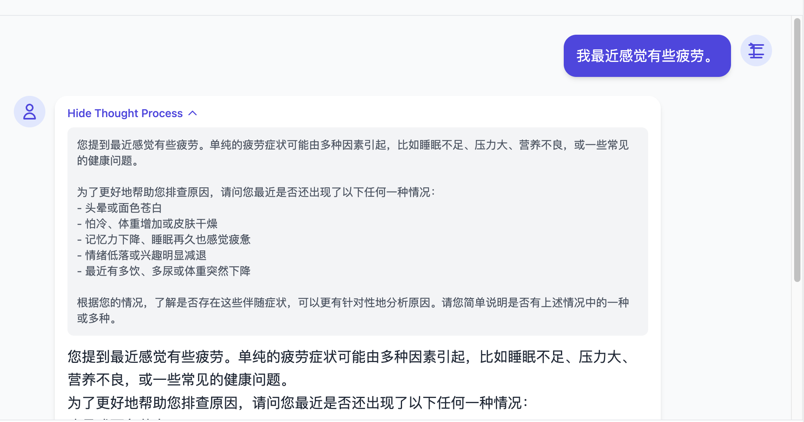
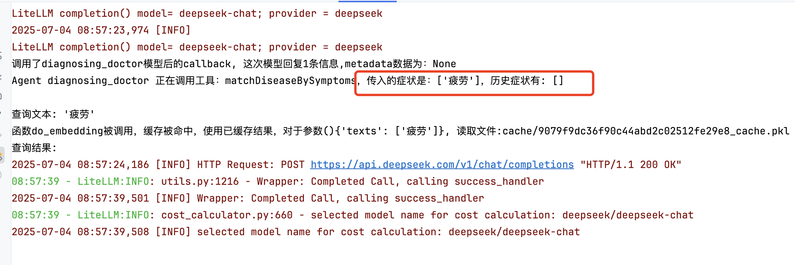
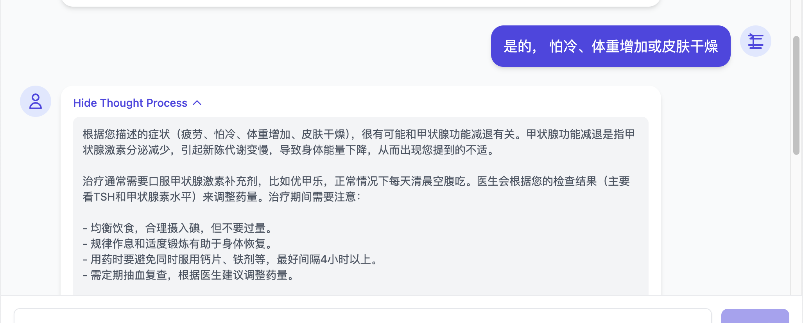
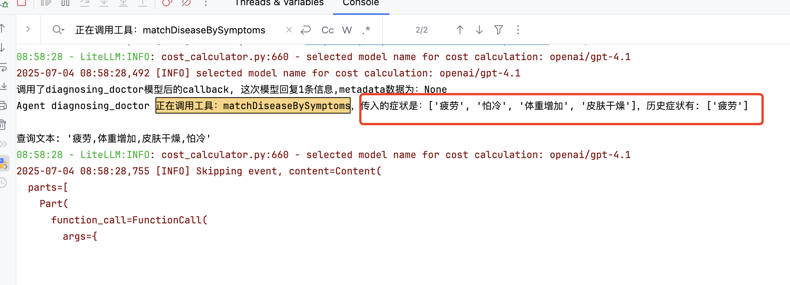
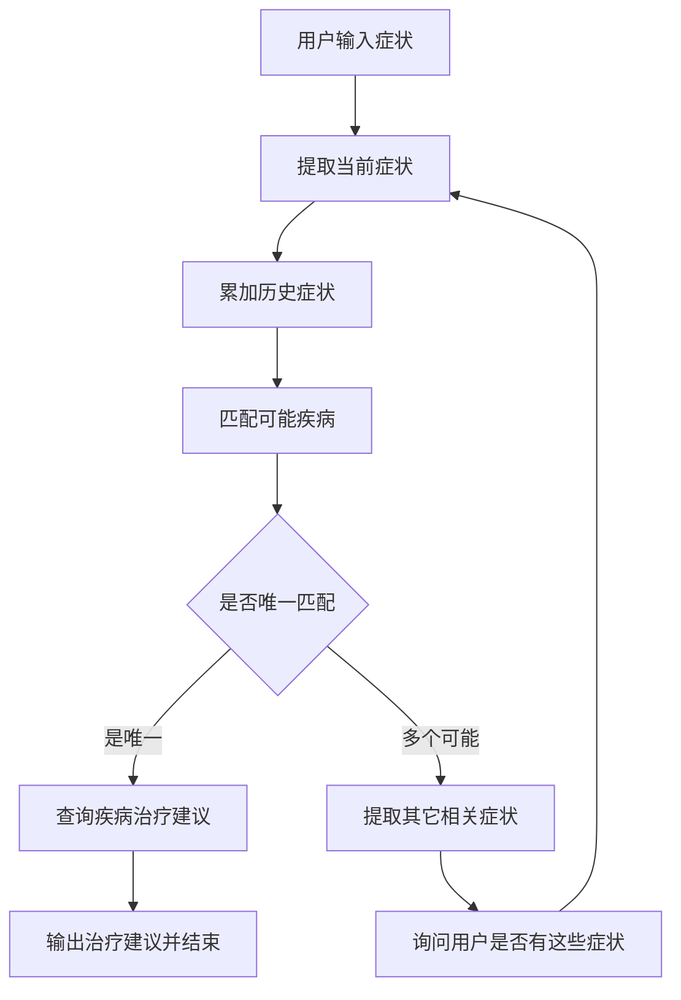

# 运行和测试
## 准备数据（数据进行向量化）
python main_data_prepare.py

## 运行服务端
python main_api.py

## 前端进行测试

# 问诊Agent，提取症状（调用工具，进行匹配）
1. 用户询问，说出症状
2. 提取症状，匹配可能的疾病，可能有多个或者唯一。 （当前提取症状和历史的症状都进行累加到匹配条件中）
3. 如果是唯一，那么查询疾病的治疗建议。
4. 如果不唯一，那么从几个可能的疾病中询问用户是否还有其它症状。（其它症状来自于其它几个可能的疾病表现）

# 示例问题：
我最近感觉有些疲劳。
疲劳感持续一周了，体重变轻了
有的