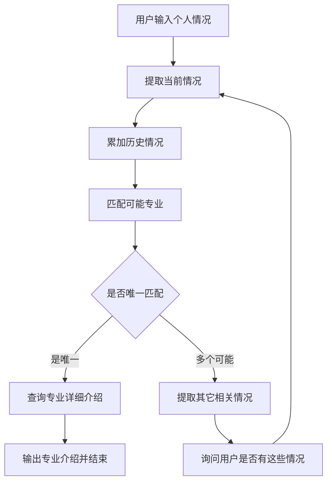

# 运行和测试
## 准备数据（数据进行向量化）
python main_data_prepare.py

## 运行服务端
python main_api.py

## 前端进行测试

# 教育规划Agent
1. 用户说出自己的个人情况，比如，兴趣，爱好，特长，成绩等
2. Agent提取用户的个人情况，匹配可能的专业，可能有一个或者多个。
3. 如果是唯一，那么查询专业的详细介绍。
4. 如果不唯一，那么从几个可能的专业中询问用户是否还有其它情况。（其它情况来自于其它几个可能的专业表现）

# 示例问题：
我喜欢画画，以后学哪个学校的哪个专业比较好？
