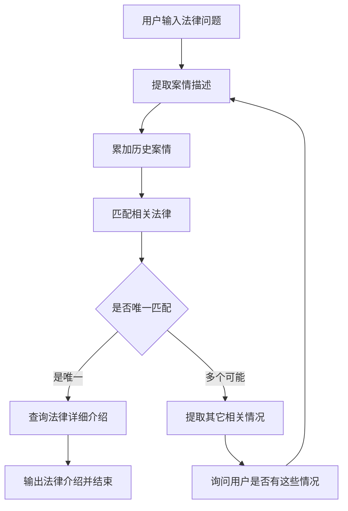

# 运行和测试
## 准备数据（数据进行向量化）
python main_data_prepare.py

## 运行服务端
python main_api.py

## 前端进行测试

# 法律咨询Agent
1. 用户说出自己的法律问题，比如，劳动纠纷，合同问题等
2. Agent提取用户的案情描述，匹配相关的法律法规，可能有一个或者多个。
3. 如果是唯一，那么查询该法律的详细介绍。
4. 如果不唯一，那么从几个可能的法律中询问用户是否还有其它情况。（其它情况来自于其它几个可能的法律适用范围）

# 示例问题：
我遇到了劳动纠纷，公司拖欠我的工资，我该怎么办？