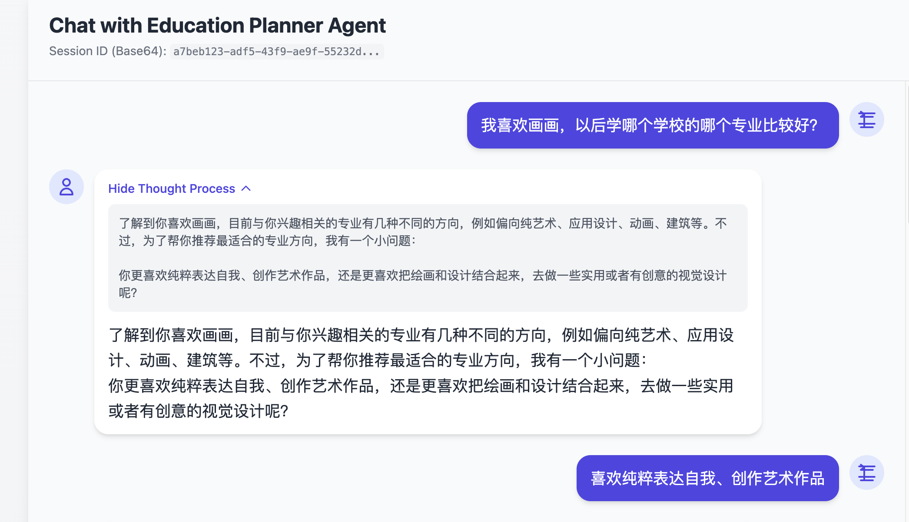
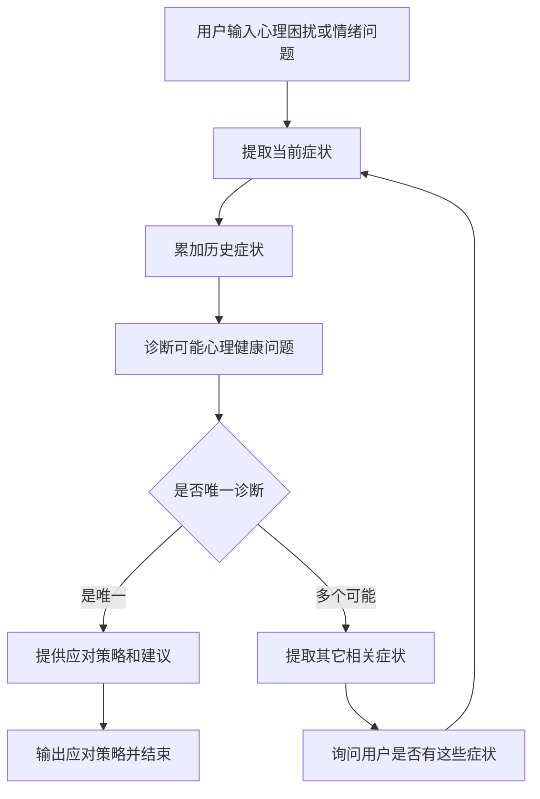

# 运行和测试
## 准备数据（数据进行向量化）
python main_data_prepare.py

## 运行服务端
python main_api.py

## 前端进行测试

# 心理健康咨询Agent
1. 用户描述自己的心理困扰或情绪问题。
2. Agent提取用户的症状，诊断可能的心理健康问题，可能有一个或者多个。
3. 如果是唯一，那么提供该心理健康问题的详细应对策略和建议。
4. 如果不唯一，那么从几个可能的问题中询问用户是否还有其它情况。（其它情况来自于其它几个可能的问题表现）

# 示例问题：
我最近感到很焦虑，晚上睡不着觉，怎么办？
