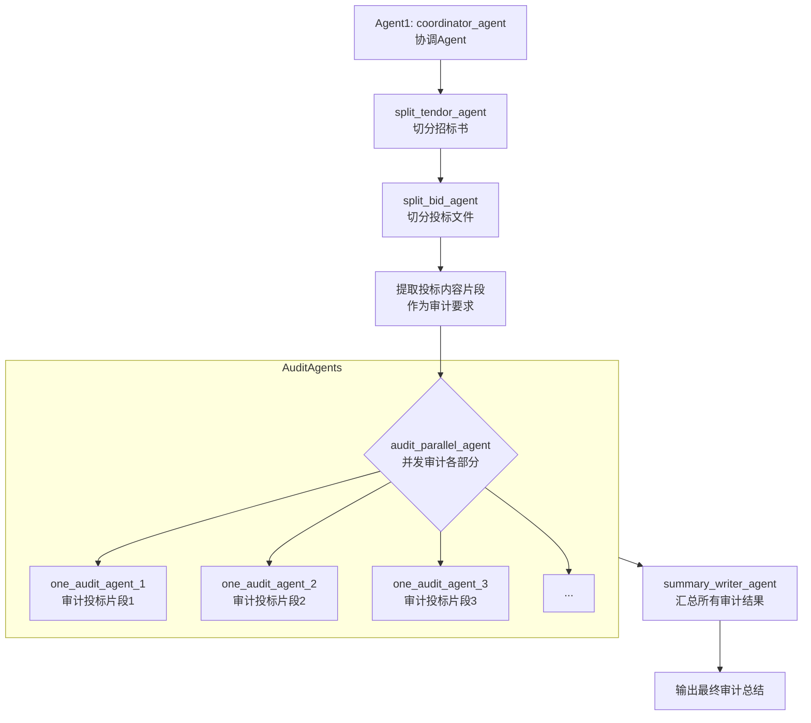

# 审计Agent
# 1. 切分招标书
# 2. 切分投标文件
# 3. 每个招标需求，对应投标文件进行检查

```mermaid
flowchart TD
    A[Agent1: coordinator_agent<br/>协调Agent] --> B[split_tendor_agent<br/>切分招标书]
    B --> C[split_bid_agent<br/>切分投标文件]
    C --> D[提取投标内容片段<br/>作为审计要求]
    D --> E{audit_parallel_agent<br/>并发审计各部分}

    subgraph AuditAgents
        direction LR
        E --> F1[one_audit_agent_1<br/>审计投标片段1]
        E --> F2[one_audit_agent_2<br/>审计投标片段2]
        E --> F3[one_audit_agent_3<br/>审计投标片段3]
        E --> F4[...]
    end

    AuditAgents --> G[summary_writer_agent<br/>汇总所有审计结果]

    G --> H[输出最终审计总结]

```
